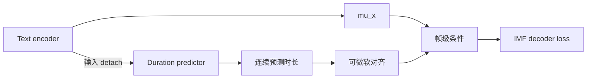

# IMF 可微 duration 实验

> 归档状态（2026-09-17）：按用户要求，只保留本文。可微 duration 的实现、配置、测试、68k checkpoint、训练日志、音频及离线诊断产物均已删除；本文记录历史方法和实测结果，不是当前可用功能或复现入口。

日期：2026-09-16。基于已完成的 IMF 主实验，增加可切换的软时长展开。实验已于 68k 停止，结果和退化诊断见下文。

## 配置与梯度路径

历史配置（现已移除）：

```yaml
model:
  differentiable_duration: true
  duration_soft_temperature: 0.5
  duration_length_loss_weight: 0.1
```

当时旧配置及旧 checkpoint 默认为 `false`；新配置写入 checkpoint，整句和流式推理均读取该开关。



箭头表示前向计算，梯度沿相反方向传播。**旧模型的 decoder loss 已能通过 `mu_x` 回到 text encoder；新增路径让它也能回到 duration predictor。** predictor 输入处的 detach 保留，它隔离 duration 分支对共享 encoder 的反向影响，不会阻断 predictor 参数自身的梯度。

具体做法：预测时长按样本归一化到训练录音的真实 Mel 长度，以累计时长作为音素区间边界，用两个 sigmoid 的差形成软区间权重。每一有效帧的 token 权重和为 1；padding 不参与归一化。温度 0.5 的单位为 Mel 帧，当前 1 帧=16ms。

MAS 仍是原 duration loss 的监督，也是 prior loss 使用的展开方式。只有 decoder 的条件改用预测时长的软展开。归一化会消去整体语速尺度，因此额外在 duration loss 中加入权重为 0.1 的总时长 log-ratio 平方误差；原 MAS duration loss 仍保留。

推理使用同样的软展开，只对整句总帧数向上取整，不再逐音素 `ceil`。独立声调的上下界在归一化前施加，软对齐质量不保证等于严格的整数时长上下界。这不是把 MAS 或输出张量长度变成可微，也不是 F5-TTS 的完整架构。


## 本次训练配置

Run：`ljs_majestic_100h_imf_h1_diffdur_tau05_b48_from21k_500ep_20260916`。

| 项目 | 值 |
| --- | --- |
| 数据 | 与上一轮完全一致：Majestic 100.0015h + 原始 LJS 21.0475h；65,282 条训练录音 |
| 初始化 | 与上一轮相同的 21k FM backbone / step-0 IMF 张量，包括 speaker 向量 |
| 初始张量核对 | 本轮与上一轮 `initial_parameter_sha256` 完全一致 |
| 训练范围 | encoder、duration predictor、speaker embedding、IMF decoder 全部更新 |
| GPU / batch | 4 卡 × 48，无梯度累积，有效 batch 192；真实容量预检通过 |
| 预算 | 500 epoch / 170k optimizer 更新 |
| Adam | betas=(0.9, 0.999)，eps=1e-8，weight_decay=0，clip norm=5 |
| LR | 1k warmup 到 3e-4，保持至第 136k 次更新，后 34k 次线性降至 2e-5 |
| 精度 | BF16 mixed；IMF/JVP 和软边界内部 FP32 |
| Seed | 20260913 |
| IMF 推理 | 2 步，时间网格 `[0, 0.5, 1]` |
| Vocos | 原权重保持不变，不参与训练 |

这次是独立对照实验，不是从旧 IMF 170k 接着优化。当时的源代码与配置逐文件哈希固定，训练和评测从运行快照执行。


## 当时完成的验证与观察项

本地 25 项测试通过，覆盖：只对 FM/IMF loss 反向传播时的 duration 与 encoder 梯度、软路径有限差分 gradcheck、padding、硬路径兼容、推理一致性、旧 checkpoint 默认值、配置保存与重新加载。声调时长限幅的 batch 广播修正与软时长方案无关，已在主代码中保留。

正式启动前，真实最长样本的每卡 batch 48 预检已确认：**仅 IMF loss 对 duration 参数的梯度有限且非零**、联合更新正常、验证 inference-mode 可执行、显存有余量。4 卡两步预检也已通过；丢弃所有预检权重后，从相同初始化开始正式训练。

以下为当时的观察项；梯度连通不等于音质改善：

- `duration_mask/train_soft_total_length_loss` 与 `soft_total_log_ratio`：整体预测时长是否漂移。
- 原始 duration 的 Corr / Std / CV、逐句归一化统计：局部长短变化是否仍被压缩。
- 相同 checkpoint 的 CER/WER、重复/漏读样例、DNSMOS 和音色相似度。
- 新 duration 报告的 `inference` 表示实际软对齐的逐 token 权重总和，标记为 `soft_alignment_mass`；`raw` 保持 `exp(logw)` 口径，便于与旧实验对照。

固定中文评测仍保留已有重复文本问题（200 条记录、115 条不同文本），不能仅凭低 CER 判断没有重复，见 [此前核查](fm_imf_final_comparison_zh.md)。


## 2026-09-17 退化诊断

诊断使用新旧实验各自 **65,000 步**的固定 checkpoint；全部操作为离线推理或读取现有统计，没有更新权重。已核对诊断读取的软时长实现与本轮运行快照一致。

## 已完成的推理对照

从原固定评测清单中，每组按原顺序取 12 条不同文本，共 48 条，覆盖 LJS 英文、Majestic 英文、中文、中英混合。保持原样本 seed、文本处理、vocoder 和 Qwen3-ASR 评测方式。表中为合并字符数加权的 micro CER。

| 65k checkpoint 与推理方式 | CER |
| --- | ---: |
| 旧模型，原硬展开，2 步 | 0.85% |
| 旧模型，仅推理改用新软展开，2 步 | 0.54% |
| 新模型，原软展开，2 步 | 23.85% |
| 新模型，软展开时长乘 1.1，2 步 | 21.31% |
| 新模型，恢复旧硬展开，2 步 | 21.55% |
| 新模型，软展开，10 步 | 16.16% |

结论：软展开本身在旧权重上可以正常合成；仅修改推理总时长、取整方式或步数，无法恢复新权重的准确率。0.54% 对 0.85% 的小样本差异不能用来声称软展开优于硬展开。


## 参考录音辅助对照

从验证集选择 speaker 1 的英文、中文、混合语种各 8 条不同文本，共 24 条，时长小于 13 秒。参考音频只用于诊断；MAS 由该 checkpoint 与参考 Mel 共同计算，并不等于人工音素对齐。

| 新模型的条件 | CER |
| --- | ---: |
| 正常预测时长 | 33.07% |
| 预测相对时长，强制使用参考录音总长度 | 30.51% |
| 参考录音 MAS 硬对齐 | 39.86% |
| 参考录音 MAS 时长的软展开 | 39.33% |
| 帧级条件置零 | 100.00% |
| 原始参考录音（ASR 对照） | 0.09% |

给出参考长度或 MAS 仍无法修复新模型。参考录音自身可被准确识别，排除了这一小批参考文本/ASR 无效的问题。换成 MAS 同时改变了新 decoder 熟悉的条件分布，故此实验单独不能证明是哪一个模块或哪一种训练梯度导致退化。置零条件失败说明模型仍依赖条件，不能简单说它完全忽略了文本。


## 训练条件错位的直接证据

代码中，prior loss 使用 MAS 展开的 `mu_y`；新 decoder loss 则使用完全由预测时长构造的 `flow_mu`。预测时长仅按真实总长度归一化，没有约束每个 token 的累积边界与该条录音一致。这一实验分支现已从 `lits.py` 移除。

根据新模型 65k 时已保存的 632 条验证记录，重建训练软对齐：施加同样的声调时长边界 1–3 帧、归一化至真实 Mel 长度、温度 0.5，得到：

| 语种 | 累积 token 边界平均绝对偏差 | 帧级最大权重 token 与 MAS 一致率 |
| --- | ---: | ---: |
| 英文 | 7.84 帧 / 125 ms | 26.81% |
| 中文 | 8.69 帧 / 139 ms | 22.97% |
| 混合 | 9.41 帧 / 151 ms | 20.95% |
| 全部 | 8.40 帧 / 134 ms | 24.61% |

这里比较的是两条训练路径的内部一致性，不是对人工音素标签的准确率。即使逐 token 时长 Corr 略有提高，累积位置仍可偏离多个音素。总长度归一化只保证句尾一致，不能消除句中位置偏差。旧模型训练时直接使用 MAS 条件，因而没有这项由预测时长替换产生的条件错位。

这支持的主要机制是：新方案在训练开始时完全替换 MAS 条件，使 decoder 在局部错位的条件下拟合同一段真实录音。它与“梯度是否连通”是不同问题。尚未通过短程训练消融区分条件错位与 decoder 梯度反馈到 duration predictor 各自的贡献。


## Encoder / decoder 交叉替换

在同一批 48 条固定样本上，两边均使用软推理，分别交换新旧模型的 encoder 和完整 decoder。encoder 使用其所属模型的 speaker embedding；decoder 也使用其所属模型的 speaker embedding，避免把 speaker 条件一起错误替换。每条样本保持上述原始 seed。

| Encoder（含 duration predictor） | Decoder | CER |
| --- | --- | ---: |
| 旧 | 旧 | 0.54% |
| 新 | 新 | 23.85% |
| 新 | 旧 | 3.09% |
| 旧 | 新 | 41.22% |

新 encoder 配旧 decoder 恢复了大部分准确率，反向替换仍严重退化，说明退化主要落在新训练得到的 decoder 一侧。新 encoder 配旧 decoder 尚未恢复到旧组合的水平，尤其混合语种仍有 12.68% CER，不能声称 encoder 完全没有退化。跨模型表示/条件不匹配也会影响交换实验，因此这个表不是各模块因果贡献的精确分解。


## 判断与后续实验建议

**已定位到：这是训练后权重的严重退化，主要表现在 decoder；不是单独的软推理公式、总时长偏短或两步采样预算所能解释。**

最有证据支持的训练机制是：从第 0 步起将 MAS 条件完全替换成预测软对齐，造成局部文本条件与真实目标录音错位。与此同时，prior 分支仍按 MAS 优化。原本能在准确对齐条件下学习的 decoder 被要求拟合错位条件，现有梯度连通测试无法检测这种学习任务本身的问题。

还不能单凭这些推理消融断定“条件错位”与“新增 flow→duration 梯度反馈”各自占多少。若后续继续研究，应从同一份可靠权重开展短程、同预算训练对照：

1. MAS 时长的软展开：隔离软边界平滑的影响。
2. 预测软展开，但阻断 flow 对 duration 的梯度：隔离条件替换本身的影响。
3. 预测软展开，允许 flow 对 duration 的梯度：测量新增梯度的额外影响。

这些对照通过后，才考虑 MAS 与预测软对齐的渐进混合。该配方未继续训练至 170k；68k checkpoint 已随实验产物清理。

## 补充：F5-TTS 与 StyleTTS 2 官方方案核对

2026-09-17 核对了论文及官方仓库。F5-TTS 原论文的标准方案没有逐音素 duration predictor：字符序列在末尾补 filler 至 Mel 长度，经 ConvNeXt 文本建模和 DiT，以语音补全的 conditional flow matching 目标学习隐式对齐。推理总长度由参考音频和文本长度比例等方式提供。这不能通过只替换本项目的 duration 展开器来等价实现。[F5-TTS 论文 §3.1–3.2](https://arxiv.org/html/2410.06885v3#S3)、[官方 CFM 代码](https://github.com/SWivid/F5-TTS/blob/main/src/f5_tts/model/cfm.py)。

用户所指的可微 duration 更接近 **StyleTTS 2**。关键是它同时保留两种训练路径：重建路径使用 text aligner 的单调对齐，并监督 duration；另一条路径使用预测时长生成波形，经 WavLM 加判别头的对抗损失回传到 duration。论文 §3.2.4 明确讨论预测时长与参考长度不匹配，并说明可微预测路径使用 SLM 对抗目标。它并未把预测对齐直接代入与原录音逐帧对应的重建目标。[论文 Fig.1、§3.2.3–3.2.4](https://papers.neurips.cc/paper_files/paper/2023/file/3eaad2a0b62b5ed7a2e66c2188bb1449-Paper-Conference.pdf)。

官方代码核对：

- [train_second.py](https://github.com/yl4579/StyleTTS2/blob/main/train_second.py#L267-L285) 通过 `maximum_path` 获取参考单调对齐，再展开文本特征；时长分布有 BCE 及 duration L1 监督。
- [Modules/slmadv.py](https://github.com/yl4579/StyleTTS2/blob/main/Modules/slmadv.py#L56-L88) 将 duration logits 的 sigmoid 求和得到期望时长，结合累积中心位置、高斯核卷积和 token 维 softmax 生成软对齐。输出总长度仍由 `round(...).item()` 决定，所以可微的是对齐权重及位置，并非输出张量形状。
- SLM 分支末端调用 `wl.generator(y_pred)`；生成器这一损失不需要与同一条参考录音逐帧配对。`losses.py` 中的 WavLM 配对特征损失是另一条重建路径，二者不应混淆。[SLM 分支](https://github.com/yl4579/StyleTTS2/blob/main/Modules/slmadv.py)、[WavLMLoss](https://github.com/yl4579/StyleTTS2/blob/main/losses.py#L194-L223)。
- 论文给出端到端训练图；所核对的官方 `train_second.py` 实现中，SLM 更新的 optimizer steps 是 BERT、BERT encoder、predictor 和 diffusion，acoustic text encoder 在该路径中用 `no_grad`，decoder 的更新发生在重建分支。SLM 梯度仍穿过 decoder 到 predictor。另有 predictor 梯度范数控制，并对 duration projection/LSTM/diffusion 的 SLM 梯度缩放；所核对示例配置 `scale=0.01`，不是可直接照搬到本项目的通用最优值。[更新代码](https://github.com/yl4579/StyleTTS2/blob/main/train_second.py#L467-L530)、[示例配置](https://github.com/yl4579/StyleTTS2/blob/main/Configs/config.yml#L108-L115)。

据此，后续设计应优先恢复 MAS 条件下的主 IMF 训练，另行评估预测软时长生成分支及不要求逐帧配对的辅助目标。要实现 StyleTTS 2 类似的梯度路径，需要可反传的 IMF 采样和声码器前向，并设计/训练判别头；仅增加软展开 config 不足以复现其训练方法。此补充更新了此前“只做对齐渐进混合”的建议，尚未实施新训练。
