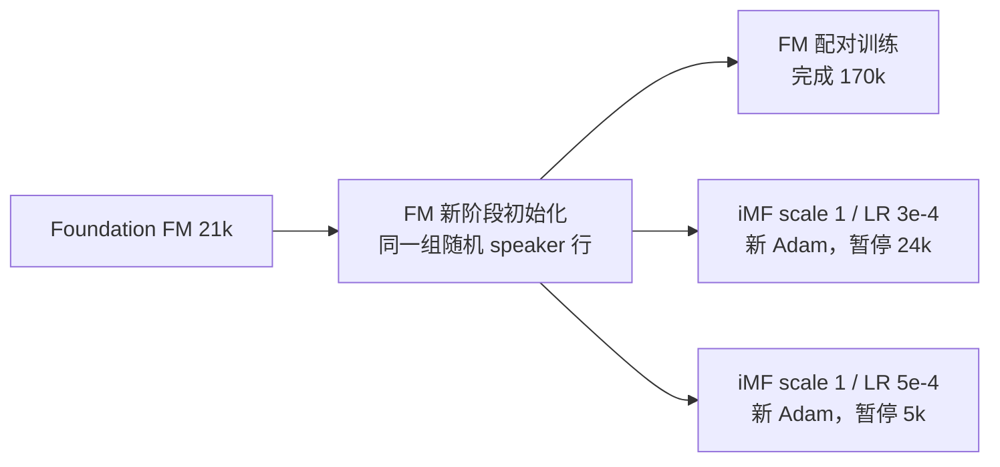
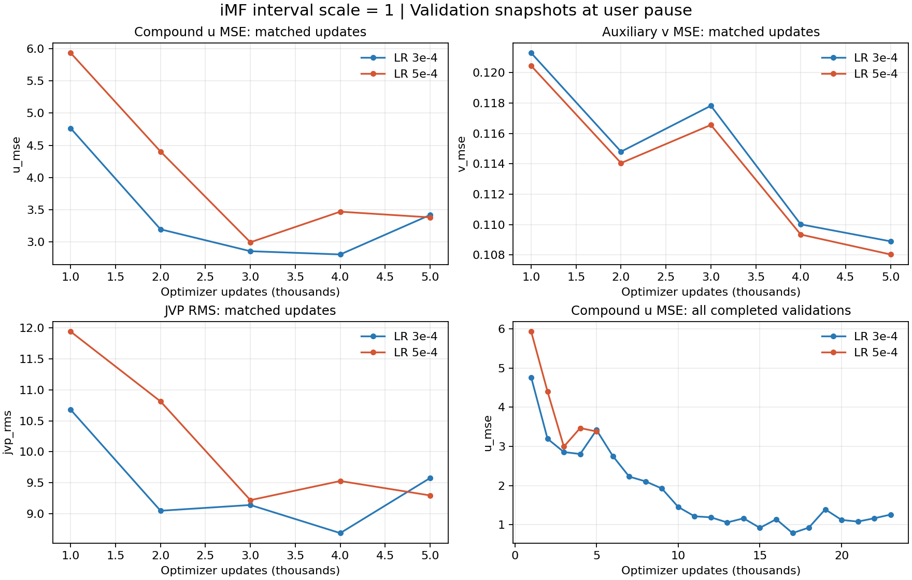

# iMF 训练、loss 异常与学习率对照记录

> 历史记录：本文记录 2026-09-15 的早期实验与暂停状态。后续恢复及完成 170k 的记录见 [IMF 完整训练记录](imf_training_record_zh.md)。

> 记录日期：2026-09-15。本文记录直接配对训练的 iMF 实验及本次暂停，包含实际配置、已确认的实现问题、修复后的曲线、学习率对照和恢复边界。所有 step 均为本轮优化器更新次数，不包含 Foundation 的 21k。两次正确 scale 的实验均未跑完原定 170k 预算。


**状态更新（2026-09-15 10:49 UTC）：按用户要求恢复 `imf_h1_b48/version_0` 的 3e-4 基线，从 24,000 步完整 checkpoint 直接续训；5e-4 对照仍暂停。下文暂停分析保留为历史记录，恢复核验见第 12 节。**

## 1. 结论与运行状态

用户观察调高 LR 后收益有限，要求先暂停训练并详细记录。暂停完成时间：**2026-09-15 09:32:44 UTC**。**当前没有证据支持通过进一步提高 LR 解决 u loss 偏高；interval scale 的实现问题已修复，但修复不等于 u 目标已经充分收敛。**

| 实验 | interval scale | 峰值 LR | 最终状态 | 恢复点 | 最后完成的完整生成评测 |
|---|---:|---:|---|---:|---:|
| 早期错误 scale 试验 | 1000 | 3e-4 | 已停止并按用户要求清理 | 不保留 | 历史诊断记录保留 |
| 修复后基线 | 1 | 3e-4 | 10:49 UTC 已从 24k 直接续训 | 24,000 | 20,000（后续见运行目录） |
| 较高 LR 对照 | 1 | 5e-4 | 本次已暂停 | 5,000 | 2,000 |

暂停采用最近一次完整 checkpoint 保存边界：5e-4 在 5k 模型与 Adam 状态落盘后退出训练、评测 watcher 及本实验 supervisor。`control.json` 已设为 `enabled=false`，`launch.json`、`training_state.json`、`supervisor_status.json` 均标记 paused。这是用户主动暂停，不是训练到预算结束或数值故障退出。

两次实验的 checkpoint、优化器、日志、TensorBoard 曲线和已有评测音频均保留。本次操作只针对当前 iMF，不更改独立的 MeanFlow distill 实验。5k checkpoint 已保存；5k 生成评测没有完成，不作为质量结论。

## 2. 实验目录、代码与初始化谱系

| 简称 | 路径 |
|---|---|
| 3e-4 基线 | `/119010446/tts-assets/training_runs/ljs_majestic_100h_imf_h1_b48_from21k_500ep_20260915` |
| 5e-4 对照 | `/119010446/tts-assets/training_runs/ljs_majestic_100h_imf_h1_lr5e4_b48_from21k_500ep_20260915` |
| 对应 FM 实验 | `/119010446/tts-assets/training_runs/ljs_majestic_100h_backbone21k_20260914` |

正确 scale 的源代码提交为 `206539cc333224989a2a640160de4d3da2916990`，实际训练源码保存在各实验的 `source/`。本文所在 `LITs-distill` 是记录位置，不代表运行时使用了该工作树的代码。



iMF 从对应 FM 实验的 **starting initialization** 迁移，声学权重来自 Foundation 21k；没有使用完成后的 FM 170k，也没有从 Foundation 197k 开始。5e-4 同样从新 step 0 开始，**没有沿用 3e-4 的 24k 权重或 Adam**。选择 21k 的 duration 相关背景见 [FM 训练记录第 3.4 节](majestic_training_record_zh.md#34-stage-1-结果和为什么选-21k)。

两次正确 scale 实验的 498 个初始 state tensors 已逐个 `torch.equal` 核对一致，包括相同种子生成的两行 speaker embedding。新 interval MLP 最后一层零初始化；辅助 v tail 从已加载的 FM tail 复制。原有 FM tensor 严格迁移，初始化后普通零间隔路径保持原 FM 行为（含时间与速度符号转换）。初始化参数指纹：`a7565dec08d45e1c75f8c231bdc5c909a877010b47cd94243e95959baccdada4`。

Foundation 21k checkpoint SHA-256：`1bbf20d7b741c11c52db74901a5bfd7655b6e4e38ffe610bcf1418454c7da86b`。这是共享声学父模型身份，不是两次 iMF 保存文件的文件哈希。

## 3. 配方与评测协议

本实验是文本/音频配对的 improved MeanFlow 训练，无教师轨迹、教师采样或 distillation targets；不能把两个 MeanFlow distill 实验的 loss 混入这里。

| 项目 | 实际设置 |
|---|---|
| 数据 | 与 FM 相同的冻结清单，65,282 条，约 121.049h |
| 组成 | 目标中文 50h、目标英文 25h、目标混读 25h、LJS 原录音约 21.047h |
| Speaker | ID 0=LJS；ID 1=目标中/英/混读 |
| Mel | 24kHz，100 bins，hop 384（16ms），沿用源模型 mean/std |
| Batch | 4 GPU × 48，无梯度累积，有效 batch 192 |
| 采样 | 全部条目自然混合并按长度分桶；340 updates/epoch |
| 计划预算 | 500 epoch / 170,000 updates；本次均提前暂停 |
| Adam | betas=(0.9,0.999)，eps=1e-8，weight_decay=0；两次均新建 |
| LR | 1000 步 warmup；稳定至 136k；最后 34k 线性降到 2e-5 |
| 唯一有意改变的训练超参数 | 峰值 LR：3e-4 → 5e-4，包含相应 warmup 曲线变化 |
| 更新范围 | text/prior、duration、speaker、条件编码器、u/v 网络从 step 0 联合更新 |
| 精度 | 外层 BF16 mixed；iMF estimator/JVP loss 路径 FP32，math SDPA |
| 梯度裁剪 / seed | norm 5 / 20260913 |
| 时间采样 | 两个 logit-normal 时间排序，P_mean=-0.4，P_std=1；每批前 50% 设 r=t |
| iMF 权重 | norm_p=1、norm_eps=0.01；u/v 分别自适应加权；dur/prior 各权重 1 |
| 推理 | 只调用 u，2 步 Euler，LITs 时间网格 [0,0.5,1]；无 CFG |
| 验证与保存 | 每 1k；固定验证 632 条 |
| 生成评测 | 1k 每组 8 条 smoke；2k、之后每 5k 完整 650 条 |

650 条包含目标中/英各 200、混读 50、LJS 英文 200；固定文本、样本噪声种子、参考音色和 Vocos。ASR 使用 Qwen3-ASR-1.7B；音色用 WavLM/CAMPPlus；音质用 DNSMOS。iMF 按 checkpoint 配置生成 2 步，原 FM 默认 10 步；跨 FM/iMF 的比较应说明步数差异。

两次容量预检、四卡两步 preflight、正式第 1/100 步初始化与参数更新核验均通过。48/GPU 的 iMF 预检峰值 allocated 约 28.18GiB；预检权重未带入正式训练。通过软件检查不等于训练效果或最终收敛已经得到证明。

## 4. “iMF loss 高”具体指什么

### 4.1 u、v 与旧 flow/prior 的区别

采用上游时间方向：t=1 为噪声、t=0 为 Mel。设真实归一化 Mel 为 x、噪声为 ε、条件为 c、0≤r≤t≤1：

```text
z_t = (1-t)x + tε
w   = ε-x
v_dir = vθ(z_t,t,t,c)
D_u = JVP[uθ(z_t,t,r,c); (v_dir,1,0)]
V   = uθ(z_t,t,r,c) + (t-r) stopgrad(D_u)
```

u 代表区间平均速度，推理每个区间用它更新一次；v 是辅助瞬时速度头，并在零间隔提供 JVP 的方向。`u_mse` 比较的是 **含 JVP 修正的 V 与 w**，不是 u 直接与瞬时速度 w 的误差。`v_mse` 比较 v 与 w，功能上更接近旧 FM 的瞬时速度回归。条件在 JVP 求导方向中固定，正常 loss 前向仍向条件编码器反传；JVP 修正本身不保留反向梯度。

r=t 时修正项为零；非零区间会引入沿预测轨迹的导数项，因此 u MSE 与 v MSE 并非同一道回归题。JVP RMS 大只表示该方向导数的幅度大，不能直接称为 optimizer 梯度爆炸。实际加入目标的幅度还受 (t-r) 影响。

旧 FM 使用 uniform 时间、sigma_min=1e-4 和普通有效元素速度 MSE；这里是 logit-normal 时间、sigma_min=0、双头目标和逐样本加权。即使 v 的含义接近，绝对数值也不应直接作同口径排名。

Prior 仍为 `Mean_valid[0.5*(x-mu)^2] + 0.5*log(2π)`，固定常数约 0.91894，学习的是 Mel 均值；duration 仍是预测 log 时长对在线 MAS 时长的 MSE。它们都不是 u/v 速度误差。

### 4.2 为什么总 loss 约 3.2，weighted u/v 却几乎不动

每个样本先对有效 Mel 元素累加平方误差，得到 S_u、S_v，再分别计算：

```text
L_u = mean_batch[S_u / stopgrad((S_u + 0.01)^1)]
L_v = mean_batch[S_v / stopgrad((S_v + 0.01)^1)]
L_total = L_duration + L_prior + L_u + L_v
```

S 远大于 0.01 时，每个加权 loss 的显示值都接近 1，因此 `sub_loss/*_diff_loss` 接近 2，总 loss 大致为 `0.2 + 0.97 + 1 + 1 ≈ 3.17`。**这部分偏高是目标定义造成的，不能与原 FM 总 loss 直接比较，也不能靠这条几乎水平的曲线判断是否学会。**

分母 detach 后仍有梯度，`dL/dS=1/(S+0.01)`（当前 p=1）；它不是把分子分母一起微分后的常数零梯度，也不是按 u/v 的整体 loss 比例自动把两个任务“调平”。较大的样本误差会得到较小权重。

真正需要查看的原始指标是 `imf/train_u_mse`、`imf/val_u_mse` 及 v 对应项：每个样本的 S 除以自身有效 Mel 元素数，再在 batch 内平均。它们有 mask，且不会被自适应除法压到约 1。训练 step 值噪声较大，趋势应同时看 epoch 均值和完整验证。

### 4.3 本次确实值得关注的高值

有两层问题：早期错误 scale 导致异常大的区间导数；修复后 u 的复合残差仍长期显著大于 v，较高 LR 也没有让它更快下降。这里的“显著高”是数值幅度描述，未做多随机种子的统计显著性检验，也没有一个通用的 u MSE 合格阈值。

## 5. 已确认并修复：interval embedding scale=1000

LITs 原 FM 的绝对时间正弦嵌入默认乘 1000，新加的区间 h=t-r 分支最初误沿用了该尺度；上游区间嵌入直接使用归一化 h。新分支一旦学到非零权重，区间导数会被放大，进入 u 的 JVP 修正。

修复只把新增 interval 分支设为 `interval_time_scale=1`，保留预训练绝对时间路径的 1000，避免破坏 FM 权重对应关系。模型把尺度写入 checkpoint 配置；旧 checkpoint 缺字段时按历史 1000 解释，不静默改变其语义。已经学习过的 iMF checkpoint 跨尺度 warm start/resume 会被拒绝，正确训练重新从 FM 初始化开始。

固定旧 1k checkpoint、8 条验证录音（四组各 2 条）、4 个相同噪声种子、FP32 且禁用 TF32，仅在独立诊断进程改变 interval scale，零优化器更新：

| 指标 | 原 interval scale 1000 | 仅改 scale 1 |
|---|---:|---:|
| 复合 u MSE | 18.109936 | 0.347283 |
| u 直接对瞬时速度的 MSE（诊断项） | 0.124658 | 0.123939 |
| v MSE | 0.122720 | 0.122631 |
| JVP 均方值（RMS 的平方） | 1567.380005 | 9.424451 |
| interval 导数均方值 | 1576.904175 | 0.002414 |
| absolute-time 导数均方值 | 11.513619 | 11.342195 |

该消融把问题定位到区间导数相关的修正，不能解释成普通瞬时速度预测全面失效。非对角 u MSE 从 36.0991 降到 0.57379；对角 u MSE 保持约 0.120776。中心有限差分在 ε=1e-4 时与 JVP 的相对 RMS 偏差约 0.15%，scale=1 消融约 0.3%，支持所检查点的求导实现正确。最初 TF32 有限差分不稳定的结果已用严格 FP32 重核，未作为 bug 证据。

错误 scale 的实际训练 epoch u MSE 曾为 1.5992 → 37.1642 → 74.0831；1k 完整验证 u MSE=28.1017、v MSE≈0.12008。上述固定 8 条消融的 18.1099 与完整验证的 28.1017 样本/随机设置不同，不能混用。诊断捕获的标量均有限，所检查早期 gradient norm 约 1.09–3.22，没有这些日志支持的 NaN/数值梯度爆炸结论。

原错误实验先被停止，9 份错误 checkpoint（约 2.7GiB）按用户要求移除；之后清理旧实验时该运行目录也删除。原始诊断报告与诊断 JSON 位于 `/119010446/tts-assets/diagnostics/imf_health_20260915/`，仍可追溯数值；已删除 checkpoint 的旧路径只表示历史来源，不是当前可加载资产。

兼容性核验包括旧尺度重载、新尺度重载、跨尺度拒绝、FM tensor 精确迁移、零初始化区间保持原 FM、checkpoint 重载一致性，均通过。该固定 checkpoint 消融证明一个局部实现修复有效，不证明修复后的整段训练一定收敛。

## 6. 修复后 3e-4 的实际长期趋势

| LR | Step | Val u MSE | Val v MSE | Val JVP RMS | Val duration | Val prior |
|---|---:|---:|---:|---:|---:|---:|
| 3e-4 | 1,000 | 4.76354 | 0.12130 | 10.67846 | 0.22840 | 0.97210 |
| 3e-4 | 2,000 | 3.19504 | 0.11480 | 9.04709 | 0.22216 | 0.97155 |
| 3e-4 | 5,000 | 3.41749 | 0.10890 | 9.57525 | 0.21623 | 0.97075 |
| 3e-4 | 10,000 | 1.45185 | 0.10696 | 5.89985 | 0.21407 | 0.97054 |
| 3e-4 | 15,000 | 0.91719 | 0.10211 | 4.21342 | 0.21172 | 0.97004 |
| 3e-4 | 20,000 | 1.11993 | 0.10477 | 5.76066 | 0.21203 | 0.96991 |
| 3e-4 | 23,000 | 1.25631 | 0.10316 | 5.10715 | 0.21287 | 0.96977 |

暂停前最后一次完整验证在 **23k**，u MSE 为 1.25631，v 为 0.10316，u/v 数值比约 12.2。u 已较早期下降，不能写成持续单调发散；但复合残差仍明显高于瞬时速度残差，也没有达到可确认充分收敛的依据。原始验证曲线有波动，单个训练 batch 或一个 checkpoint 不应单独定性。3e-4 的 24k checkpoint 已保存，但 24k 验证未完成；暂停状态 JSON 中携带的上述 val 指标来自 23k，不能按状态文件的 global_step 将它们误标为 24k。



左上/右上/左下分别为两种 LR 在共同步数范围的 u、v、JVP；右下保留 3e-4 到 23k 的完整验证 u 曲线，并标出 5e-4 的实际短程记录。纵轴不是相互统一的误差尺度，JVP RMS 也不是梯度范数。

## 7. 3e-4 与 5e-4 的相同步数比较

初始化、数据、batch、seed、interval scale、目标和预算保持一致，唯一有意改变的训练超参数是 LR。下表来自每 1k 完整验证；时间/噪声在验证中仍采样，这不是多 seed 重复实验。

| LR | Step | Val u MSE | Val v MSE | Val JVP RMS | Val duration | Val prior |
|---|---:|---:|---:|---:|---:|---:|
| 3e-4 | 1,000 | 4.76354 | 0.12130 | 10.67846 | 0.22840 | 0.97210 |
| 5e-4 | 1,000 | 5.93308 | 0.12046 | 11.93920 | 0.22680 | 0.97268 |
| 3e-4 | 2,000 | 3.19504 | 0.11480 | 9.04709 | 0.22216 | 0.97155 |
| 5e-4 | 2,000 | 4.40275 | 0.11405 | 10.81246 | 0.22218 | 0.97188 |
| 3e-4 | 3,000 | 2.85534 | 0.11783 | 9.14019 | 0.22224 | 0.97118 |
| 5e-4 | 3,000 | 2.99400 | 0.11656 | 9.21851 | 0.21717 | 0.97144 |
| 3e-4 | 4,000 | 2.80473 | 0.11001 | 8.68635 | 0.21693 | 0.97111 |
| 5e-4 | 4,000 | 3.46889 | 0.10934 | 9.52740 | 0.21659 | 0.97137 |
| 3e-4 | 5,000 | 3.41749 | 0.10890 | 9.57525 | 0.21623 | 0.97075 |
| 5e-4 | 5,000 | 3.38052 | 0.10803 | 9.29464 | 0.21843 | 0.97172 |

在用户最初提出“调高 LR 看起来没用”时，已完成的 1k–4k 四次验证中，5e-4 的 u MSE 都高于 3e-4；4k 为 3.46889 对 2.80473，约高 24%。v MSE、duration loss 的差异很小，JVP RMS 也没有更低。暂停前补齐的 5k 验证为：3e-4 u=3.41749，5e-4 u=3.38052；5k 的 5e-4 u MSE 比基线低约 1.1%，两者已很接近，不能继续沿用“每个点都更高”的表述；但尚无持续加速下降的趋势，其余精确值见表。

总 loss 约 3.2 或 weighted u/v≈1 本身不能支持 LR 无效的结论；**相同步数 raw u/JVP 与完整生成评测没有一致收益**才是本次暂停的依据。无法由此推出所有更高 LR、不同训练长度或不同模型结构都无效，也未证明 5e-4 最终必然更差。

## 8. 已完成的生成质量与 duration 对照

### 8.1 相同 2k，固定 650 条生成评测

两个实验均完整完成，四组 evaluation failures=0。CER/WER 为 micro 百分比；中文 WER 用“—”，混读 WER 仅英文词。相似度与 DNSMOS 为样本均值，非百分比，也不是主观听感评分。

| 分组 | LR | CER / WER ↓ | WavLM / CAMP ↑ | DNSMOS OVRL / SIG / BAK ↑ |
|---|---|---:|---:|---:|
| 目标中文 | 3e-4 | 0.820% / — | 0.742 / 0.578 | 3.309 / 3.559 / 4.119 |
| 目标中文 | 5e-4 | 0.714% / — | 0.752 / 0.593 | 3.335 / 3.586 / 4.124 |
| 目标英文 | 3e-4 | 0.650% / 1.449% | 0.671 / 0.748 | 3.089 / 3.346 / 4.070 |
| 目标英文 | 5e-4 | 0.566% / 1.255% | 0.683 / 0.758 | 3.149 / 3.407 / 4.084 |
| 目标混读 | 3e-4 | 1.330% / 5.208% | 0.689 / 0.553 | 3.254 / 3.513 / 4.099 |
| 目标混读 | 5e-4 | 1.241% / 10.417% | 0.690 / 0.561 | 3.311 / 3.562 / 4.126 |
| LJS 英文 | 3e-4 | 1.195% / 2.801% | 0.458 / 0.620 | 2.554 / 3.084 / 3.383 |
| LJS 英文 | 5e-4 | 1.059% / 2.414% | 0.480 / 0.671 | 2.675 / 3.189 / 3.476 |

5e-4 在这些早期样本上确有部分收益，例如目标中文/英文的内容与音色分数、LJS 音质；不能概括成“所有指标毫无改善”。但目标混读英文 WER 从 5.208% 到 10.417%，方向相反，混读只有 50 条；总体不足以证明一致的实际收益。u MSE 更高与某些生成指标更好可以同时出现，二者不是单调对应关系。

### 8.2 相同 2k，固定验证集的 duration

使用 632 条验证样本而非生成评测集；统一为 speech token、raw exp(logw)，排除静音/标点/独立声调。比值均为预测/MAS，MAE 单位为帧（16ms）。目标英文不混入 LJS 英文。

| 分组 | LR | 句数 | Corr | Std 比 | CV 比 | 均值比 | MAE（帧） |
|---|---|---:|---:|---:|---:|---:|---:|
| 目标中文 | 3e-4 | 192 | 0.634 | 0.640 | 0.663 | 0.965 | 1.230 |
| 目标中文 | 5e-4 | 192 | 0.636 | 0.648 | 0.669 | 0.969 | 1.210 |
| 目标英文 | 3e-4 | 115 | 0.661 | 0.664 | 0.727 | 0.913 | 1.318 |
| 目标英文 | 5e-4 | 115 | 0.648 | 0.621 | 0.689 | 0.901 | 1.321 |
| 目标混读 | 3e-4 | 93 | 0.637 | 0.626 | 0.667 | 0.938 | 1.308 |
| 目标混读 | 5e-4 | 93 | 0.643 | 0.629 | 0.667 | 0.943 | 1.307 |
| LJS 英文 | 3e-4 | 232 | 0.625 | 0.628 | 0.667 | 0.941 | 1.461 |
| LJS 英文 | 5e-4 | 232 | 0.641 | 0.585 | 0.638 | 0.917 | 1.467 |

中文 Corr 从约 0.634 到 0.636，变化很小；目标英文 duration 的 Corr/Std 比反而下降。更高 LR 尚未显示出一致的时长建模收益。MAS 是当前模型产生的参照，其路径随模型变化，不能把 Corr 解释成时长正确率，也不能由 Std 比低于 1 单独归因中文机械感。

### 8.3 3e-4 最后一次完成的 20k 生成评测

下面用于记录已取得的阶段效果，不能拿它和刚训练到 2k 的 5e-4 直接作 LR 优劣比较。

| 分组 | CER / WER ↓ | WavLM / CAMP ↑ | DNSMOS OVRL ↑ |
|---|---:|---:|---:|
| 目标中文 | 0.688% / — | 0.777 / 0.657 | 3.368 |
| 目标英文 | 0.409% / 0.869% | 0.732 / 0.777 | 3.198 |
| 目标混读 | 0.000% / 7.292% | 0.722 / 0.637 | 3.347 |
| LJS 英文 | 0.629% / 1.449% | 0.584 / 0.776 | 2.882 |

两次实验所有已完成 checkpoint 的精确生成分数都导出在附录 CSV；1k smoke 保留实际 samples=8，不能当作 650 条完整评测。

## 9. 已知事实、尚未确认的原因与本次决策

| 判断 | 当前证据与边界 |
|---|---|
| 错误 interval scale 曾放大 JVP | 固定权重/样本/噪声消融直接支持；已修复并重新初始化训练 |
| weighted loss 近常数 | p=1、分母 stopgrad 的定义决定；不代表没有反向梯度 |
| scale=1 后 u 仍偏高 | raw 验证曲线支持，但含导数修正，不能按 v 或旧 FM 的目标尺度机械排名 |
| LR=5e-4 没有一致收益 | 相同步数 loss 与 2k 完整生成指标支持；观察预算仅到 5k，非多 seed 结论 |
| 梯度爆炸/NaN 是本次原因 | 无现有证据；高 JVP 是输入/时间方向导数，不等于参数梯度爆炸 |
| duration 是中文听感问题唯一原因 | 未证明；需要独立对齐或受控听感证据 |
| 自适应权重导致困难样本学习不足 | 是可检查假设，尚未做权重分布或受控消融验证 |
| 保留的绝对时间 scale=1000 仍影响修正 | 可能需要单独分析；它承担预训练兼容性，不能直接照搬 interval 修复去改 |
| 图像 iMF 配方可无条件适用于 Mel | 未证明；本实现保留 LITs 因果 U-Net/条件编码器，并非官方图像 DiT |

本次决定是 **停止继续投入当前 LR 对照，保留完整现场并暂停**。未修改 norm_p、u/v 权重、时间采样比例、duration loss 或 backbone，也没有启动新的对照训练。后续若重启诊断，优先固定样本/时间/噪声，拆开对角与非对角误差、区间导数/绝对时间导数/状态方向项，以及每样本自适应权重；再将诊断与固定两步生成结果对应。这里只记录候选诊断方向，不代表已执行或已定位新 bug。

## 10. 保存点与恢复边界

- **3e-4**：恢复 step=24,000；停止前状态记录 step=24,000。
  [完整 checkpoint](/119010446/tts-assets/training_runs/ljs_majestic_100h_imf_h1_b48_from21k_500ep_20260915/checkpoints/paused_step_00024000.ckpt)；SHA-256：`f70f6e2a2c55f78db27647ad39a46a8d46d600a4a51501f02074f13aec87fc33`。
  [暂停核验](/119010446/tts-assets/training_runs/ljs_majestic_100h_imf_h1_b48_from21k_500ep_20260915/pause_verification.json)。

- **5e-4**：恢复 step=5,000；停止前状态记录 step=5,000。
  [完整 checkpoint](/119010446/tts-assets/training_runs/ljs_majestic_100h_imf_h1_lr5e4_b48_from21k_500ep_20260915/checkpoints/paused_step_00005000.ckpt)；SHA-256：`41e7dc9c4aa183c8699d9dd116b1adae6d7104eb8555fe4c2053424cbcb9c474`。
  [暂停核验](/119010446/tts-assets/training_runs/ljs_majestic_100h_imf_h1_lr5e4_b48_from21k_500ep_20260915/pause_verification.json)。

两份 paused checkpoint 均保存模型、Adam state、global_step 和 Lightning 训练状态；不是仅供推理的 weights-only 文件。文件名不能替代内部 step，暂停脚本已加载核验内部步数和四个 optimizer 参数组。

恢复必须使用相应完整 checkpoint、interval_time_scale=1、原始数据/模型配置，并恢复原 LR 的 170k WSD 边界。不能从 `initialization.ckpt` 再启动冒充续训，不能沿用初次启动“空 Adam/step 0”检查，也不能删除 launch.json 绕过保护。已有 supervisor 面向首次交接，不应直接运行它当作已验证的 resume 命令。完整恢复还需正确处理 sampler/epoch 与随机状态；本次没有实际执行恢复试验，不保证逐位复现后续 batch。

TensorBoard 原标签 `imf_h1_b48/version_0` 与 `imf_h1_lr5e4_b48/version_0` 保留用于历史比较；旧曲线仍存在不代表训练进程仍在更新。

## 11. 证据、原始数值与实现入口

- [验证 loss 全量 CSV](imf_training_record_assets/validation_metrics.csv)：截至暂停，3e-4 每 1k 至 23k、5e-4 每 1k 至 5k。
- [已完成生成评测 CSV](imf_training_record_assets/evaluation_metrics.csv)：包括 CER/WER、WavLM/CAMP、DNSMOS 三项与 failures。
- [已完成 duration 评测 CSV](imf_training_record_assets/duration_metrics.csv)：分 speaker/语言，raw/inference 两种口径。
- [证据索引与文件哈希](imf_training_record_assets/evidence_index.json)：运行配置、暂停记录、初始化核验与评测完成状态；目录内另存暂停时状态快照。
- [早期 scale 问题原报告](/119010446/tts-assets/diagnostics/imf_health_20260915/report.md)、[scale 修复兼容性结果](/119010446/tts-assets/diagnostics/imf_scale1_fix_20260915/compatibility.json)。
- [LR 初始化逐 tensor 对照](/119010446/tts-assets/diagnostics/imf_lr5e4_switch_20260915/initialization_comparison.json)。
- [实际 iMF 实现快照](/119010446/tts-assets/training_runs/ljs_majestic_100h_imf_h1_lr5e4_b48_from21k_500ep_20260915/source/lits/models/components/improved_mean_flow.py)、[实际配置](/119010446/tts-assets/training_runs/ljs_majestic_100h_imf_h1_lr5e4_b48_from21k_500ep_20260915/.hydra/config.yaml)、[计划](/119010446/tts-assets/training_runs/ljs_majestic_100h_imf_h1_lr5e4_b48_from21k_500ep_20260915/plan.json)、[启动参数](/119010446/tts-assets/training_runs/ljs_majestic_100h_imf_h1_lr5e4_b48_from21k_500ep_20260915/launch.json)。
- [上游训练算法，固定 bf60cd7](https://github.com/Lyy-iiis/imeanflow/blob/bf60cd7cb653f6628e59d48034b333c5eba445e2/imf.py)、[上游归一化时间嵌入](https://github.com/Lyy-iiis/imeanflow/blob/bf60cd7cb653f6628e59d48034b333c5eba445e2/models/embedder.py)。训练移植自官方 JAX main；官方 torch 分支主要提供推理。本地实现差异见对应 `source/training/imf/README.md`。

表格与图按保存的原始 JSON/JSONL 生成，未重新训练或重新生成音频。本文结论截止本次暂停，不预言后续训练结果。


## 12. 2026-09-15：3e-4 基线直接续训

用户明确指定恢复 `imf_h1_b48/version_0`。使用原 `checkpoints/paused_step_00024000.ckpt`，其 SHA-256 仍为 `f70f6e2a2c55f78db27647ad39a46a8d46d600a4a51501f02074f13aec87fc33`。没有使用初始化 checkpoint，没有重置 speaker embedding 或平均/瞬时速度头。

恢复时逐张量核对模型权重和全部 Adam 状态，与原 checkpoint 完全一致。全局步数 24,000、epoch 70、四组 LR 都为 3e-4；随后第一次真实更新已到 24,001，所有 Adam step 同步为 24,001，梯度有限。原数据、4 GPU × batch48、BF16、累积 1、interval_time_scale=1、170k/500 epoch 总预算及 WSD 边界保持一致，评测 watcher 重新连接。日志继续写入原 tensorboard/version_0。

原 checkpoint 保存于 epoch 70 中间，在该 epoch 已完成 200/340 个 batch。运行专用恢复适配器按原 seed/epoch 构造相同分桶序列，跳过这 200 个 batch。CPU 已核对四个 rank 的后缀与下一 epoch 全序列，实际首个恢复 batch 也在四卡逐一核对为原 epoch70 的零基索引 200。加载器使用已提交的 batch 游标保存后续状态，避免将预取游标误当训练进度。Lightning 自身处理原 checkpoint 在 on_train_batch_end 保存时 completed/processed 的计数差，没有修改原 checkpoint。

**随机状态限制：** 原完整 checkpoint 未保存 Python/NumPy/Torch/CUDA RNG 状态。因此模型、优化器、LR、循环计数与采样位置均恢复，但恢复后的 FM 随机时间/噪声及 dropout 使用重新播种后的随机序列，不能声称与未中断运行的后续更新逐位一致。

运行仍使用原 `source/` 冻结源码，已核对其所有文件 hash 和全部数据清单；只在运行目录 `resume_20260915/` 加入恢复入口、数据游标适配器与恢复审计，未更改模型、loss 或训练超参数。原 launch/control/state 元数据已保存在该目录的 before_*.json。

- [恢复权重/Adam 核验](/119010446/tts-assets/training_runs/ljs_majestic_100h_imf_h1_b48_from21k_500ep_20260915/resume_20260915/restoration.json)
- [启动前数据与源码核验](/119010446/tts-assets/training_runs/ljs_majestic_100h_imf_h1_b48_from21k_500ep_20260915/resume_20260915/prelaunch.json)
- [恢复后的第一次更新](/119010446/tts-assets/training_runs/ljs_majestic_100h_imf_h1_b48_from21k_500ep_20260915/resume_20260915/update_24001.json)
- [本次启动命令及 PID](/119010446/tts-assets/training_runs/ljs_majestic_100h_imf_h1_b48_from21k_500ep_20260915/resume_20260915/launch.json)

恢复后进一步核验：已完成 100 次更新（24,100），Adam step 与全局 step 一致；24,140 后进入 epoch 71，四个 rank 的首 batch 均与原 sampler 的 epoch71/batch0 一致。核验时训练已到 24,150；TensorBoard HTTP 接口已读到原 `imf_h1_b48/version_0` 的新增 scalar。
