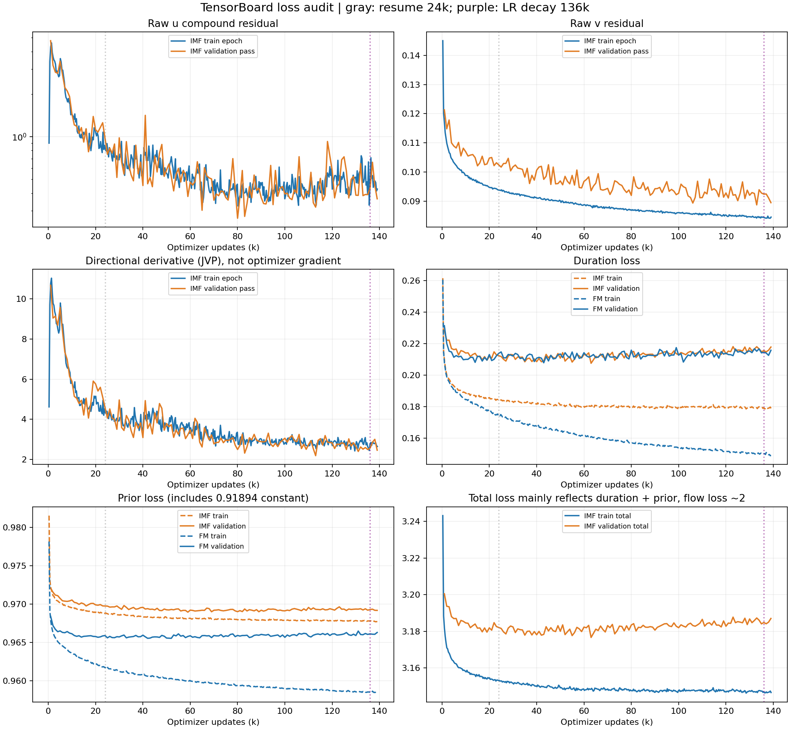
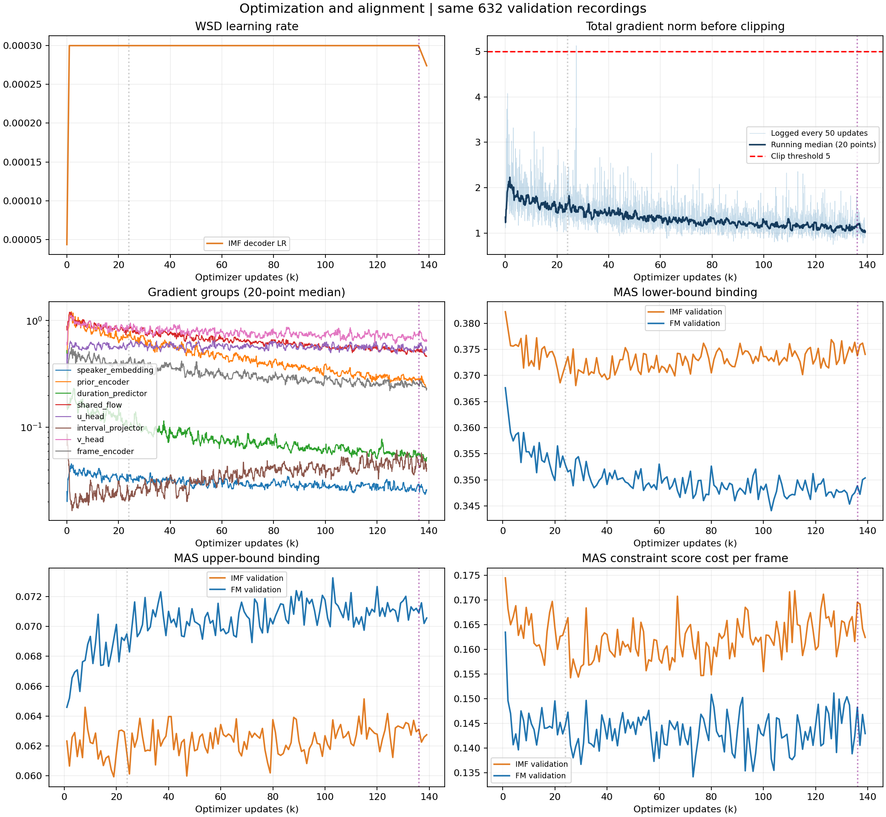
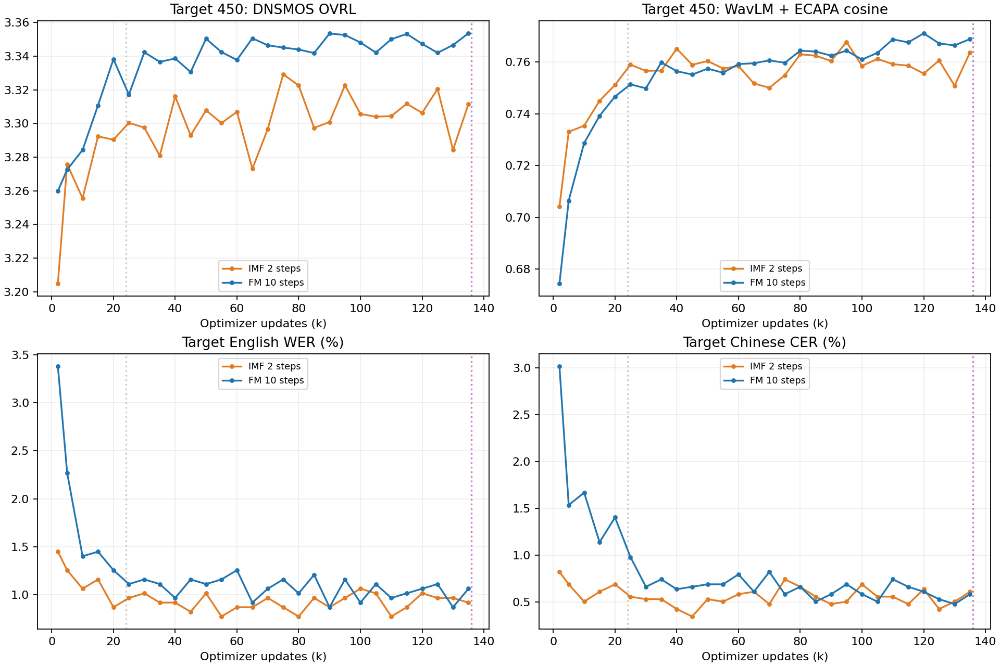

# IMF TensorBoard 指标审计

日期：2026-09-16 UTC。读取当前 `imf_h1_b48/version_0` 两份 event 文件的固定字节快照，覆盖训练至 **139,150 updates**、完整验证至 **139k**，并读取 FM 对照与共同完成至 **135k** 的 650 条生成评测。只读分析；没有更改训练、checkpoint 或原 TensorBoard 日志。所有训练步数在文中换算为完成的更新次数（TensorBoard 某些标量横轴少 1）。

**判断：没有已记录的数值崩溃证据，确有验证 step 横轴重叠问题；训练效果方面，u 的复合残差已进入平台并回升，duration 泛化出现轻度退化，生成音质长期未追平 FM。不能用接近常数的总 flow loss 宣告收敛，也不能据当前曲线断言必须立即停训。**

## 1. 730 条标量为何这么多

| 指标族 | 条数 | 用途 / 主要误读 |
|---|---:|---|
| `imf` | 24 | 6 项 × train/val × step/epoch；优先看原始 u/v MSE 与 JVP。 |
| `sub_loss` | 12 | duration、prior、diff × train/val × step/epoch。 |
| `mas_duration` | 112 | 28 种 MAS 分配诊断 × train/val × step/epoch；不是生成音频真实音素时长。 |
| `duration_mask` | 68 | 17 种 mask/约束诊断 × train/val × step/epoch；当前 masked_* 多数是代码设为零。 |
| `train` | 2 | duration/prior loss 权重，当前都固定为 1。 |
| `loss` | 4 | train/val 总损失的 step/epoch。 |
| `learning_rate` | 10 | 4 个优化器参数组 + lr 别名，各自 step/epoch；目前值相同。 |
| `grad_norm` | 497 | 497 条 = 496 个参数张量 + 1 个总范数；不是 497 种性能指标。 |
| `epoch` | 1 | 训练 epoch 计数。 |

一共 1,664,549 个记录值，95 条标量在本次快照内完全不变。逐条统计见 [指标清单 CSV](imf_training_record_assets/tensorboard_audit_20260916/all_tag_inventory.csv)。生成评测的 CER/WER、相似度、DNSMOS **没有被当前 watcher 写入 TensorBoard**，只保存在 `eval/`；这比缺少更多训练标量更影响判断效果。

## 2. 确认的显示与解释问题

### 验证 `_step` 横轴不是训练 step，且续训后重叠

`imf/val_u_mse_step` 的横轴在续训前走到 234，续训后从 0 重启；235 个横轴位置重复，共 55 条验证 step 指标出现回退。它们记录验证 batch 计数，不能与训练的 20k/100k 放在同一 step 轴上解读。恢复时按 global step 设置的 `purge_step=24001` 无法解决这种不同坐标的重叠。

**看验证趋势应选 `*_val_*_epoch` / `imf/val_*_epoch`**：它们的 step 单调、无重复，1000 步一次汇总完整验证 pass（这里的 `_epoch` 不表示一定等一个训练 epoch）。24k 在暂停前未完成验证，缺失是已知边界，不能拿状态文件携带的 23k 指标冒充 24k。`train_*_step` 与梯度每 50 步记录；`train_*_epoch` 是 340 updates/epoch 的汇总，24k 恢复所在 epoch 的后半段不能当作完整 340 步均值。

### `weighted≈1`、`diff≈2`、`loss≈3.18` 的含义

当前每个样本的原始平方误差和为 S，目标显示值为 `S / stopgrad(S + 0.01)`。当 S 很大时，u/v 各接近 1，总 flow loss 接近 2。分母停止梯度，因此参数仍然得到梯度；显示值接近常数不代表梯度为零。

所以总 loss 约等于 `2 + duration + prior`，后期总验证 loss 上升主要反映 duration。优先查看 `imf/val_u_mse_epoch`、`imf/val_v_mse_epoch`，不要用加权 loss 或 FM/IMF 总 loss 的绝对大小评判模型。

### 一些“正常值”不是效果证据

- `fm_fraction=0.5` 是规定一半样本走 r=t，不是学出来的结果。
- `duration_mask/*masked* = 0`：启用 constrained MAS 后，代码主动跳过上下界 outlier masking，不意味着所有时长目标都自然正确。
- `blank_* = 0`：135k 的 632 条验证诊断里根本没有 blank ID 0；这些比率分母被 clamp 后为零，不证明 blank 对齐好。
- `mas_duration/*mean`、`mel_per_token*` 部分几乎不变：固定数据总 Mel 帧数和 token 数基本决定了它们。
- TensorBoard 的 `speech_*` 只排除 blank 和 `_`，**还包含声调 token、标点与 `<sil>`**。例如验证 `speech_le2≈33.2%` 不能解释成 33.2% 的真正音素只有两帧。独立 duration 诊断的 `speech` 排除了这些特殊符号，口径不同。
- `*_max_epoch` / `*_min_epoch` 经跨卡与跨 batch 均值聚合，不是全验证集严格最大/最小值；各比率同样不是严格 token 加权的全数据比例。两者验证均为每卡 batch 16、相同的 632 条数据，但各模型自身产生的 MAS 目标可能不同。
- TensorBoard 的 Mel/对齐图片使用训练 **epoch** 作为横轴，而且 rank 0 的展示采样没有固定噪声种子，不应当成固定条件下的质量基准。

## 3. 确实值得关注的训练趋势

下面是区间内汇总点的均值，区间右端不包含；用于避开单个随机 batch 的波动，不代表多次独立训练。

| 指标 | 20k–40k | 80k–100k | 120k–136k |
|---|---:|---:|---:|
| 训练 u MSE | 0.74598 | 0.41563 | 0.50011 |
| 验证 u MSE | 0.80158 | 0.41290 | 0.48862 |
| 训练 v MSE | 0.09279 | 0.08645 | 0.08479 |
| 验证 v MSE | 0.10142 | 0.09425 | 0.09252 |
| 验证 JVP RMS | 4.20653 | 2.86074 | 2.67498 |
| 训练 duration loss | 0.18343 | 0.17965 | 0.17955 |
| 验证 duration loss | 0.21120 | 0.21358 | 0.21598 |
| 验证 prior loss | 0.96962 | 0.96920 | 0.96934 |

### u 平台与回升：优先级最高

验证 u MSE 从早期大幅下降，但 80k–100k 均值约 0.413，120k–136k 为 0.489；训练 u 同期从 0.416 升至 0.500。训练、验证一起回升，更符合 u 目标的优化平台/波动，**不单是验证集过拟合的典型形状**。与此同时 v 持续缓慢改善，JVP RMS 没有重新爆涨。

u MSE 是 `u + (t-r)·JVP` 对速度目标的复合残差，v MSE 是另一个目标，二者数值不能当相同难度的任务比较。推理实际使用 u，因此 v 变好不足以说明 2 步生成也会变好。现在缺少对角 r=t / 非对角、区间长度 h、语言/时长等分组误差，无法把平台精确归因到哪个子问题。

验证会重新采样 t/r、噪声，还随机选择 streaming 分支，因此单点 u 有额外噪声。139k 的 u=0.3647 不能单独证明已经解决；125k 的 u=0.7218 也不代表该 checkpoint 音频必然最差。

### duration 泛化缓慢变差；prior 基本进入平台

验证 duration 在 40k–60k 均值 0.2110，120k–136k 为 0.2160；训练则约 0.1810 → 0.1796。约 2.4% 的验证相对上升属于轻度泛化退化信号，不是 duration 崩溃。FM 也有较小的同类趋势：同期验证约 0.2119/0.2147（20k–40k / 120k–136k）。在线 MAS 目标也在更新，因此不能把它完全归因于传统固定标签过拟合。

Prior loss 包含常数 `0.5·log(2π)≈0.91894`。验证约 0.969 并不是“误差接近 1”；扣除常数再乘 2，归一化 Mel 平方误差约 0.101。后期验证 prior 基本平台，训练仍缓慢下降，泛化差距略扩大，但幅度很小。

## 4. 梯度、学习率与 MAS 有没有硬故障

- 全部已记录 IMF 标量没有 NaN/Inf；已记录的 496 个参数梯度范数没有任何一条全程为零，后期各组均有梯度。梯度存在不能证明每个参数方向都有效学习。
- 总梯度范数来自 **裁剪前** hook。2783 个采样点中，中位数 1.307，最大 5.126，发生在 27,450 updates；只有一个记录点超过 clip=5。后期中位数约 1.1，未见梯度爆炸或整体消失。日志每 50 步采样，这不是全量更新的裁剪率。
- 参数范数按平方和重建总范数，相对偏差最大 1.8e-07，与已记录 total 一致。IMF 与 FM 梯度量级不同，目标归一化不同，不能把比值直接理解成不稳定程度。
- 四个优化器参数组学习率一致，所有记录点与 WSD 公式一致（最大浮点误差小于 2e-11）。136k 开始线性下降，快照最后约 **2.741e-4**，170k 计划到 2e-5；没发现续训后 LR 错位。下降阶段目前只有约 3k 步，尚不足以判定最终收益。
- 记录中的 `infeasible_sample_ratio`、floor/ceiling rescale 比率均为零，未见这些监测项表示的约束不可行问题；零时长 token 比率也为零。标准 MAS/约束本身会保证若干此类性质，不能据此宣布对齐准确。
- 120k–136k IMF 验证 floor binding 约 37.4%、ceiling binding 约 6.3%；FM 约 34.8%/7.1%。约束仍在明显影响 MAS，值得观察，但没有通用阈值证明这些占比异常。分母只含设有对应界限的 token，不是全部音素。
- 独立 135k duration 诊断中，真实语音 token 的预测时长标准差 / 自身 MAS 标准差约 **0.65–0.67**，与 20k 的 0.67–0.69 接近，仍有时长变化被压平的现象；FM 135k 约 0.63–0.67，属于两者共有的限制。MAS 不是人工真实时长，不能由此直接判定韵律错误或模型排名。

## 5. loss 与生成质量没有一一对应

同 checkpoint 的目标 450 条（中文 200、英文 200、混读 50）均值；FM 10 步、IMF 2 步，其余固定评测协议一致。WavLM 指使用现成微调权重的 **WavLM + ECAPA-TDNN** 余弦相似度；DNSMOS 是自动预测分数。

| Step | Val u MSE ↓ | IMF DNSMOS ↑ | FM DNSMOS ↑ | IMF WavLM+ECAPA ↑ | FM WavLM+ECAPA ↑ |
|---:|---:|---:|---:|---:|---:|
| 80k | 0.2660 | 3.3226 | 3.3440 | 0.7630 | 0.7644 |
| 100k | 0.3942 | 3.3057 | 3.3481 | 0.7585 | 0.7610 |
| 110k | 0.3940 | 3.3044 | 3.3500 | 0.7592 | 0.7688 |
| 120k | 0.5768 | 3.3063 | 3.3473 | 0.7555 | 0.7711 |
| 125k | 0.7218 | 3.3205 | 3.3420 | 0.7606 | 0.7672 |
| 130k | 0.3866 | 3.2843 | 3.3466 | 0.7508 | 0.7664 |
| 135k | 0.3902 | 3.3116 | 3.3536 | 0.7637 | 0.7689 |

125k→130k，验证 u 从 0.722 降至 0.387，但 IMF DNSMOS 从 3.321 降至 3.284、相似度从 0.761 降至 0.751，说明 **不能按最低 u loss 自动选择听感最好的 checkpoint**。135k 相似度恢复至 0.764、DNSMOS 回升至 3.312，130k 不是已确认的持续退化起点。

在共同完成的 28 对 checkpoint 中，FM 的目标 DNSMOS 有 27 个更高。后期实际生成音质未随 v loss 的缓慢下降而持续改善，这个脱节比加权 loss 接近常数更值得重视。

## 6. 建议的阅读顺序与下一步

1. **主要看生成指标**：按 checkpoint 同时看分语言 CER/WER、WavLM+ECAPA、CAMPPlus、DNSMOS，并听固定样本。当前这些评测没有进 TensorBoard，后续应另加按训练 global step 记录的评测曲线。
2. **主要看六条训练诊断**：`imf/val_u_mse_epoch`、`imf/val_v_mse_epoch`、`imf/val_jvp_rms_epoch`、`sub_loss/val_dur_loss_epoch`、`sub_loss/val_prior_loss_epoch`、`grad_norm/grad_2.0_norm_total`；训练对应 epoch 曲线用作参照。
3. **控制项**：`learning_rate/decoder_step`、MAS infeasible/rescale、约束 binding 与 score gap。当前 LR 已开始下降，保留现有 170k 计划观察衰减阶段表现；现有证据不支持仅凭这些数值立即停训或再次加大学习率。
4. **下一轮诊断最有价值的新增项**：固定验证随机种子/噪声与 streaming 模式，拆分 diagonal/off-diagonal u 残差、不同 h 区间，以及真正语音 token 的语言分组时长指标。这是需要补充的证据，不是已经执行的训练改动。
5. 暂时隐藏验证 `*_step`、大部分单参数梯度、重复 LR 别名与恒零 mask 项即可显著减少阅读负担；原始记录仍保留用于定位故障。

## 7. 可复核证据

- [全部 IMF/FM 标量统计](imf_training_record_assets/tensorboard_audit_20260916/all_tag_inventory.csv)
- [关键原始曲线 CSV](imf_training_record_assets/tensorboard_audit_20260916/core_series.csv)
- [分窗口统计](imf_training_record_assets/tensorboard_audit_20260916/window_statistics.csv)
- [分组梯度](imf_training_record_assets/tensorboard_audit_20260916/gradient_groups.csv)
- [生成评测汇总与原文件路径](imf_training_record_assets/tensorboard_audit_20260916/generation_quality.csv)
- [审计摘要](imf_training_record_assets/tensorboard_audit_20260916/audit_summary.json)
- [event 提取脚本](imf_training_record_assets/tensorboard_audit_20260916/extract_events.py)、[分析脚本](imf_training_record_assets/tensorboard_audit_20260916/analyze.py)

代码依据：运行快照 `source/lits/models/base.py`（日志坐标、梯度、统计口径），`source/lits/models/components/improved_mean_flow.py`（目标与随机采样），`source/lits/models/lits.py`（prior/MAS/mask），`source/training/majestic_scratch/schedule.py`（LR），`source/training/majestic_scratch/watch_eval.py`（评测输出）。完整冻结的数值提取位于 `/119010446/tts-assets/diagnostics/imf_tensorboard_20260916/`。
