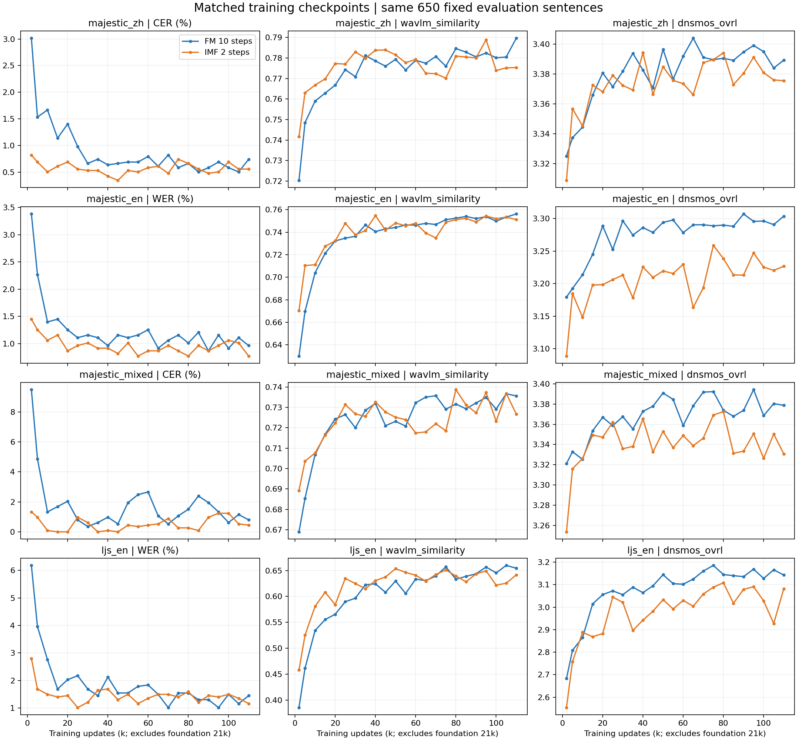

# IMF 与 FM：相同训练 checkpoint 的性能对比

分析日期：2026-09-16 UTC。配对 **23 个完整 checkpoint（2k–110k）**，每个模型每个 checkpoint 均为固定 650 条。1k 为小样本 smoke，不混入；分析开始时 IMF 115k 尚未完成，固定截至 110k。以下数值均来自已有完整评测，本次没有重新训练或更改推理配置。

**结论：IMF 2 步较早达到较低识别错误率；后期准确率接近且有波动，不能说全面优于 FM。FM 10 步的目标音色 DNSMOS 在 22/23 个配对 checkpoint 更高；到 110k，FM 的 WavLM/CAMPPlus 也在四个分组全部更高。当前表现是低步数推理与音质之间的取舍。**

## 比较口径

- FM：`ljs_majestic_100h_backbone21k_20260914`；IMF：`ljs_majestic_100h_imf_h1_b48_from21k_500ep_20260915`，即 `imf_h1_b48/version_0` 的 3e-4 基线。
- “同 checkpoint”按各自本轮 optimizer update 配对，均不计共同 Foundation 21k。相同初始化谱系、冻结数据、有效 batch 192、峰值 LR 3e-4；110k 前均处于相同计划的稳定学习率阶段。不是同一权重文件，也不是相同训练耗时比较。
- 推理采用已有设置：**FM 10 步 Euler，IMF 2 步 Euler**；temperature=1，相同逐条随机种子规则、token/tone、speaker 与参考录音；原始 24kHz Vocos。读取到的 Vocos 权重 SHA-256 为 `1d60c04156e59348566c65cab921591e1651ab48757ca3766caf9459475bd1c2`，原 FM 工作树与 IMF 快照一致。
- 固定目标中文 200、目标英文 200、目标混读 50、LJS 英文 200。逐对核验 650 个 ID、文本、speaker、token/tone、ASR 分母与 DNSMOS 协议一致；所有纳入结果均无评测失败。评测清单 SHA-256：`957efd16aba7e038b283e981b62e37ecbafafe46af5cef7e4112c54e2e3931d3`。
- 中文/混读报 micro CER，英文报 micro WER，均为百分数，越低越好；WavLM、CAMPPlus、DNSMOS 越高越好。目标音色/音质汇总按 450 句加权，不含 LJS。四组参考录音不同，主要看同组模型差异。
- DNSMOS 是自动预测音质分数，不是人工 MOS，不能单凭它断言某种噪声已解决。总训练 loss 定义不同，不用于性能排名。

## 多 checkpoint 主表

**每格顺序均为 FM / IMF。** 下图展示全部 23 个配对 checkpoint 的分组趋势。

| 训练 step | 英文 WER% ↓ | 中文 CER% ↓ | 混读 CER% ↓ | 目标音色 WavLM ↑ | 目标音质 DNSMOS ↑ |
|---:|---:|---:|---:|---:|---:|
| 2k | 3.380 / 1.449 | 3.016 / 0.820 | 9.486 / 1.330 | 0.6745 / 0.7042 | 3.2599 / 3.2049 |
| 10k | 1.400 / 1.062 | 1.667 / 0.503 | 1.330 / 0.089 | 0.7287 / 0.7354 | 3.2842 / 3.2555 |
| 20k | 1.255 / 0.869 | 1.402 / 0.688 | 2.039 / 0.000 | 0.7467 / 0.7511 | 3.3382 / 3.2904 |
| 40k | 0.966 / 0.917 | 0.635 / 0.423 | 0.975 / 0.089 | 0.7565 / 0.7651 | 3.3386 / 3.3161 |
| 60k | 1.255 / 0.869 | 0.794 / 0.582 | 2.660 / 0.443 | 0.7592 / 0.7585 | 3.3378 / 3.3069 |
| 80k | 1.014 / 0.773 | 0.661 / 0.661 | 1.507 / 0.266 | 0.7644 / 0.7630 | 3.3440 / 3.3226 |
| 100k | 0.917 / 1.062 | 0.582 / 0.688 | 0.621 / 1.241 | 0.7610 / 0.7585 | 3.3481 / 3.3057 |
| 110k | 0.966 / 0.773 | 0.741 / 0.556 | 0.798 / 0.443 | 0.7688 / 0.7592 | 3.3500 / 3.3044 |

IMF 在 2k 的目标英文 WER 从 FM 的 3.380% 降至 1.449%，中文 CER 从 3.016% 降至 0.820%，混读 CER 从 9.486% 降至 1.330%，早期优势很清楚。但 100k 三项错误率都反向变差，110k 又全部较低，说明后期不能挑一个点判定稳定领先。

60k–110k 共 11 个配对点中，IMF 英文 WER 更低/相同/更高为 9/1/1，中文 CER 为 5/2/4，混读 CER 为 9/0/2。这些是相关 checkpoint 的描述性计数，不是独立实验次数。

目标 450 条的 DNSMOS OVRL：IMF − FM 的差值范围为 -0.0776 至 +0.0032；22/23 个点较低，唯一例外是 5k（IMF 高 0.0032）。110k 为 3.3044 对 3.3500，差 −0.0456。IMF 后期音质未呈现随训练步数持续追平的趋势。

## 110k 分语言与音色

每格仍是 **FM / IMF**。英文 ASR 栏为 WER，中文和混读为 CER。

| 组别 | ASR 错误率% ↓ | WavLM ↑ | CAMPPlus ↑ | DNSMOS OVRL ↑ | DNSMOS SIG ↑ | DNSMOS BAK ↑ |
|---|---:|---:|---:|---:|---:|---:|
| 目标中文 | 0.7407 / 0.5556 | 0.7896 / 0.7753 | 0.6990 / 0.6982 | 3.3892 / 3.3755 | 3.6376 / 3.6249 | 4.1388 / 4.1322 |
| 目标英文 | 0.9657 / 0.7726 | 0.7562 / 0.7512 | 0.8060 / 0.7931 | 3.3036 / 3.2267 | 3.5484 / 3.4882 | 4.1395 / 4.0945 |
| 目标混读 | 0.7979 / 0.4433 | 0.7356 / 0.7267 | 0.6753 / 0.6702 | 3.3788 / 3.3307 | 3.6260 / 3.5864 | 4.1463 / 4.1210 |
| LJS 英文 | 1.4486 / 1.1589 | 0.6545 / 0.6416 | 0.8433 / 0.8328 | 3.1424 / 3.0820 | 3.5231 / 3.4635 | 3.8632 / 3.8436 |

110k 的主要音质差距出现在目标英文（OVRL 低约 0.077）与 LJS 英文（低约 0.060）；目标中文差距约 0.014。四组 WavLM 均低于 FM，CAMPPlus 也均略低，其中目标中文 CAMPPlus 几乎持平。

混读 CER 只覆盖当前归一化后的字符错误；已有英文片段 WER 在 110k 为 FM 6.25%、IMF 8.33%（仅 50 句中的少量英文词）。因此混读 CER 改善不能解释成中英两部分都更好。

## 最新点的不确定性

按同一文本配对重采样 4000 次，seed=20260916。错误率差值单位为百分点，其余为原分数。区间只反映固定评测文本的抽样不确定性，不含不同训练 seed/推理 seed 的变化，不作多重比较校正。

110k 四组 ASR 差值区间都跨过 0，因此该点错误率数值较低不足以确认稳定优势；四组 DNSMOS 差值区间均在 0 以下，目标中文上界非常接近 0。

| 组别 | 指标 | IMF − FM | 配对 bootstrap 95% 区间 |
|---|---|---:|---:|
| 目标中文 | cer | -0.1852 | [-0.4475, +0.0794] |
| 目标中文 | wavlm_similarity | -0.0143 | [-0.0184, -0.0102] |
| 目标中文 | camp_similarity | -0.0008 | [-0.0038, +0.0023] |
| 目标中文 | dnsmos_ovrl | -0.0137 | [-0.0278, -0.0002] |
| 目标英文 | wer | -0.1931 | [-0.5169, +0.0950] |
| 目标英文 | wavlm_similarity | -0.0050 | [-0.0099, +0.0001] |
| 目标英文 | camp_similarity | -0.0130 | [-0.0166, -0.0095] |
| 目标英文 | dnsmos_ovrl | -0.0770 | [-0.0966, -0.0579] |
| 目标混读 | cer | -0.3546 | [-1.6711, +0.6284] |
| 目标混读 | wavlm_similarity | -0.0089 | [-0.0186, +0.0005] |
| 目标混读 | camp_similarity | -0.0051 | [-0.0143, +0.0035] |
| 目标混读 | dnsmos_ovrl | -0.0481 | [-0.0743, -0.0220] |
| LJS 英文 | wer | -0.2897 | [-0.8358, +0.2053] |
| LJS 英文 | wavlm_similarity | -0.0129 | [-0.0217, -0.0042] |
| LJS 英文 | camp_similarity | -0.0104 | [-0.0158, -0.0047] |
| LJS 英文 | dnsmos_ovrl | -0.0604 | [-0.0940, -0.0269] |

## 推理效率与 duration 的边界

IMF 使用 2 次采样更新，FM 使用 10 次，采样更新次数减少 80%。**这不等于端到端快 5 倍**：声学网络路径、duration/prior、Vocos、I/O 与共享 GPU 负载都会影响时间。历史 `synthesis_seconds` 包括 waveform 写盘且测量环境未隔离，本报告不把它当受控延迟 benchmark。尚无 FM 同 checkpoint 2 步对照，因此这里证明的是现有 IMF-2 与 FM-10 配方的差异，不把收益全部归因于训练目标。

本次分析包含 632 条 duration 诊断记录。其中相关性/MAE 都是相对于各模型自身产生的 MAS，对齐目标也会改变，不能当作共同真实时长标签上的准确率来排名。

## 可追溯数据

- [IMF 训练与恢复记录](imf_training_record_zh.md)、[FM 训练记录](majestic_training_record_zh.md)

原始结果位于两实验各自的 `eval/step_XXXXXXXX/summary.json` 与 `details.jsonl`。本报告复核各组 micro 错误率和音色/音质均值与逐句数据一致。
