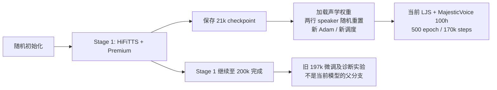
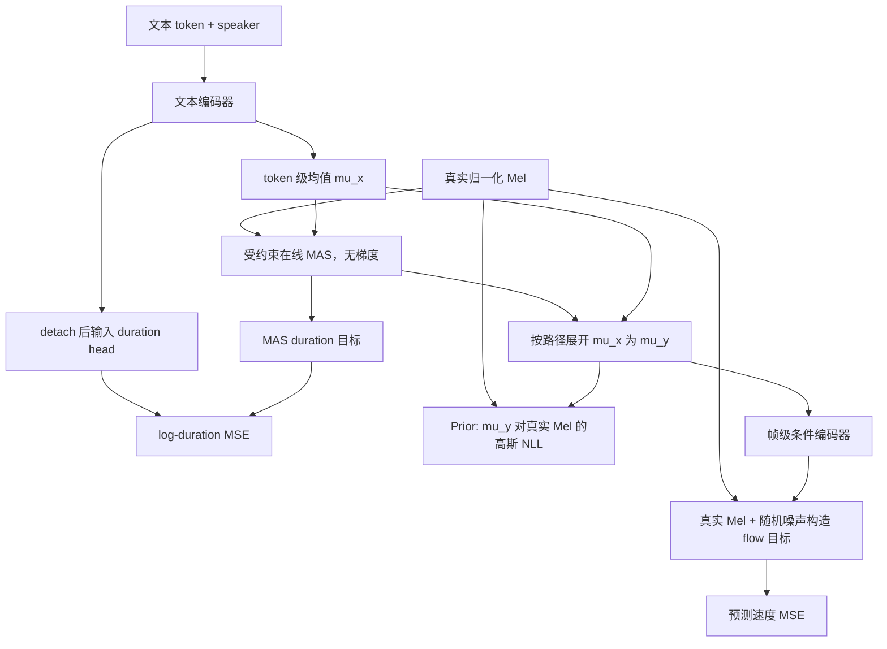

# LITs 当前模型完整训练记录：Stage 1 → 21k 初始化 → LJS + MajesticVoice 100h

> 本文记录实际执行的训练，核对启动命令、冻结 plan、模型配置、数据清单、源代码快照和审计报告。统计截止时间、运行状态见第 1 节。训练尚在进行时，本文中的结果是时间快照，不代表最后完成结果。

后续直接配对 iMF 训练、interval scale 修复、3e-4/5e-4 对照、u loss 偏高与暂停恢复记录，见 [iMF 训练与 loss 诊断记录](imf_training_record_zh.md)。

## 1. 模型身份、谱系与记录时间

记录时间：**2026-09-15T01:47:41+00:00**。

- Stage 1：`/119010446/tts-assets/training_runs/hifitts_premium_stage1_lr3e-4_20260911`。
- 当前模型：`/119010446/tts-assets/training_runs/ljs_majestic_100h_backbone21k_20260914`。
- 当前数据项目：`/ai_sds_wuzz/DATA_TTS/MajesticVoice_200h_20260913`。目录中的 `200h` 是历史名称，最终选入目标音色训练的是 **100h**。
- 文档采集时：新训练 **154260 / 170,000 steps**，日志 epoch=453（从 0 开始），启动记录状态 **running**。不能把计划 500 epoch 当作已经完成。
- 当前新训练启动时间：**2026-09-14 07:41:39 UTC**。全部新训练步数从 0 计，不包含父模型先前的 21k。



父 checkpoint：`/119010446/tts-assets/training_runs/hifitts_premium_stage1_lr3e-4_20260911/eval/step_00021000/checkpoint.ckpt`。

SHA-256：`1bbf20d7b741c11c52db74901a5bfd7655b6e4e38ffe610bcf1418454c7da86b`。

准备后的初始化文件：`/119010446/tts-assets/training_runs/ljs_majestic_100h_backbone21k_20260914/initialization.ckpt`，SHA-256：`1ee4744264e35b457688a3192b9b627e192e7094fd71d481e16a92748cfb9889`。

早期 197k 微调、仅 MajesticVoice 微调、从零训练提案，以及 250 epoch/171k 步估算均与当前最终执行方案不同。当前不是这些实验的连续 resume，也没有继承它们的 optimizer、speaker 行或 checkpoint。

## 2. 两阶段实际配置总览

| 项目 | Stage 1 正式 3e-4 实验 | 当前训练阶段 |
|---|---|---|
| 声学初始化 | 全随机 | Stage 1 21k 权重，speaker 两行例外 |
| 数据 | HiFiTTS + Premium 原录音 | LJS 原录音 + MajesticVoice 合成录音 |
| 唯一训练量 | 709,208 条，1,146.865h | 65,282 条，121.049h |
| speaker | 所有实际说话人共用 ID 0；ID 1 未使用 | ID 0=LJS；ID 1=目标中/英/混读 |
| embedding | 2×64 | 2×64，两行重新随机初始化 |
| batch | 4×144=576 | 4×48=192 |
| 采样 | 两来源按条数 1:1 配平，重复较小池 | 唯一条目自然混合，不配平 |
| 预算 | 200,000 steps，已完成 | 500 epoch=170,000 steps |
| LR | 1000 步 warmup，cosine 3e-4→6e-5 | 1000 步 warmup，stable，linear decay 3e-4→2e-5 |
| 更新范围 | 全模块 | 全模块，从新 step 0 开始 |
| 优化器 | Adam，新建 | Adam，新建，不加载旧状态 |
| 精度/裁剪/累积 | BF16 mixed / norm 5 / 无累积 | 同左 |
| 对齐和 loss | constrained online MAS；dur/prior/flow=1:1:1 | 同左 |
| 固定验证 loss | 512 条 | 632 条 |
| 完整生成评测 | 450 条 | 650 条 |

## 3. Stage 1：原始声学基础如何训练

### 3.1 正式实验与早期试验

正式 Stage 1 开始于 2026-09-11 10:17:51 UTC，结束于 2026-09-13 00:22:01 UTC，完成 200,000 步，约 38.07 小时（包含验证等开销）。`ckpt_path=null`、`init_ckpt_path=null`，不加载任何旧 LITs 权重。

之前的 1e-4 实验曾在 9k 恢复以应用 flow padding 修复，随后停止；末尾日志 28,450 步，保留过 28k checkpoint。正式 3e-4 实验从头重训，从第 0 步使用修复后的 valid-frame flow loss，不是直接调高旧 optimizer LR 继续训练。

### 3.2 Stage 1 数据

| 来源 | train 条数/h | val 条数/h | test 条数/h |
|---|---|---|---|
| HiFiTTS 英文 | 320,897 / 289.209 | 494 / 0.599 | 991 / 1.210 |
| WenetSpeech4TTS Premium | 388,311 / 857.656 | 2,396 / 5.406 | 2,081 / 4.784 |
| 合计 | 709,208 / 1,146.865 | 2,890 / 6.006 | 3,072 / 5.994 |

HiFiTTS 用官方 train/dev/test。Premium 按原录制组 ID 的 SHA-256 哈希划分：前 8 位对应整数模 1000，0–4 为 val，5–9 为 test，其余 train；同一录制的切片不跨集合。

准备处理 731,472 条候选，排除时长不在 0.5–20s 的 12,983 条、空/未知编码 274 条、训练与保留文本音素重叠 3,026 条、val/test 音素重叠 19 条。该音素哈希去重不等于语义去重。数据读取使用冻结 SQLite：`/119010446/tts-assets/data_24k/foundation/dataset.sqlite`；其历史冻结哈希见 Stage 1 实录与 integrity.json。重新无序并行建库可能改变行顺序，不能只靠随机种子复现相同 batch。

HiFiTTS 原采样率 44.1kHz，Premium 为 16kHz；读取时 soxr HQ 转 24kHz，不改写原录音。多个真实说话人共用 speaker 0，不能解释成单一自然音色；其数据中的音色、语速差异仍在。

### 3.3 Stage 1 采样与 LR

较大的 Premium 池 388,311 条每轮遍历；HiFiTTS 重复打乱补到同样条数。合并、打乱后，以 `576×50` 个样本为窗口按长度排序，切全局 batch，再打乱 batch 和批内顺序，四卡各取 144 条。按来源 1:1 是整轮条数，不是每批、每卡或音频时长 1:1。尾部不足 576 的 batch 丢弃，每轮 1,348 次更新。

seed=20260911；每卡 8 个 worker；persistent workers；无二次 DistributedSampler；完整录音训练，`out_size=null`。

所有 Adam 组使用同一 LR。设更新前 step 为 s，P=3e-4、F=6e-5：

- s<1000：`P*(0.1+0.9*(s+1)/1000)`；第一次更新 3.027e-5。
- s≥1000：`F+(P-F)/2*(1+cos(pi*(s-1000)/199000))`。

200k 结束约为 6e-5。调度是 callback 每批写 optimizer LR，故 checkpoint 中空 `lr_schedulers` 不表示没有调度。无自动冻结、无 prior/duration loss 权重衰减。

### 3.4 Stage 1 结果和为什么选 21k

| 验证 step | Duration | Prior | Flow | Total |
|---|---:|---:|---:|---:|
| 10k | 0.37250 | 1.00402 | 0.25541 | 1.63193 |
| 21k | 0.35269 | 1.00180 | 0.21931 | 1.57380 |
| 100k | 0.34206 | 0.99942 | 0.21220 | 1.55368 |
| 197k | 0.34832 | 1.00013 | 0.21346 | 1.56191 |
| 200k | 0.34519 | 1.00029 | 0.18328 | 1.52875 |

Stage 1 每 1k 验证固定中英各 256 条并保存，1k 启动生成检查每组 8 条；之后通常每 2k 评估固定英文 200、中文 200、混读 50，额外评估最终 200k。197k 的英文 WER 1.352%、中文 CER 4.656%、混读 CER 34.220%；200k 分别为 1.738%、5.926%、33.067%。这些不是当前数据/音色上的指标。

#### 为什么没有继续用 197k：主要顾虑是 duration 与对齐

当时转向较早 checkpoint 的主要动机，是 **197k 已出现明显的 duration 长短变化压缩，尤其是中文，且其 MAS 时长也不能直接作为可靠监督**。希望保留已经学到的声学基础，再用 LJS 与目标音色数据联合适配时长、对齐和生成网络；担心继续沿用 197k 会继承旧数据下已有的时长与声学条件关系。这是选择初始化的判断依据，尚未通过迁移训练对照证明这种继承一定妨碍新域学习。

197k 的只读诊断使用固定验证集 512 条（中文、英文各 256 条），排除静音、标点和独立声调等特殊 token，比较 `exp(logw)` 与该模型自身 MAS 时长：

| Duration 指标 | 中文 | 英文 |
|---|---:|---:|
| 预测 Std / MAS Std，取整前 | 0.385 | 0.508 |
| 预测与 MAS 的 Pearson Corr，取整前 | 0.419 | 0.501 |
| 每句分别归一化到均值 1 后，实际推理时长 Std / MAS Std | 0.432 | 0.511 |

也就是说，预测的 token 长短变化比 MAS 平缓得多；中文在消除整体语速差异后仍然明显压缩，因此不能仅归因于说得快、推理取整或声调限幅。与此同时，验证 duration loss 从 21k 的 0.35269 到 197k 的 0.34832 只小幅下降，较低的平均 log-duration MSE 并没有保证局部节奏变化得到保留。[197k duration 诊断报告](/119010446/tts-assets/training_runs/hifitts_premium_stage1_lr3e-4_20260911/diagnostics/duration_smoothing_197000_20260914/REPORT.md)

但当时也没有采用“直接换成 MAS duration”或“强行放大预测方差”：三条中文在固定噪声、相同总时长的对照中，用户反馈 MAS 版本更难听清；后续复核确认路径展开实现正确，预测 duration 与 MAS duration 的合并 CER 分别为 17.9% 和 51.8%。增加 flow 步数、取消 MAS 显式约束及简单插值均未优于预测基线。这些小样本结果提示需要一起审视 MAS 对齐与 flow 对时序条件的适配，不能只把 duration head 当成已定位的唯一故障，也不能把 197k 的 MAS 固定下来当 teacher。[中文 duration 替换与消融报告](/119010446/tts-assets/training_runs/hifitts_premium_stage1_lr3e-4_20260911/diagnostics/duration_failure_197000_20260914/REPORT.md)

#### 为什么具体选 21k，以及选择的边界

旧日志中约 20k 后 prior/duration 的下降已明显放缓，flow 到约 60k 仍有小幅改善；当时用户选择复用中早期声学基础，并明确不做迁移 A/B 训练。因此选用了完整保存的 **21k**；20k 常规文件已不在保存集。21k/41k/61k/99k/197k 曾在同一批 48 条新域样本上做只读诊断，包含 speaker 重置前后比较，但没有执行优化更新，不能据此声称 21k 的 duration 更准确、迁移收敛更快或最终效果最好。[初始化选择记录](/ai_sds_wuzz/DATA_TTS/MajesticVoice_200h_20260913/reports/backbone_initialization_review/selection.json)、[同批新域诊断](/ai_sds_wuzz/DATA_TTS/MajesticVoice_200h_20260913/reports/backbone_initialization_review/summary.json)

实际执行仍加载了 21k 的 duration head 和其余声学权重，未把 duration head 随机重置；仅重置两行 speaker embedding，并新建 Adam、调度和 global step。全部模块从新 step 0 联合更新，MAS 随当前模型在线重算，不固定使用 21k 或 197k 的对齐路径。21k 同样存在时长分布压缩，不能视为无旧数据偏差的初始化；此选择提供了重新适配的起点，并未保证解决中文机械感或外国腔。MAS 本身也不是人工时长真值，以上诊断不能单独证明 duration 是这些听感问题的主要原因。

Stage 1 更完整的排除、容量、历史评测和诊断在 [Stage 1 训练实录](stage1_training_zh.md)。

## 4. 共享模型、前端和声学表示

### 4.1 结构

声学模型 23,799,149 参数：prior/text encoder 9,319,844；duration head 395,009；speaker embedding 128；decoder（帧级条件编码器+flow）14,084,168。Vocos 声码器单独加载，不在声学 optimizer 中。

- 173-token 中英 rhyme-body-tone 前端；cleaner=`en_zh_dict_mixed_rhyme_body_tone_cleaners`；加开头 sil，不插入额外 blank。
- 文本 embedding 192 维，speaker 64 维；文本主干 256 维、6 层 RoPE、2 头、FFN 768、dropout 0.1、prenet 开启。
- prior 均值输出 100 维；duration 为两层 Conv，hidden 256、kernel 3、dropout 0.1。
- 帧级条件编码器 6 层、hidden 100、2 头、FFN 2048；flow 速度网络通道 [256,256]，2 个 middle block、SnakeBeta、dropout 0.05。
- 流式配置含 static_chunk_size=50、decoder_left_frames=20，训练随机流式/非流式；常规完整句评测默认非流式路径。

**声调配置要区分**：当前和 Stage 1 均为 `n_tones=0`，没有额外 additive tone embedding；`mas_n_tones=5` 服务于声调 token 识别和时长边界。中文声调通过 rhyme-body-tone 序列中的声调符号等前端表示提供，不应写成“另有一个五类 tone embedding 已在训练”。缓存保留 tone IDs 不等于启用了那个可选分支。

### 4.2 Mel 与归一化

24kHz，单声道；FFT=2048，window=1536，hop=384（16ms），100 Mel bins，0–12kHz。幅度谱经 Mel 滤波后自然对数压缩，最小值 1e-5。

Stage 1 从每来源 2,048 条训练录音、共 4,096 条估计共享标量 mean/std，非逐句/逐频带统计；原统计高精度为 -5.604226163908895 / 3.2161116943289363。checkpoint float32 保存为 **-5.604226112365723 / 3.216111660003662**；当前直接复用这两个 buffer，不在新数据上重估尺度。

输入归一化 `(log_mel-mean)/std`；合成送入声码器前按模型路径反归一化。文本和 Mel padding 使用真实长度 mask；训练不随机裁切完整录音。

## 5. MAS、Duration、Prior 和 Flow 的实际监督



### 5.1 MAS 与 duration

真实 Mel y 与 token 均值 mu_x 的单位方差高斯 log probability 决定单调路径。当前 `duration_constrained_mas=true`、`use_precomputed_durations=false`，路径在 no_grad 内计算并 detach。

中文 floor scale=1，英文 ARPA floor scale=0.5，全局最小 floor=2 帧；tone ceiling=3 帧。`tone_floor_frames=1` 不能独立解读，组合后合法 MAS tone 通常为 2–3 帧。推理 tone 限幅为 1–3 帧。ARPA/中文离线时长统计仅提供边界和异常目标规则，不是逐句人工时长真值。

Duration target 为 MAS 每 token 的帧数 d；预测为 logw。loss 是 `(logw-log(d+1e-8))²` 加监督 mask，除以有效 token 数。异常目标被 mask，但分母仍按原有效长度计算。文本主干输出在 duration 分支入口 detach，duration loss 不直接反传文本主干；duration head 本身正常更新。

### 5.2 Prior 不是“只监督 std”

`Lprior = Mean_valid[0.5*(y-mu_y)^2] + 0.5*log(2*pi)`。

这里学习的是均值 mu，方差固定为 1；固定常数约 0.91894。**Prior 直接用真实 Mel 的平方误差监督均值**。duration 诊断中的 Std ratio 是另一项统计，不是 prior 的可训练标准差。一个 token 展开的多帧起初共享 mu，帧内精细变化由后续网络生成。

### 5.3 Flow 如何使用 prior

帧级 mu_y 先经过条件编码器，再与当前 noisy Mel 沿通道拼接；速度估计器同时收到 speaker 条件和时间 t。每次 Euler 更新都使用该条件。不是把 prior 当作最终 Mel，也不是简单预测 `Mel-prior` 残差。

令 z 为标准高斯噪声，t 为随机 U(0,1)，sigma_min=1e-4：

`x_t = [1-(1-sigma_min)*t]*z + t*y`

`u = y-(1-sigma_min)*z`

`Lflow = Mean_valid[(v_theta(x_t,t,encoded_mu,speaker)-u)^2]`

训练 flow 使用真实 Mel 构造速度目标，梯度经条件编码器回到 prior/text encoder。没有完整采样若干 Euler 步后再对最终 Mel 单独计算重建 loss；这不等于没有真实 Mel 监督。推理从 `z*temperature` 开始，不是从 `mu+z` 开始。

三项权重始终 **1:1:1**，没有 F0、ASR、speaker 相似度或 DNSMOS 辅助训练 loss。这些外部模型用于数据筛选/评测，不提供反向传播。每个 rank 先按本地有效 token/帧归一化，再 DDP 平均梯度，不是全局有效元素统一加权平均。

Flow 在每次前向约 50% 选择流式或非流式；验证也有随机时间和噪声。flow loss 不保证单调下降；总 loss 的下降不直接证明口音变自然。

## 6. 当前 100h 目标音色数据如何生成

### 6.1 文本、音频与参考的来源

文本使用 Foundation **train** 完整转写、Emilia2 已有完整转写，以及用户批准的 4,997 条既有 DOTA-ME-CS GPT-4o/人工检查脚本（DOTA 仅进入 train）。本任务不新生成 LLM 文本，不拼接句子。Foundation train 文本的复用被明确允许，因此不能声称当前 train 与整个 Stage 1 train 文本互斥。

排除范围覆盖保留/外部评测文本、旧目标语料等禁止集合；近似文本匹配和音素哈希去重继续执行。按来源组隔离 train/val/test，最终联合审计的跨 split 音频、音素以及 train/外部评测音素重叠均为 0。文本复用与原录音复用不同：目标音色实际训练的是新合成音频，LJS 才使用原录音。

合成引擎为 VoxCPM2（本地模型 `/119010446/tts-assets/VoxCPM2`，vLLM-Omni 服务）。中文/混读用最初中文参考；英文后来改用用户试听选择的 candidate 72003，同时修改英文 QC reference：

- 中文/混读：`/ai_sds_wuzz/DATA_TTS/MajesticVoice_200h_20260913/reference/ts004_cn_000001.wav`。
- 英文：`/ai_sds_wuzz/DATA_TTS/MajesticVoice_200h_20260913/candidates/wavs_24k/72003.wav`，文本为 “Archie sends his love, and will, with me, be very glad to welcome you to your old home, should you care to visit it.”

这是经用户批准的英文音色目标调整。英文相似度不是对原中文参考计算，不能把两个参考下的通过率当同一指标。每条 synthesis/QC 元数据保存参考路径和哈希；早期已合格候选保留其原评分信息，最终审计按记录核对。

### 6.2 候选与质检

每轮 2 个候选，本轮评分完成后选最佳合格录音。最终上限：中文 4、英文 4、混读 8；英文曾为 12（test 曾 14），后因后几轮收益低改到 4。不是每句固定生成满上限；有合格结果即结束该文本。一个独立文本仅选一个 winner 计入训练小时。

| 门槛 | 实际要求 |
|---|---|
| 中文内容 | CER≤2%；可接受带声调拼音完全一致且原始 CER≤5% 的同音例外 |
| 英文内容 | WER≤2%，CER≤2% |
| 混读内容 | 英文 WER=0，中文 CER≤2% |
| WavLM / CAMPPlus | ≥0.70 / ≥0.68 |
| DNSMOS OVRL / SIG / BAK | ≥3.3 / ≥3.5 / ≥3.8 |
| 时长 | 3–20 秒 |
| 削波比例 | ≤0.0005 |
| 有声占比 | ≥0.55 |
| 首部/尾部/内部静音 | ≤0.4 / 0.6 / 0.8 秒 |
| 格式与前端 | 24kHz mono PCM16，无未知 token，Mel 帧足够容纳编码 |

Qwen3-ASR 不传参考文本提示。阈值是逐条准入门槛，不是合成集均值，不是人类“像不像”的百分比。通过 ASR 和音色门槛不构成母语口音保证。

四卡各一 TTS 服务，每卡 8 并发；GPU2 共享 ASR，GPU3/0 共享质量模型（具体映射见生成配置）。SQLite 保存状态、租约、候选和失败原因，accepted 文件为最佳音频的硬链接。供料曾每轮重写约 130MB 清单造成队列耗空；后来每 60 秒刷新完整清单，进度仍每轮写，预取从 24 提至 64、等待 2s→0.5s。完成时强制刷新清单，未降低门槛。

### 6.3 冻结进入训练的数据

验收池中文 50.2611h、英文 25.0917h、混读 35.3348h；实际按来源、文本长度、混读英文词数分层选取 50/25/25h，层内固定随机顺序，最多超过目标一条音频。超额数据不全部进入训练。

| 分组 | speaker | train 条数 | train 小时 | 条数占比 |
|---|---:|---:|---:|---:|
| 目标中文 | 1 | 25,323 | 50.000400 | 38.79% |
| 目标英文 | 1 | 16,515 | 25.000222 | 25.30% |
| 目标混读 | 1 | 11,894 | 25.000889 | 18.22% |
| LJS 原录音 | 0 | 11,550 | 21.047470 | 17.69% |
| 合计 | — | 65,282 | 121.048981 | 100% |

LJS 排除了历史合成录音；其已有划分 train=11,550、val=232、test=0。目标 val=400、test=608，因此联合 val=632、test=608。目标每种语言 val/test 均至少 10 分钟；实际 val 中文/英文/混读为 0.37662/0.19333/0.19511h，test 为 0.41542/0.44991/0.23911h；LJS val 额外 0.41039h。

## 7. 当前初始化与训练配方

加载旧 21k 的文本编码器、prior 投影、duration、条件编码器、flow；两行 64d speaker 保留新随机初始化，不复制旧 row0。所有源/目标 tensor key、shape、有限性及非 speaker 参数一致性经过校验。

`ckpt_path=null`；`init_ckpt_path=initialization.ckpt` 仅装载准备后的模型权重。global step=0、Adam state 空、新调度从头。完整 resume 与此不同。两行 speaker 0/1 在本轮均有真实样本更新，无 CAM++ embedding 注入。

Adam：betas=(0.9,0.999)、eps=1e-8、weight_decay=0、amsgrad=false。四个组 prior_encoder/duration_predictor/spk_emb/decoder LR 完全相同。全部从 step 0 联合更新；无 embedding-only warmup、冻结或低 LR backbone 分组。

4×A800 80GB，DDP、BF16 mixed、batch 48/GPU、累积 1、clip norm=5，seed=20260913；不保证 CUDA 位级确定性。容量预检使用真实最长 batch，峰值 allocated 22.019GiB，单次前后向与更新约 6.21s（仅预检，不是训练平均速度）；预检权重丢弃。

## 8. 当前 epoch 采样的确切行为

当前 `NaturalBuckets` 继承来源分桶器，但覆盖成一个全体索引池，所以不再执行旧 Stage 1 的来源配平。

1. seed+epoch 生成全体独立索引的随机排列。
2. 在 192×50=9,600 条的随机窗口中，按缓存 float32 音频时长排序。
3. 切成 192 条全局 batch；打乱 batch 顺序、批内顺序。
4. 四个 rank 各拿 48 条；同一步四卡不重复。
5. 65,282 条使用 65,280 条，尾部 2 条丢弃；下个 epoch 重新打乱。

尾部是最后排序窗口中不足整批的长音频，因此不是从全体独立均匀抽取两条；每轮仅两条，当前未更改这个行为。无额外中文优先权重、speaker 1:1 quota 或固定每 batch 语言比例。

实际按第 25 个 epoch 重建：中文 25,322、目标英文 16,515、混读 11,893、LJS 11,550；所有全局 batch 都含目标中/英/混读，58 批不含 LJS，最长连续 3 批无 LJS。四个等长区间中文条数占比为 39.4/37.8/38.6/39.4%。这是同代码/seed/长度的确定性复现，不是逐 batch 运行 trace。

[采样图与明细](/119010446/tts-assets/training_runs/ljs_majestic_100h_backbone21k_20260914/diagnostics/epoch_sampling/summary.json)。

纯中文按条数 38.8%，两类纯英文合计 43.0%，混读 18.2%；按时长中文约 41.3%、纯英文 38.1%、混读 20.7%。不能把混读全算中文，也不能把条数比例当作精确梯度贡献比例。

## 9. 500 epoch 和 WSD 的确切边界

`floor(65282/192)=340 steps/epoch`，因此 500 epoch=**170,000 steps**。Trainer 同时设置 max_epochs=500 和 max_steps=170000。

设 s 为更新前的 zero-based global step，P=3e-4，F=2e-5：

| 阶段 | 实际更新编号（从 1 开始） | LR |
|---|---|---|
| warmup | 1–1,000 | P*(0.1+0.9*(s+1)/1000) |
| stable | 1,001–136,000 | P |
| linear decay | 136,001–170,000 | P+(F-P)*(s-136000+1)/34000 |

第 1 次 LR=3.027e-5；第 1000 次达到 3e-4；第 136001 次开始下降；最后一次为 2e-5。按总步数 80% 进入衰减，即完成第 400 个 epoch 后进入最后 100 epoch。调度直接在 batch-start callback 根据 global_step 写所有 optimizer group；没有余弦。

运行中的回调为 `source/training/majestic_scratch/schedule.py`。开发目录名 scratch 是历史实现命名，不能据此认定当前声学模型随机初始化。

## 10. 数据交接、监督与检查

### 10.1 自动交接实际已完成

九项目标配额达标、在途候选完成 → 停止生成/ASR/质量工作进程与四路 TTS → 全量数据 QC/唯一性/来源组/音频格式/MAS 长度审计 → 冻结清单与哈希 → 加载核对 21k、重置 speaker → 真实数据 GPU preflight → 四卡正式训练。

数据审计、GPU preflight、初始化核验、第 1/100 步参数更新检查均通过。第 100 步两行 speaker 更新范数约 0.00821/0.00915，文本/prior、duration、frame encoder、flow 均有更新。预检还验证 19 个真实样本的前端缓存一致性及四卡划分无重复。

### 10.2 各层监督的职责和边界

- 生成 supervisor 每 5 秒检查 feeder/synth/ASR/metrics，持有独占锁；生成结束后同步执行 prepare/preflight/training 交接。
- 外层 watchdog 每 30 秒查看进程和服务，每 5 分钟生成报告。生成服务/流水线异常退出可恢复，每组件每小时最多 3 次。活着但不响应、残留 GPU 进程、达到次数上限时记录问题，不盲目重复启动。
- 训练每 10 步更新 training_state，每 1k 验证；更新检查由训练 callback 执行。
- 独立 eval watcher 轮询专用 checkpoint 队列，记录失败并在训练仍活着时重试；训练退出后仍处理待评 checkpoint。
- 这些是后台进程，不依赖聊天窗口。**不是模型效果自动修复器**：不会根据外国腔主观感受自动改 loss/数据，也没有仅依据评测自动 early stop。
- 训练失败保留日志和 checkpoint，不自动从零重训；生成 watchdog 在训练交接期间不会重启合成抢 GPU。watchdog 本身的主机级开机自动恢复未配置，评测 watcher 退出也不应假定必然被自动拉起。

## 11. 验证、评测与 checkpoint 保留

固定 val loss 632 条，每 1,000 步验证。常规 checkpoint 每 1k，按 step 保留最近 3 个并保存 last，包含模型与 optimizer 状态；另一个回调监控 sub_loss/val_prior_loss，保留 1 个 best-val-prior。该 best-prior 只代表该验证指标，不是自动选出的听感最佳模型。另外 1k、2k、每 5k、显式诊断点和最后 step 保存到 evaluation_checkpoints；这些专用文件不受常规最近 3 份清理限制。

1k 是每组 8 条、共 32 条的启动检查；2k 起完整评测共 650 条：LJS 英文 200、目标英文 200、目标中文 200、目标混读 50。不能把 1k 小样本均值与后续全量均值当作严格同集趋势。

每次完整评测顺序：duration → synthesis → ASR → metrics → summarize。650 条音频已经生成不等于相似度已完成；以 summary.json 和 latest_eval.status=complete 为准。每阶段有日志与超时，checkpoint 复制快照并记 SHA-256。

生成：预测 duration、10 步 Euler、temperature=1，样本种子 `20260910+index`，Vocos `vocos/generator.ckpt`；使用默认非流式合成路径。ASR 为 Qwen3-ASR-1.7B，无参考文本提示。质量为 WavLM、CAMPPlus、DNSMOS；这些模型不参与本轮参数优化。

| 评测分组 | speaker 条件 | 相似度参考 |
|---|---:|---|
| LJS 英文 | 0 | LJS LJ002-0321.wav |
| 目标英文 | 1 | 英文 candidate 72003.wav |
| 目标中文、混读 | 1 | 原中文 ts004_cn_000001.wav |

LITs 推理只用 learned speaker ID，以上参考是评分用的，不是每次 LITs 推理的 reference prompt。英文评分参考已经经用户批准切换，不能把英文对中文原声的相似度混入此趋势。

CER/WER micro 按编辑数/参考长度聚合；混读 WER 主要是提取出的英文词，不能代表整句。混读仅 50 条，少量错误就可能造成明显波动。相似度数值不是“相似百分比”，两个嵌入模型尺度不同；DNSMOS 不是主观口音评分。

Duration 使用同一 632 条联合 val，按语言、speaker/语言以及全体统计 raw exp(logw)、ceil、实际 inference 时长。speech 排除特殊符号；另有 supervised_speech、tone、all_tokens，记录 Corr、Std ratio、CV ratio、mean ratio、MAE、句内/去均值统计与 tone 分配。MAS 是当前模型派生参照，不是人工真值；跨模型的 MAS 路径也会变化。

## 12. 阶段结果与已知问题

本节于 **2026-09-15 补录至最终 170,000 步**，该 FM 实验已完成 500 epoch。第 1 节及其他标注“文档采集时”的运行状态仍为原始时间快照。下面按训练先后选取 **2k、15k、45k、100k、170k** 五个节点，不按指标挑选最优点；1k 仅有每组 8 条启动检查，未混入同集趋势。

### 12.1 生成评测：内容、音色相似度与音质

五个节点均完成相同协议的 650 条生成评测：目标中文 200、目标英文 200、目标混读 50、LJS 英文 200；每个节点四组的 evaluation failures 均为 0。使用预测 duration、10 步 Euler、固定样本种子和同一 Vocos，参考音色与评分方法见第 11 节。

CER/WER 为 micro 编辑错误率，越低越好；中文 WER 无有效定义，以“—”表示，混读 WER 仅统计提取出的英文词。WavLM/CAMP 是逐条音色相似度的均值；DNSMOS 是逐条音质分数的均值，OVRL=整体质量、SIG=语音质量、BAK=背景质量，通常越高越好。相似度不是百分比，DNSMOS 也不是人类试听 MOS 或中文口音评分。

| Step | 分组 | CER / WER ↓ | WavLM / CAMP ↑ | DNSMOS OVRL ↑ | SIG ↑ | BAK ↑ |
|---:|---|---:|---:|---:|---:|---:|
| 2,000 | 目标中文 | 3.02% / — | 0.720 / 0.642 | 3.325 | 3.592 | 4.094 |
| 2,000 | 目标英文 | 1.89% / 3.38% | 0.630 / 0.762 | 3.179 | 3.441 | 4.079 |
| 2,000 | 目标混读 | 9.49% / 29.17% | 0.669 / 0.616 | 3.321 | 3.576 | 4.114 |
| 2,000 | LJS 英文 | 3.85% / 6.18% | 0.386 / 0.744 | 2.683 | 3.290 | 3.333 |
| 15,000 | 目标中文 | 1.14% / — | 0.763 / 0.683 | 3.366 | 3.620 | 4.124 |
| 15,000 | 目标英文 | 0.57% / 1.45% | 0.721 / 0.794 | 3.245 | 3.501 | 4.113 |
| 15,000 | 目标混读 | 1.68% / 9.38% | 0.717 / 0.664 | 3.354 | 3.603 | 4.139 |
| 15,000 | LJS 英文 | 0.84% / 1.69% | 0.555 / 0.809 | 3.014 | 3.453 | 3.726 |
| 45,000 | 目标中文 | 0.66% / — | 0.776 / 0.694 | 3.371 | 3.619 | 4.132 |
| 45,000 | 目标英文 | 0.60% / 1.16% | 0.743 / 0.803 | 3.279 | 3.527 | 4.128 |
| 45,000 | 目标混读 | 0.53% / 8.33% | 0.721 / 0.671 | 3.378 | 3.624 | 4.149 |
| 45,000 | LJS 英文 | 0.63% / 1.55% | 0.608 / 0.837 | 3.095 | 3.509 | 3.797 |
| 100,000 | 目标中文 | 0.58% / — | 0.780 / 0.695 | 3.395 | 3.636 | 4.147 |
| 100,000 | 目标英文 | 0.42% / 0.92% | 0.750 / 0.810 | 3.296 | 3.540 | 4.141 |
| 100,000 | 目标混读 | 0.62% / 6.25% | 0.729 / 0.674 | 3.369 | 3.611 | 4.147 |
| 100,000 | LJS 英文 | 0.63% / 1.50% | 0.645 / 0.839 | 3.127 | 3.502 | 3.863 |
| 170,000 | 目标中文 | 0.40% / — | 0.786 / 0.693 | 3.410 | 3.648 | 4.154 |
| 170,000 | 目标英文 | 0.48% / 1.16% | 0.762 / 0.811 | 3.305 | 3.548 | 4.141 |
| 170,000 | 目标混读 | 0.80% / 8.33% | 0.734 / 0.673 | 3.394 | 3.631 | 4.159 |
| 170,000 | LJS 英文 | 0.41% / 1.11% | 0.674 / 0.839 | 3.196 | 3.538 | 3.938 |

各 checkpoint 的完整分组结果保存在运行目录 `eval/step_*/summary.json`；1k 为 smoke 评测。

### 12.2 Duration：与当前模型 MAS 时长的关系

使用固定 **632 条验证样本**，五个节点的验证清单 SHA-256 一致。这里按 speaker/语言分别取目标中文 192、目标英文 115、目标混读 93、LJS 英文 232 条；样本数和用途均不同于上面的 650 条生成评测。

表中统一使用 **speech token 的 raw `exp(logw)`**，排除静音、标点和独立声调等特殊符号，尚未推理取整/限幅。各指标以本节点模型的 MAS 为参照：Corr 是 Pearson 相关；Std 比是预测标准差/MAS 标准差；CV 比是双方变异系数之比，用于观察相对长短变化；均值比是预测平均时长/MAS 平均时长；MAE 单位为 Mel 帧，1 帧=16ms。各比值接近 1 只表示对应统计量接近 MAS，不代表已达到自然节奏。

| Step | 分组 | Corr | Std 比 | CV 比 | 均值比 | MAE（帧） |
|---:|---|---:|---:|---:|---:|---:|
| 2,000 | 目标中文 | 0.630 | 0.614 | 0.657 | 0.934 | 1.213 |
| 2,000 | 目标英文 | 0.648 | 0.645 | 0.705 | 0.915 | 1.293 |
| 2,000 | 目标混读 | 0.633 | 0.618 | 0.670 | 0.921 | 1.283 |
| 2,000 | LJS 英文 | 0.642 | 0.602 | 0.644 | 0.936 | 1.393 |
| 15,000 | 目标中文 | 0.657 | 0.683 | 0.701 | 0.975 | 1.174 |
| 15,000 | 目标英文 | 0.654 | 0.678 | 0.737 | 0.920 | 1.271 |
| 15,000 | 目标混读 | 0.666 | 0.672 | 0.704 | 0.953 | 1.232 |
| 15,000 | LJS 英文 | 0.665 | 0.659 | 0.696 | 0.947 | 1.304 |
| 45,000 | 目标中文 | 0.663 | 0.648 | 0.691 | 0.938 | 1.133 |
| 45,000 | 目标英文 | 0.636 | 0.628 | 0.716 | 0.878 | 1.290 |
| 45,000 | 目标混读 | 0.651 | 0.653 | 0.711 | 0.917 | 1.216 |
| 45,000 | LJS 英文 | 0.637 | 0.614 | 0.667 | 0.920 | 1.309 |
| 100,000 | 目标中文 | 0.667 | 0.675 | 0.711 | 0.950 | 1.133 |
| 100,000 | 目标英文 | 0.634 | 0.659 | 0.725 | 0.908 | 1.275 |
| 100,000 | 目标混读 | 0.668 | 0.694 | 0.741 | 0.938 | 1.197 |
| 100,000 | LJS 英文 | 0.644 | 0.652 | 0.695 | 0.939 | 1.287 |
| 170,000 | 目标中文 | 0.654 | 0.663 | 0.708 | 0.936 | 1.122 |
| 170,000 | 目标英文 | 0.634 | 0.645 | 0.721 | 0.894 | 1.285 |
| 170,000 | 目标混读 | 0.661 | 0.682 | 0.738 | 0.925 | 1.205 |
| 170,000 | LJS 英文 | 0.646 | 0.654 | 0.701 | 0.933 | 1.283 |

原始 `duration_summary.json` 包含 raw 和 inference 两种口径，以及句均值归一化统计。表中没有混用这两种口径，也没有将目标英文与 LJS 英文合并。

### 12.3 结果解释与尚未解决的问题

从 2k 到最终节点，内容错误率和音色相似度总体改善，但并非每个指标逐点单调变好。170k 的目标中文 CER 为 0.397%，WavLM/CAMP 为 0.786/0.693，DNSMOS OVRL 为 3.410；其 duration Corr/Std 比仍约为 0.654/0.663。duration 的长短变化压缩在后期仍存在，不能由低 CER 或较高音质分数认定中文节奏问题已解决。

历史 140k 和 150k 曾作为试听候选：150k 中文/英文自动指标均衡，但混读 CER 高于 140k。没有一个统一的、经过校准的“最佳 checkpoint”分数，也尚未用听感确立全局最优；最后一步并不自动等于听感最佳。

用户已试听合成训练音频，认为所听例子中文自然；训练模型的中文输出仍被反馈有外国腔，45k 时未明显消失。不能由这些少量样本断言整个合成库毫无口音问题，也不能用低 CER 或较高 speaker similarity 推翻主观反馈。

中文 speech raw duration 的 Std/MAS Std：旧 197k 诊断约 0.385（旧 512 条数据），当前 5k/15k/45k/150k/170k 约 0.614/0.683/0.648/0.663/0.663。当前没有持续朝 1 改善，平均误差下降也不等于节奏自然度提高。旧报告的数据不同，不能严格量化跨实验提升。

尚未证明外国腔由 duration、声调表示、旧 backbone、数据比例或某个 loss 唯一造成。没有 F0/口音显式监督是配置事实，不是已确立的故障因果。旧 197k 曾进行 MAS duration 替换与消融，直接替换反而损害可懂度，不能把 MAS 当完美 teacher；当前 100h 模型尚不能套用旧对照的结论。后续若做同模型 duration 替换，应固定文本、噪声、flow 步数和总时长，并保存原始输出作对照。

## 13. 文件、环境、复现与恢复

主要环境：

- LITs 训练：`/119010446/tts-assets/chenmingjie/lits-tts/envs/lits/bin/python`。
- 合成服务：`/119010446/tts-assets/.venv-vllm-voxcpm2/bin/python`。
- ASR/数据流水线：`/119010446/tts-assets/.venv-voxcpm2/bin/python`。
- 质量评分：`/119010446/UltraEval-Audio/envs/metrics/bin/python`，DNSMOS 的 CUDA ONNX 路径见生成配置。

写作时训练环境包版本：PyTorch 2.7.1+cu128、Lightning 2.5.2、NumPy 1.26.4、Hydra 1.3.2、OmegaConf 2.3.0、SoundFile 0.13.1、soxr 0.5.0.post1、TensorBoard 2.20.0。此为当前环境读取值，不冒充历史启动时锁文件。

可复现资产以各运行 `source/`、`.hydra/config.yaml`、冻结数据及完整 `launch.json.command` 为准；当前仓库后续可能变化。将所有数据重新导入或换版本不能保证同 seed 完全复现。当前文档没有新启动训练或修改训练配方。

Stage 1 历史命令（仅记录；不要对已存在运行重复启动）：

```bash
cd /119010446/LITs
/119010446/tts-assets/chenmingjie/lits-tts/envs/lits/bin/python training/foundation/run.py \
  --run-dir /path/to/new_stage1_run --run-name stage1_reproduction \
  --peak-lr 0.0003 --final-lr 0.00006
```

当前阶段由数据流水线调用 `data_generation/majestic_200h/prepare_training.py`；backbone_init 分派到 `training/majestic_scratch/prepare.py`。预检和启动兼容入口最终分派到该目录的 preflight/run。准确命令已完整保存，不应手工从文档简写拼出不同配方。

恢复已有训练必须加载包含 optimizer/global_step 的训练 checkpoint，并保留原 WSD 总步数和阶段边界；当前 launcher 的初次启动审计明确要求 step0/空 Adam，**不是可直接当作 resume 的入口**。不要删除 launch.json 绕过保护再从 initialization.ckpt 启动来冒充续训；需单独设计并核验恢复路径，避免重置 speaker/optimizer。最终 checkpoint 的内容 step、元数据哈希优先于文件名推断。

TensorBoard 端口 32001，目前只展示 foundation_lr3e-4 和 majestic_100h_21k_wsd3e-4。其他实验仅从展示移除，日志仍在。两次数据不同，不能以 loss 绝对高低排名。2k 仍由专用评测保存机制保留；用户允许后续清理，不代表已执行删除。

证据入口：

- [当前 plan](/119010446/tts-assets/training_runs/ljs_majestic_100h_backbone21k_20260914/plan.json)、[实际启动参数](/119010446/tts-assets/training_runs/ljs_majestic_100h_backbone21k_20260914/launch.json)、[Hydra](/119010446/tts-assets/training_runs/ljs_majestic_100h_backbone21k_20260914/.hydra/config.yaml)。
- [当前模型配置](/119010446/tts-assets/training_runs/ljs_majestic_100h_backbone21k_20260914/data/model_config.json)、[初始化核验](/119010446/tts-assets/training_runs/ljs_majestic_100h_backbone21k_20260914/initialization_verification.json)、[backbone 转移审计](/119010446/tts-assets/training_runs/ljs_majestic_100h_backbone21k_20260914/data/backbone_transfer_audit.json)。
- [数据最终审计](/119010446/tts-assets/training_runs/ljs_majestic_100h_backbone21k_20260914/dataset_audit.json)、[联合划分审计](/119010446/tts-assets/training_runs/ljs_majestic_100h_backbone21k_20260914/data/joint_split_audit.json)、[采样方案](/119010446/tts-assets/training_runs/ljs_majestic_100h_backbone21k_20260914/data/sampling_plan.json)。
- [GPU preflight](/119010446/tts-assets/training_runs/ljs_majestic_100h_backbone21k_20260914/preflight.json)、[100步更新检查](/119010446/tts-assets/training_runs/ljs_majestic_100h_backbone21k_20260914/startup_verification.json)。
- [生成项目交接说明](/ai_sds_wuzz/DATA_TTS/MajesticVoice_200h_20260913/TRAINING_PLAN.md)、[参考与评测协议](/119010446/tts-assets/training_runs/ljs_majestic_100h_backbone21k_20260914/data/eval_protocol.json)。
- [Stage 1 launch](/119010446/tts-assets/training_runs/hifitts_premium_stage1_lr3e-4_20260911/launch.json)、[Stage 1 源码快照](/119010446/tts-assets/training_runs/hifitts_premium_stage1_lr3e-4_20260911/source)、[Stage 1 详细记录](stage1_training_zh.md)。
- [当前模型/loss 路径](/119010446/tts-assets/training_runs/ljs_majestic_100h_backbone21k_20260914/source/lits/models/lits.py)、[Flow](/119010446/tts-assets/training_runs/ljs_majestic_100h_backbone21k_20260914/source/lits/models/components/flow_matching.py)、[采样器](/119010446/tts-assets/training_runs/ljs_majestic_100h_backbone21k_20260914/source/training/majestic_scratch/data.py)、[WSD](/119010446/tts-assets/training_runs/ljs_majestic_100h_backbone21k_20260914/source/training/majestic_scratch/schedule.py)。
写作时已重新计算全部 17 个 manifest 哈希并与 plan 核对一致；动态状态数值对应当时的采集时刻。
