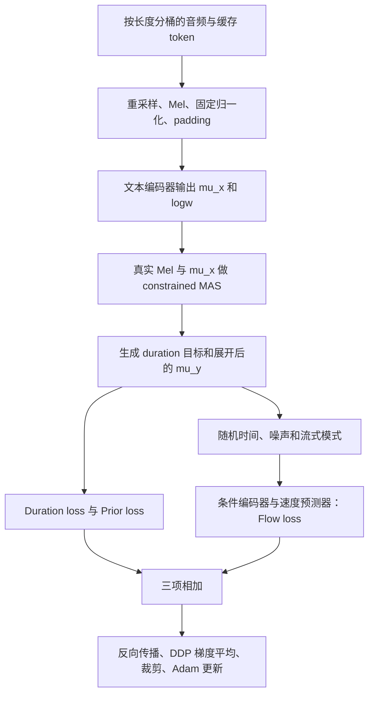

# LITs Stage 1 训练实录

核对日期：2026-09-14；2026-09-15 更新模型谱系说明。本文记录完整 Stage 1 实验。旧微调曾用其 197k；当前 100h 联合训练实际用其 **21k** 声学权重，详见 [当前模型完整训练记录](majestic_training_record_zh.md)。

## 1. 本文对应哪一轮

正式运行目录：

`/119010446/tts-assets/training_runs/hifitts_premium_stage1_lr3e-4_20260911`

| 项目 | 实际值 |
|---|---|
| 初始化 | 声学模型从随机权重开始 |
| 训练数据 | HiFiTTS 英文 + WenetSpeech4TTS Premium 中文 |
| 总预算 / 实际完成 | 200,000 / 200,000 optimizer steps |
| 峰值学习率 | 3e-4 |
| 结束学习率 | 约 6e-5 |
| 开始时间 UTC | 2026-09-11 10:17:51 |
| 结束时间 UTC | 2026-09-13 00:22:01 |
| 启动至退出用时 | 约 38.07 小时，包含训练中的验证等开销 |
| 后续迁移点 | 本轮 step 197,000，而非最后一个 checkpoint |

Stage 1 的目标是学习中英发音、文本到音频的对齐及声学生成能力。 当前 100h 模型从该运行的 21k 声学权重初始化，重置两行 speaker embedding，使用全新 Adam 和 500 epoch WSD 配方；不是从零训练。197k 是更早微调实验的迁移点，不是当前模型的父 checkpoint。

## 2. 与旧实验的关系

此前存在 `hifitts_premium_stage1_20260911`，峰值 LR 为 1e-4、最终 LR 为 2e-5。旧实验曾从 9,000-step checkpoint 恢复以应用 flow padding loss 修复，随后因用户要求提高 LR、从头重训而停止。

交接时保留的旧 checkpoint 是 28,000 步，最后日志到 28,450 步。新 3e-4 实验的 `ckpt_path=null`、`init_ckpt_path=null`，**没有继承旧实验权重或 Adam 状态**。新实验从第 0 步起使用修复后的 flow loss。

因此两轮不能简单描述为“同一个模型在 28k 时提高了 LR”，也不能把早期质量差异全部归因于 LR：旧实验早期还涉及 padding loss 差异。

证据：[旧实验交接](/119010446/tts-assets/training_runs/hifitts_premium_stage1_lr3e-4_20260911/previous_experiment.json)。完整绝对路径索引见文末。

## 3. 数据来源、规模与划分

冻结数据目录：`/119010446/tts-assets/data_24k/foundation/`。

| 来源 | 训练条数 | 训练小时 | 验证条数 / 小时 | 测试条数 / 小时 |
|---|---:|---:|---:|---:|
| HiFiTTS | 320,897 | 289.209 | 494 / 0.599 | 991 / 1.210 |
| Premium | 388,311 | 857.656 | 2,396 / 5.406 | 2,081 / 4.784 |
| 合计 | **709,208** | **1,146.865** | **2,890 / 6.006** | **3,072 / 5.994** |

这是原始录音数据，不是目前后台生成的 MajesticVoice 合成数据。

HiFiTTS 使用官方 train/dev/test 划分，dev 对应 val。Premium 从文件名提取原录制组 ID，计算 SHA-256 前 8 位对应整数模 1000：0–4 分到 val，5–9 分到 test，其余 train。同一原录制的不同切片共用分组，避免切片跨集合。

数据准备共处理 731,472 条候选：

- 排除时长不在 0.5–20 秒内的 12,983 条。
- 排除空编码或未知 token 的 274 条。
- 从训练集删除与保留文本音素序列重叠的 3,026 条。
- 从验证集删除与测试集音素序列重叠的 19 条。

保留文本包括本轮 val/test、既有目标音色 val/test 及固定外部评测文本。重叠判断对完整 token ID 序列做哈希，不能解释成语义近重复检测。音频格式、有限值及文本长度能否容纳于 Mel 帧数也会检查；没有为了满足最长时长而截断完整录音。

## 4. 文本前端与冻结索引

准备脚本调用 `text_to_sequence_with_tones`，使用 `en_zh_dict_mixed_rhyme_body_tone_cleaners`：

1. 读取原转写，去除首尾空白，把文件列表分隔符 `|` 替换为空格。
2. 编码为 173-token 中英 rhyme-body-tone inventory。
3. 添加开头 `<sil>`；不在 token 间插入额外 blank。
4. 保存 token IDs、并行 tone IDs、可读音素串、原文本与音频路径。

训练读取 SQLite 中已缓存的数值编码，不在每个 batch 重新跑前端。这一流程与部署端 C++ 前端应区分。

`dataset.sqlite` 每条记录包含 split、source、duration、text_key 和 JSON payload；payload 中保存绝对音频路径、原采样率、文本、ids、tones、phonemes、speaker 等。

冻结索引 SHA-256：

`0b22137fd262457f62a2ed77dd1faefd2159cabb9d6da8dd6b25f8391bc33ed0`

准确复现应保留该索引。准备阶段采用并行无序回收，重新建库可能改变行 ID 与顺序；仅使用相同随机种子并不保证重建后样本顺序完全相同。

## 5. 音频读取与 Mel 归一化

| 项目 | 配置 |
|---|---|
| 原录音采样率 | 数据审计中 HiFiTTS 为 44.1 kHz，Premium 为 16 kHz |
| 模型采样率 | 24 kHz，单声道 float32 |
| 重采样 | 读取时 soxr HQ，原文件不改写 |
| FFT / window / hop | 2048 / 1536 / 384 |
| Mel bins / 频带 | 100 / 0–12 kHz |
| 帧间隔 | 384 / 24000 = 16 ms |
| 频谱处理 | 幅度谱 → Mel 滤波 → 自然对数压缩，最小值 1e-5 |
| Mel mean | -5.604226163908895 |
| Mel std | 3.2161116943289363 |

归一化为 `y=(log_mel-mean)/std`。mean/std 从每个来源固定抽取 2,048 条训练音频估计，共 4,096 条、143,953,300 个 Mel 元素。按全部元素求均值和方差，得到共享的标量统计量，不是逐句或逐 Mel bin 归一化；验证、测试不参与统计。

训练全程固定这组统计量。后续 197k 微调继续使用它，避免改变模型已有的声学尺度。

## 6. Speaker 设置的真实含义

模型配置 `n_spks=2`，speaker embedding 为 `[2,64]`。Stage 1 所有录音均使用 **ID 0**，ID 1 为后续音色保留。

这意味着多个真实说话人的录音共享一个可训练音色向量，并非把各个真实说话人分别建模，也不是训练过程中通过参考录音提取 speaker embedding。ID 1 没有本轮样本监督。

这个设定可以用于先学习通用发音，但不能据此声称已经学到一个统一、稳定的目标音色。真实语速、音色、韵律差异仍存在于监督音频中。

## 7. 模型规模与更新范围

声学模型共 **23,799,149 个参数**，所有声学模块从随机初始化开始训练。

| 优化器分组 | 参数量 | 内容 |
|---|---:|---|
| prior_encoder | 9,319,844 | 文本 embedding、Prenet、6 层 RoPE 主干、Mel 均值投影 |
| duration_predictor | 395,009 | 两层卷积时长网络及输出投影 |
| spk_emb | 128 | 两个 64 维 embedding 槽位 |
| decoder | 14,084,168 | 帧级条件编码器与 flow 速度预测器 |

文本 embedding 宽度 192，拼接 speaker 的 64 维后主干为 256 维。文本主干 6 层、2 个注意力头、FFN 768；声学均值输出 100 维。

帧级条件编码器为 6 层、hidden 100、2 头、FFN 2048。速度预测器为通道 `[256,256]` 的 U-Net，2 个 down stage、2 个 middle stage、2 个 up stage。详细结构、尺寸和梯度路径见 [模型架构与 loss](training_loss_zh.md)。

Vocos 是单独加载的预训练声码器，只参与音频生成评估，不在本轮声学优化器中。Stage 1 不使用先前 LITs checkpoint、语言模型或 VoxCPM 权重初始化声学模型。

## 8. 采样、分桶与 batch

训练按来源样本数 1:1 配平：中文池有 388,311 条，英文池较小，通过重复打乱采样补齐同样数量，再合并全局打乱。

**配平发生在一个采样轮次的来源数量上，不是每卡每批严格一半中文、一半英文，更不是中英文音频小时数各一半。** 中文平均录音更长，按小时/有效帧计算仍有更高占比。

全局 batch 为四卡 × 每卡 144 = **576 条**，无梯度累积。采样器在 `576×50` 大小的随机窗口中按时长排序、切 batch，随后打乱 batch 顺序及 batch 内顺序，再分给四个 rank。不足一个完整全局 batch 的尾部丢弃。

各 rank 使用一致的全局采样构造，不再让 Lightning 自动注入另一个 DistributedSampler。每个 rank 配 8 个 DataLoader worker；训练 worker 持久化，worker 内 PyTorch 线程设为 1。

Collate 对文本与 Mel 补零，Mel 长度补齐到网络要求的 4 帧倍数，保留真实长度供 mask 使用。`out_size=null`，使用整条录音而非随机声学裁片。

200k 次更新名义上包含 `200000×576=115,200,000` 次样本呈现，其中大量是跨轮次重复；不能把这个数字解释为不同录音数量。

## 9. 一个训练 step 做什么



MAS 不反向传播。Duration 分支输入被 detach，因此 duration loss 直接更新时长预测器；prior 和 flow 可以经声学条件路径更新文本主干与 speaker 0。

## 10. 三项 loss 与 MAS

本轮使用动态 MAS，`load_durations=false`，没有使用外部强制对齐器逐句提供的固定 duration 标签。外部时长统计表仅用于给 MAS 和异常目标筛选提供边界。

$$
L=L_{dur}+L_{prior}+L_{flow}.
$$

令 MAS 分配给 token 的帧数为 $d_i$，预测 log duration 为 $\hat\ell_i$，有效文本长度为 $N_b$：

$$
L_{dur}=\frac{\sum_{b,i}m_{b,i}(\hat\ell_{b,i}-\log(d_{b,i}+10^{-8}))^2}{\sum_b N_b}.
$$

异常目标由 $m$ 屏蔽，分母仍是全部有效 token 数。MAS 按单位方差高斯声学匹配搜索路径，得到展开均值 $\mu$：

$$
L_{prior}=\operatorname{Mean}_{valid}\left[\tfrac12(y-\mu)^2+\tfrac12\log(2\pi)\right].
$$

其固定常数为 0.91894，不能期待 prior loss 降到 0。

对每条样本随机采样 $s\sim U(0,1)$ 和高斯噪声 $z$，取 $\sigma=10^{-4}$：

$$
x_s=[1-(1-\sigma)s]z+sy,\quad u=y-(1-\sigma)z,
\quad L_{flow}=\operatorname{Mean}_{valid}(v_\theta-u)^2.
$$

Flow loss 在日志中叫 `diff_loss`。每次前向约以 50% 概率使用流式或非流式模式，共用模型参数。Prior/flow 按有效 Mel 帧数 ×100 归一化，padding 不参与分子或分母。

三项首先在每个 rank 的本地 batch 内归一化，再由 DDP 平均梯度；没有先跨卡汇总有效元素数。因此不等价于对四卡所有有效 token/帧做一次严格全局平均。

本轮未启用辅助 loss 衰减。200 次验证日志中的 duration/prior 权重全部为 1。也未启用自动 encoder 冻结、验证停滞降 LR 或回退到 best-prior 权重。

MAS 的配置包括：中文 floor scale 1.0，英文 floor scale 0.5，全局最小 floor 2 帧，声调 ceiling 3 帧。由于 floor 的组合规则，声调 MAS 下限实际为 2 帧，尽管 `tone_floor_frames=1`；推理声调限幅为 1–3 帧。详见 loss 文档中的实际边界说明。

## 11. 优化器、学习率与数值设置

四张 A800，DDP，BF16 mixed precision；`find_unused_parameters=true`、`static_graph=false`，梯度 norm 裁剪为 5.0。随机种子为 20260911，但 Trainer 的 `deterministic=false`，不承诺位级复现。

优化器为 **Adam**：betas=(0.9,0.999)，eps=1e-8，weight_decay=0，amsgrad=false。四个参数组在 Stage 1 使用相同 LR。

设 $s$ 为更新前的 global step，$P=3\times10^{-4}$，$F=6\times10^{-5}$：

$$
\eta(s)=\begin{cases}
P[0.1+0.9(s+1)/1000],&s<1000\\
F+\frac{P-F}{2}\left[1+\cos\left(\pi\frac{s-1000}{199000}\right)\right],&s\ge1000.
\end{cases}
$$

| 更新前 step | LR |
|---:|---:|
| 0 | 3.027e-5 |
| 999 / 1,000 | 3.000e-4 |
| 10,000 | 2.988e-4 |
| 100,000 | 1.809e-4 |
| 197,000 附近 | 6.013e-5 |
| 200,000 端点 | 6.000e-5 |

调度由 `WarmupCosine.on_train_batch_start` 根据 global step 写入所有参数组。因此 checkpoint 中 `lr_schedulers=[]` 不代表没有 LR 调度。197k checkpoint 中四组 Adam 的实际 LR 均为 `6.013464666467663e-05`；checkpoint step 是已完成更新数，与上述更新前索引有一个 step 的区别。

## 12. 容量与 padding 修复

最长样本压测包含约 1,248 个 Mel 帧、388 个文本 token，执行真实前向、反向和 Adam 更新。每卡 batch 144 的峰值 allocated 显存为 67.37 GiB，reserved 为 68.11 GiB；该极端批次约 2.63 秒/step，不是全程平均速度。压测权重丢弃，正式训练独立随机初始化。

MAS Cython 内核使用 OpenMP 与 `noexcept nogil`，避免每个 DP 单元反复获取 GIL。历史核对的 23 组路径/分数数组逐元素一致，16 条长样本对齐从约 2.456 秒降到 0.029 秒。这是计算优化，不是修改 MAS 目标。

旧 flow loss 曾在分母排除 padding，却把 padding 上的噪声误差加进分子。修复后先乘有效帧 mask 再求和；本轮 3e-4 实验从第 0 步使用修复版本。不能把修复前后的 loss 数值直接当作同一指标比较。

## 13. 验证 loss 与 checkpoint 保存

固定种子从每个来源的 val 抽 256 条，共 512 条。完整 val 仍有 2,890 条，但日常 loss 只在这个固定子集计算。四卡无重复划分验证样本，每卡验证 batch 为 16。

每 1,000 steps 验证并保存；训练开始前有 2 个 sanity validation batch。验证仍使用真实录音 Mel 做 MAS，flow 中仍有随机时间、噪声及模式选择。

| 已完成 step | Val duration | Val prior | Val flow | Val total |
|---:|---:|---:|---:|---:|
| 1,000 | 0.42984 | 1.01467 | 0.86069 | 2.30520 |
| 10,000 | 0.37250 | 1.00402 | 0.25541 | 1.63193 |
| 100,000 | 0.34206 | 0.99942 | 0.21220 | 1.55368 |
| 197,000 | 0.34832 | 1.00013 | 0.21346 | 1.56191 |
| 200,000 | 0.34519 | 1.00029 | 0.18328 | 1.52875 |

常规 checkpoint 按 step 保留最近 3 份及 last，另保留 best-val-prior；结束保存 final.ckpt。文件包含模型、优化器等状态。部分文件名的 step 显示可能比 checkpoint 内 `global_step` 少 1，应以内含值和评估快照 metadata 为准。

每 10 步写 training_state.json，验证结果追加到 validation.jsonl，TensorBoard 保存标量曲线。验证结束时的 step 指标与 epoch 聚合值应区分。

## 14. 独立的固定文本生成评测

评估 watcher 在 GPU 0 上依次生成、ASR、DNSMOS、汇总。它把选中的 checkpoint 复制成不可变快照并记录哈希，避免训练覆盖原文件。

首次 1k 只做每组 8 条，共 24 条的启动检查；之后正常评估英文 200、中文 200、混合 50，共 450 条。实际记录从 3k 开始通常每隔 2k 评一次，直到 199k，并额外评了最终 200k。

生成统一用 speaker 0、预测 duration、temperature=1、10 步 Euler 和 24 kHz Vocos，按样本索引固定随机种子。实际 `synthesise → decoder` 调用没有传 streaming，使用 decoder 的默认 `streaming=False`；不能由 Causal 类名推断这里做的是流式 mask 评测。

ASR 为本地 Qwen3-ASR-1.7B，自动识别语言、不提供参考文本提示，常规评估 batch=8。中文主要看 CER，英文主要看 WER；纯中文不把英文分词器返回的 WER=0 当成准确率。混合 WER主要覆盖提取出的英文词，不能代表整句中英内容质量。DNSMOS 衡量声音质量，不代替文本正确性或人工自然度评价。Stage 1 不评估与 MajesticVoice 目标音色的相似度。

| 固定生成评测 | 197k | 200k |
|---|---:|---:|
| 英文 WER micro，200 条 | 1.352% | 1.738% |
| 中文 CER micro，200 条 | 4.656% | 5.926% |
| 混合 CER micro，50 条 | 34.220% | 33.067% |
| 英文 DNSMOS OVRL mean | 3.253 | 3.224 |
| 中文 DNSMOS OVRL mean | 3.352 | 3.326 |

197k 的中英文内容指标在这次对照中优于最终 200k，混合指标则相反。后续显式选用 197k，不是训练器自动选出的所有指标最优点。200k 的验证总 loss 更低，也不能推出生成质量全面更好。

## 15. 197k 迁移到 Stage 2

使用的权重是：

`eval/step_00197000/checkpoint.ckpt`

SHA-256：`f3cfa4a9eaa7c0036ce78bb3b5857a55ebcccf4b40943062c1191e7d28b31a35`。

此前 Stage 2 方案只加载模型权重，新建 Adam，微调步数从 0 开始；speaker 1 从已训练的 row 0 复制，保留原 Mel mean/std。原 100 小时 MajesticVoice 配方先仅更新 embedding 500 步，随后联合微调 47,500 步，总计 48,000 步。这些均是第二阶段行为，不是 Stage 1 的训练设置；该待启动方案未成为当前配方；当前实际执行的是 21k backbone 初始化、两行 speaker 随机重置和全模块联合训练。

## 16. 已知结果边界与最近诊断

Stage 1 基础中英发音已有较好固定文本指标，但中英混合明显较弱。共享 speaker 0 也不能被视为统一音色建模已经成功。

最近的 512 条验证样本诊断发现 duration 预测相对 MAS 的方差明显压缩；但三条中文试听中直接换成 MAS 时长反而损害可懂度。进一步 30 条消融音频排除了 A/B 实现错误，取消 MAS 约束、增加 flow 步数或简单时长插值均未优于预测基线。

因此本阶段记录的低 prior loss、MAS 打分或 duration 方差都不能单独代表音素边界可靠性。当前仍需独立对齐验证来区分 MAS 时序误差和 flow 对条件的生成适配问题。相关证据见 [loss 文档的诊断章节](training_loss_zh.md)。这些是训练完成后的发现，未反向修改此次 Stage 1 历史记录。

## 17. 复现入口与证据索引

运行环境为 `/119010446/tts-assets/chenmingjie/lits-tts/envs/lits/bin/python`。固定数据与容量结果准备好后，历史启动入口如下；此处仅展示命令，未启动新训练：

```bash
cd /119010446/LITs
/119010446/tts-assets/chenmingjie/lits-tts/envs/lits/bin/python training/foundation/run.py \
  --run-dir /119010446/tts-assets/training_runs/stage1_reproduction \
  --run-name stage1_reproduction \
  --peak-lr 0.0003 --final-lr 0.00006
```

必须显式指定两项 LR：入口默认值仍是旧配方 1e-4/2e-5。启动器拒绝覆盖已存在 launch.json 的运行目录。准确复现应优先使用原运行的 source 快照、冻结数据和解析后的 Hydra 配置，而不只依赖后来可能改动的仓库默认值。

- [实际启动记录](/119010446/tts-assets/training_runs/hifitts_premium_stage1_lr3e-4_20260911/launch.json)
- [完整 Hydra 配置](/119010446/tts-assets/training_runs/hifitts_premium_stage1_lr3e-4_20260911/.hydra/config.yaml)
- [旧实验交接记录](/119010446/tts-assets/training_runs/hifitts_premium_stage1_lr3e-4_20260911/previous_experiment.json)
- [启动核验与实际 LR](/119010446/tts-assets/training_runs/hifitts_premium_stage1_lr3e-4_20260911/startup_verification.json)
- [数据规模与排除统计](/119010446/tts-assets/data_24k/foundation/summary.json)
- [数据完整性记录](/119010446/tts-assets/data_24k/foundation/integrity.json)
- [Mel 统计](/119010446/tts-assets/data_24k/foundation/mel_statistics.json)
- [容量实测](/119010446/tts-assets/data_24k/foundation/capacity.json)
- [验证日志](/119010446/tts-assets/training_runs/hifitts_premium_stage1_lr3e-4_20260911/validation.jsonl)
- [197k 生成评测](/119010446/tts-assets/training_runs/hifitts_premium_stage1_lr3e-4_20260911/eval/step_00197000/summary.json)
- [200k 生成评测](/119010446/tts-assets/training_runs/hifitts_premium_stage1_lr3e-4_20260911/eval/step_00200000/summary.json)
- [数据准备实现](../training/foundation/prepare.py)、[数据加载和分桶](../training/foundation/data.py)、[LR 调度](../training/foundation/callbacks.py)、[训练入口](../training/foundation/run.py)
