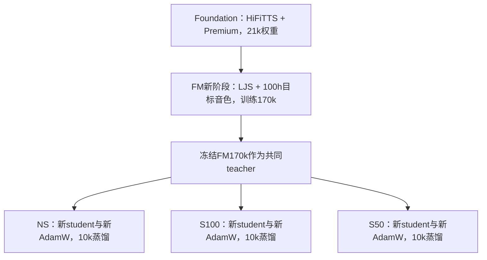

# 两种 streaming 与非 streaming 蒸馏对比

记录日期：2026-09-16。只比较以下三组 MeanFlow 蒸馏实验，不包含直接训练的 iMF。三组都已完成 10,000 次蒸馏更新，都从相同的 FM 170k teacher 出发，teacher 16步、student 推理2步。表中 1k/5k/10k 是蒸馏更新数，不是 FM 基础训练步数。

## 1. 实验身份与初始化谱系

本文用以下短名称区分实验，目录名都是实际运行目录；不要把这里的 IntMeanFlow 蒸馏与 `imf_h1_b48` 直接训练混在一起。

| 简称 | 实际运行目录（均位于 `/119010446/tts-assets/training_runs/`） | 最终更新数 | 训练完成时间 UTC |
|---|---|---:|---|
| NS：非 streaming | `majestic100h_meanflow_distill_t16_s2_20260915` | 10,000 | 2026-09-15 06:09:32 |
| S100：100帧 streaming | `majestic100h_meanflow_streaming_t16_s2_20260915` | 10,000 | 2026-09-15 09:11:43 |
| S50：50帧 teacher-matched streaming | `majestic100h_meanflow_teacher_matched_t16_s2_20260915` | 10,000 | 2026-09-15 11:35:14 |

完成状态取各自 `training_state.json`，不是仍可能保留 `running` 字段的历史 `launch.json`。



三组 student 都从同一个**完成训练的 FM 170k** 初始化，包括两个 speaker embedding；S100 不是接着 NS 的蒸馏权重训练，S50 也不是接着 S100 的10k训练。S100 唯一的中途恢复发生在其自身1k，见第6节。

共同 teacher 文件：

`/119010446/tts-assets/training_runs/ljs_majestic_100h_backbone21k_20260914/evaluation_checkpoints/step_00170000.ckpt`

运行计划记录的 SHA-256：`90a689649a4a77971d4a99324923e3ad1801557d6f514ec74f42ff0a436eab68`。基础 FM 使用65,282条、约121.049小时配对数据，包含11,550条LJS原录音与53,732条目标音色合成录音；它的完整训练背景见 [FM训练记录](majestic_training_record_zh.md)。本文的10k是**额外蒸馏更新数**，不能与FM从头适配时的10k混为同一训练阶段。

## 2. 数据：具体用了什么、训练时实际读取什么

### 2.1 训练清单与验证清单

三组 `data/train.jsonl` 和 `data/val.jsonl` 分别逐字节一致，已重新计算SHA-256与运行计划核对。以下条数、来源和时长由实际JSONL重新统计，而非用目标配额代替。

| 语言 | 训练条数 | 对应源录音小时 | 训练文本来源 | 验证条数 | 验证源录音小时 |
|---|---:|---:|---|---:|---:|
| 中文 | 25,323 | 50.000400 | Premium：25,323 | 192 | 0.376622 |
| 英文 | 16,515 | 25.000222 | HiFiTTS：16,515 | 115 | 0.193333 |
| 中英混读 | 11,894 | 25.000889 | Emilia2：10,491；既有DOTA-ME-CS审核脚本：614；Premium：789 | 93 | 0.195111 |
| 合计 | **53,732** | **100.001511** | 四类文本来源 | **400** | **0.765067** |

验证混读由Emilia2的88条和Premium的5条组成；中文验证192条来自Premium，英文验证115条来自HiFiTTS。DOTA脚本只进入训练集。

全部训练和验证条目都属于**目标speaker 1**。**LJS speaker 0未进入本次蒸馏训练或蒸馏loss验证**，但保留在生成评测中，用于观察原有音色能力。两行speaker权重从FM170k继承且冻结；decoder仍是共享的，因此没有LJS训练不等于LJS输出会保持不变。

训练最长336个token，验证最长316个token；使用清单中已审计的 `ids`、`tones`、`speaker`，不重新分词、不截断长句、不添加blank。`max_text_len=0` 表示不施加额外长度上限，不是使用空文本。词表173，tone取值0–5。

### 2.2 “100小时”在蒸馏中的含义

清单保留了 `audio`、`duration`、`source`、`source_group`、`synthetic` 等来源字段。这里的100小时是这些文本对应的**已验收合成录音总时长**，不是蒸馏期间读取的真实音频时长，也不是teacher在线生成时长的精确总和。

实际 `TextPromptDataset` 只读取文本编码、tone和speaker；不读取WAV、不计算真实录音Mel、不运行真实录音MAS对齐。每批由冻结的FM teacher预测duration、展开文本条件，并从新高斯噪声在线生成16步轨迹作为监督。因此：

```text
冻结文本清单（ids / tones / speaker）
  → 冻结文本编码、duration、speaker和条件编码器
  → 预测长度的Mel条件 + 新高斯噪声
  → 冻结teacher在线16步轨迹
  → student两步轨迹与区间速度
  → 三项蒸馏loss，仅更新student decoder estimator
```

训练噪声每次重新采样；没有缓存整套teacher轨迹数据集。数据字段中的Premium/HiFiTTS等标记是**文本来源**，目标音色对应的录音来自VoxCPM2合成，不是这些来源说话人的原声录音。

### 2.3 目标语料的上游生成和筛选

这批目标文本沿用Foundation train转写、Emilia2转写和既有DOTA-ME-CS审核脚本；没有为这三组蒸馏重新生成文本或录音。上游使用VoxCPM2生成24kHz单声道PCM16录音，按来源、长度等分层选取约中文50h、英文25h、混读25h。一个独立文本只保留一个合格winner。

上游筛选记录包括：英文WER/CER均≤2%；中文CER≤2%（带声调拼音完全一致可放宽至原始CER≤5%）；混读英文WER=0、中文CER≤2%；WavLM≥0.70、CAMPPlus≥0.68；DNSMOS OVRL/SIG/BAK≥3.3/3.5/3.8；时长3–20秒，并检查削波、静音、格式和前端有效性。这些是**上游录音准入门槛**，不是蒸馏loss或student评测必须达到的门槛。完整候选策略、参考音色变更及筛选细节见 [FM记录第6节](majestic_training_record_zh.md#6-当前-100h-目标音色数据如何生成)。

中文/混读参考为 `ts004_cn_000001.wav`，英文最终采用候选 `72003.wav`。因此英文的相似度目标与中文/混读参考不同。

### 2.4 划分、重复检查与指纹

本次重新核对：训练有53,732个唯一音频路径、53,732个唯一token序列；验证有400个唯一音频路径、400个唯一token序列。train–val的token重叠和source_group重叠均为0；train–650条生成评测、val–650条生成评测的token序列重叠也均为0。这是精确编码匹配检查，不代表语义级别完全无重复，也不代表与Foundation训练文本互斥。

| 文件 | 三组共同SHA-256 |
|---|---|
| `data/train.jsonl` | `135066611ddd2b197c7029b247ee4fce5b0d7eb04f959057a0f3d1d69c536ebe` |
| `data/val.jsonl` | `571e6924101c1e7e3c7c5348e52fd043e6c3215b5f9ba7bbf200eaf3f1fcc6e5` |

## 3. 网络改动、冻结范围与训练目标

### 3.1 初始化与可训练参数

student保留FM的文本、duration、speaker、Mel条件编码和decoder结构，只给速度预测器增加区间时间输入：

```text
sinusoidal(r) ─┐
              ├─ concat → Linear([0,I]初始化，bias=0) → 原time_mlp → 原速度预测器
sinusoidal(t) ─┘
```

时间嵌入保留FM原来的scale=1000。初始化投影只选取终点 `t` 的嵌入，保证该嵌入路径与原FM一致；这不表示未训练student的两大步轨迹等于teacher的16小步轨迹。这套IntMeanFlow是单速度输出的轨迹蒸馏，没有iMF的辅助v head、JVP或区间导数loss。

| 部分 | teacher | student |
|---|---|---|
| 文本/prior编码、duration、speaker embedding | 冻结，eval | 冻结，eval |
| decoder条件编码器 | 冻结，eval | 冻结，使用teacher条件 |
| decoder速度预测器 | 冻结，eval | 更新，训练时train模式 |
| 新区间时间投影 | 无 | 更新 |
| Vocos | 不参与蒸馏训练 | 仅生成评测时使用 |

student总参数 **23,938,805**，可训练 **11,366,636**。本次不重训duration或speaker，也没有duration/prior损失。ASR、DNSMOS、WavLM、CAMPPlus均只用于评测，不参与反向传播。

### 3.2 每次更新的计算过程与loss

以归一化Mel空间为状态。teacher从噪声 `z ~ N(0,I)` 出发，在 `0, 1/16, …, 1` 上做16次Euler更新；student从**相同噪声、相同条件**出发，走 `0 → 0.5 → 1`。取teacher在0、0.5、1的状态为 `T₀,T₁,T₂`，student状态为 `S₀,S₁,S₂`，两段间隔均为 `Δt=0.5`。

定义 `MSE_M(a,b)` 为有效Mel帧上的平方误差，分母为 `100 × 有效帧数`，padding不计入。三个分量为：

```text
L_endpoint   = MSE_M(S₂, T₂)
L_trajectory = [MSE_M(S₁, T₁) + MSE_M(S₂, T₂)] / 2
L_mean_flow  = mean_i MSE_M(uθ(Tᵢ; rᵢ,tᵢ), (Tᵢ₊₁ − Tᵢ) / 0.5), i=0,1
L_total      = L_endpoint + 0.5 × L_trajectory + L_mean_flow
```

`trajectory`确实包含最终端点，不能解释为只约束0.5处的中间状态。mean-flow项另做两次区间预测，输入是teacher的区间起点；轨迹项则检查student自己两步展开后的状态。缓存分支用一次区间Euler结果与起点的差除以间隔，得到相同定义的平均速度。

teacher轨迹、文本条件及监督target都停止梯度；student轨迹与辅助区间预测保留梯度。ODE状态、MSE和归约使用FP32，网络前向使用BF16。每卡先按本地有效帧归一化，再跨卡平均梯度，并非把两卡全部帧拼成一个全局加权MSE。

三组的损失形式与权重相同，但teacher可见的上下文不同、S50还混合两种模式，因而**监督轨迹不完全相同，三组loss数值不能直接视为同一道固定目标上的排名**。

代码依据：[训练目标](../meanflow_distill/train_intmeanflow_distill.py)、[区间估计器](../meanflow_distill/interval_estimator.py)。S100、S50的运行代码位置见第6节。

## 4. 共同优化配置与采样方式

| 项目 | 实际配置 |
|---|---|
| teacher / student步数 | 16 / 2；student网格 `[0,0.5,1]` |
| 初始噪声温度 | 1.0 |
| 优化器 | 新建AdamW，LR `2e-5`、weight decay=0 |
| AdamW默认项 | betas=(0.9,0.999)，eps=1e-8；代码未覆盖这些默认值 |
| LR调度 | 常数LR，无warmup/衰减scheduler |
| 多卡 | 2个rank，NCCL，每卡batch16，常规全局batch32 |
| 梯度累积 / 裁剪 | 无累积；同步梯度后clip global norm=1 |
| 精度 | BF16 autocast；ODE/loss FP32；BF16下未开启FP16 GradScaler |
| 随机种子 | 基础seed=20260915；随机流按rank区分 |
| 文本长度 | 不截断；max_text_len=0 |
| DataLoader workers | 每rank 2 |
| 更新预算 | 总计10,000次 |
| 保存 / loss验证 | 每1,000次；保存完整student、AdamW及相关状态 |
| 生成评测 | 1k每组8条，共32；5k/10k各650条 |

训练采用 `DistributedSampler(shuffle=True, seed=20260915, drop_last=False)`，逐epoch设置采样epoch；DataLoader也不丢弃最后一批。按清单条数自然混合，不按语言强制1:1，不按小时重新采样，也没有FM基础训练使用的长度分桶。

53,732条分给2个rank，每rank26,866条、每轮1,680个batch；轮末每rank2条，因此全局batch32有轮末例外。按实现计算，10k更新约处理 **319,860次文本呈现，约5.953轮**；运行计划中的320,000/5.96轮是忽略尾批的近似预算。

NS用常规DistributedDataParallel。两种streaming训练使用初始权重广播，并在一次完整loss反向结束后显式求全参数梯度均值，再裁剪、更新；用于覆盖多次区间前向和缓存路径。启动审计比较跨rank权重指纹，确认同步。

验证使用固定400条，按rank分片、不shuffle；固定验证随机种子，验证结束恢复训练随机状态。验证loss不是650条生成质量评测，也不使用它的ASR/MOS分数。

## 5. 三组streaming机制的实际差别

| 项目 | NS | S100 | S50 teacher-matched |
|---|---|---|---|
| 训练模式 | 100%非流式 | 100%流式decoder | 每rank每次loss约50%流式、50%非流式 |
| Mel条件编码 | 全句非流式 | 全句非流式 | 与本次loss模式一致；流式时chunk50、左历史不限 |
| teacher训练轨迹 | 全句16步 | 100帧缓存语义的16步 | 原teacher整段forward + 原有各层mask，16步 |
| student训练轨迹 | 全句2步 | 100帧缓存语义的2步 | 与teacher共用本次模式和mask，2步 |
| 梯度计算实现 | 全句 | 1k前逐块缓存；1k后等价语义的整段并行实现 | 整段张量 + attention mask，不逐块缓存训练 |
| 生成评测 | 非流式 | decoder chunk100 | 条件chunk50 + decoder chunk50 |
| decoder左上下文配置 | 非流式不受此限制 | 20 | 20 |
| Vocos评测 | 整句 | 分块、8帧Mel缓存、交叉淡化 | 同S100 |

S50的“teacher-matched”指匹配原FM训练时的上下文选择与mask。每次loss只抽取一次模式，由条件编码、teacher全部16步、student两步和两个辅助区间共同使用；两个GPU独立抽取。训练记录中单次 `streaming_batch_fraction` 可为0、0.5或1，不要求每一次全局batch恰好一半流式。固定验证集的实际加权流式比例是0.54。

S50不是简单把S100参数100改成50：它同时更改了条件编码可见范围、训练模式混合方式以及缓存语义/原teacher mask。因此本文是**三套完整配方的比较**，并非单因素chunk-size消融。S50训练用mask模拟上下文，评测实际使用缓存解码，两者也不能直接称为同一条执行路径。

两种streaming均先拿到完整文本，再预测整句时长和条件；每个ODE步骤维护自己的KV/卷积缓存，跨句清理缓存。评测器最终拼接完整WAV评分，不代表已实现上游文本token逐个到达的实时服务。

24kHz、hop384对应每Mel帧16ms：100帧常规块对应1.6秒音频，50帧为0.8秒；20帧配置对应名义0.32秒，但decoder各层有不同分辨率，不能将其当成所有层统一的实际感受野。末尾不足整块的余量合并到上一块，最后一块可能大于名义chunk；总长度小于一块时直接输出一块。

Vocos在块间保留8帧Mel（128ms）与相应波形重叠，使用Hann窗交叉淡化。训练参数记录 `pre_lookahead_len=3`；实际缓存调用会扣回这部分以确定已完成的输出边界，评测函数也没有把它计成额外首包输出。因此不把“3帧”直接报告成48ms实测延迟。

## 6. 实际执行、恢复记录与可复现入口

| 实验 | 工作树 | 关键代码版本 |
|---|---|---|
| NS | `/119010446/LITs-distill` | 训练启动 `f01f0d9`；评测解释器修复后记录 `d878405`，训练器/模型未改 |
| S100 | 初期 `/119010446/LITs-distill-streaming`；恢复后 `/119010446/LITs-distill-streaming-performance` | 初期 `c30ac6d`；1k后 `ff0b78f` |
| S50 | `/119010446/LITs-distill-teacher-matched` | `5fc8953` |

S100在自身1k完整checkpoint处切换为更快的并行streaming训练实现。恢复加载student和AdamW，optimizer步数最小/最大均为1000，LR仍为2e-5，sampler epoch=0、下一个batch=1000。新启动命令中的 `--max-steps 9000` 表示**恢复后再更新9000次**，最终global_step=10000，不是总预算缩为9000。checkpoint未保存完整训练RNG状态，因此这里记录为模型/优化器/数据位置恢复，不宣称逐位连续重现未中断训练。

并行实现通过attention可见范围和卷积边界修正复现逐块缓存语义，不改变部署时缓存解码。等价性、梯度、速度/容量和双卡恢复证据由S100的 `performance_preflight.json` 索引；`parallel_throughput.json` 记录恢复早期平均约0.394秒/更新。这是训练吞吐，不是生成RTF、首包时延或三组受控速度对照。

三组的启动检查包含：时间嵌入初始化、teacher与生产路径对齐、batch duration与单条一致、最长336-token/batch16反向、有限梯度、checkpoint保存/重载以及双卡启动。正式1/100次更新核验teacher和冻结条件不变、可训练模块确实更新；S100恢复后又在1001/1100进行核验。S50额外保存原teacher两个分支mask和条件输出核对记录。这里引用已有检查证据，没有在本次文档更新中重跑训练预检。

三个实验的完整启动参数已从各自 `launch.json` 原样导出至 [历史启动命令](streaming_comparison_20260916_assets/recorded_launch_commands.txt)。全部计划、最终metadata、数据统计、恢复后的启动命令与最终状态见 [训练证据快照](streaming_comparison_20260916_assets/training_evidence.json)。其中完整commit与文件指纹原始索引仍保留在各运行目录 `plan.json`。

checkpoint命名为 `checkpoints/student_step_0001000.pt` 等，每1k保存一次。文件含student完整state、teacher架构超参数、区间网格、蒸馏参数、optimizer/scaler状态和指标；加载应使用对应工作树的 `meanflow_distill.stage2_support.load_student`，不能直接当普通FM Lightning checkpoint处理。生成评测通过该工作树的 `training/common/evaluate_checkpoint.py --distilled`，显式指定冻结评测数据与Vocos。

## 7. 生成评测协议与比较口径

- 非 streaming：条件编码与声学解码均使用整句路径，Vocos 整句生成。
- Streaming 100帧：条件编码非流式，decoder 100帧缓存解码，左上下文20帧；训练采用缓存对齐蒸馏。
- Streaming 50帧 teacher-matched：条件编码使用50帧分块 mask，decoder 50帧缓存解码，左上下文20帧；训练约50%流式/50%非流式，沿用原 teacher 的分层 attention mask。
- 两种 streaming 均分块运行 Vocos。两者不只是 chunk 大小不同，因此不能将差异单独归因于50帧或100帧。
- 同一 checkpoint 下三组的文本、token、tone、speaker、样本顺序逐条一致，均2步推理。汇总指标已从 details.jsonl 重算核对，全部评测失败数为0。
- 5k/10k 每组650条：目标英文200、中文200、混读50，另有LJS英文200。下方主表音色/音质为目标450条按样本加权平均，不含LJS。WER/CER使用micro口径。
- 1k 每组32条（每语言/说话人组8条），仅作早期小样本比较；其均分不可与650条完整评测直接解释为训练趋势。1k与完整评测的部分样本随机种子也会因索引变化而不同。
- 本次读取已有评测，没有重新生成音频、修改训练或运行主观听测；DNSMOS是客观估计，不能证明无偶发杂音。已有耗时记录不是受控延迟测试，不据此报告速度比。


评测使用同一份冻结的四组清单（SHA-256：`957efd16aba7e038b283e981b62e37ecbafafe46af5cef7e4112c54e2e3931d3`），speaker0对应LJS，speaker1对应目标三组。每条种子为 `20260910 + 当前评测索引`，temperature=1；输出24kHz PCM16。三组5k/10k的文本、token、tone、speaker和顺序已逐项一致性核验；各自streaming设置按实际生成记录确认。

合成、ASR、质量评分、汇总分进程运行：合成用LITs环境，ASR用`tts-assets/.venv-voxcpm2`，质量模型用`UltraEval-Audio/envs/metrics`。ASR为Qwen3-ASR-1.7B，BF16、无参考文本context提示；WavLM/CAMPPlus与DNSMOS评分输入转16kHz。评测器逐条输出 `synthesis.jsonl`、`asr.jsonl`、`metrics.jsonl`，合并为 `details.jsonl` 与 `summary.json`。

共同声码器为 `/119010446/LITs/vocos/generator.ckpt`，运行计划记录SHA-256：`1d60c04156e59348566c65cab921591e1651ab48757ca3766caf9459475bd1c2`。本比较使用原始固定声码器；整句与分块运行方式是配方差异之一。

相似度使用固定参考：LJS为 `LJ002-0321.wav`，目标英文为 `72003.wav`，目标中文/混读为 `ts004_cn_000001.wav`。这是已学习speaker ID下的合成评测，不是用Seed-TTS原prompt声音做zero-shot克隆对比。

英文WER以参考词数加权，中文/混读CER以参考字符数加权，即micro口径；中文WER无有效分母，不作为指标，混读WER也不代表整句中英混合准确率。WavLM/CAMP与DNSMOS先逐条评分再平均。目标总体评分的权重为英文200/450、中文200/450、混读50/450，**不是三种语言等权平均**；LJS单列。1k三种目标语言各8条，均值权重与完整评测不同。

同一实验另有 `eval/teacher_16step` 和 `eval/teacher_2step`，它们是FM170k在相应推理模式下的基线；历史FM常规评测是非流式10步。本表对比的是三组student在相同蒸馏更新数、相同两步预算下的效果，没有混入这些不同推理步数的teacher结果。

## 8. 固定400条上的蒸馏验证loss

以下值来自各自 `validation.jsonl`，列的是未乘权重的三项loss；total已按 `1:0.5:1` 合成。S50验证包含固定比例的两种模式，生成质量评测则始终选择流式。因此loss更低不能直接推断流式听感更好。

| 更新数 | 实验 | total | endpoint | trajectory | mean-flow |
|---|---|---:|---:|---:|---:|
| 1k | NS | 0.004124 | 0.001892 | 0.001067 | 0.001698 |
| 1k | S100 | 0.004375 | 0.002013 | 0.001140 | 0.001792 |
| 1k | S50 | 0.004154 | 0.001916 | 0.001079 | 0.001698 |
| 5k | NS | 0.003334 | 0.001630 | 0.000913 | 0.001248 |
| 5k | S100 | 0.003488 | 0.001676 | 0.000947 | 0.001339 |
| 5k | S50 | 0.003241 | 0.001559 | 0.000876 | 0.001244 |
| 10k | NS | 0.002834 | 0.001344 | 0.000759 | 0.001110 |
| 10k | S100 | 0.003242 | 0.001582 | 0.000893 | 0.001213 |
| 10k | S50 | 0.002836 | 0.001353 | 0.000763 | 0.001102 |

## 9. 5k与10k完整评测

| 蒸馏更新 | 模型 | 英文 WER% ↓ | 中文 CER% ↓ | 混读 CER% ↓ | WavLM ↑ | CAMP ↑ | DNSMOS OVRL ↑ | SIG ↑ | BAK ↑ |
|---|---|---:|---:|---:|---:|---:|---:|---:|---:|
| 5k | 非 streaming | 1.111 | 0.450 | 0.887 | 0.7658 | 0.7469 | 3.3501 | 3.5922 | 4.1423 |
| 5k | Streaming 100帧 | 1.207 | 0.397 | 0.177 | 0.7613 | 0.7470 | 3.3354 | 3.5821 | 4.1321 |
| 5k | Streaming 50帧 teacher-matched | 1.207 | 0.476 | 0.177 | 0.7599 | 0.7454 | 3.3218 | 3.5702 | 4.1274 |
| 10k | 非 streaming | 1.111 | 0.423 | 0.798 | 0.7642 | 0.7481 | 3.3471 | 3.5901 | 4.1403 |
| 10k | Streaming 100帧 | 1.255 | 0.397 | 0.177 | 0.7635 | 0.7476 | 3.3394 | 3.5845 | 4.1359 |
| 10k | Streaming 50帧 teacher-matched | 1.304 | 0.423 | 0.177 | 0.7597 | 0.7455 | 3.3240 | 3.5718 | 4.1283 |

## 10. 1k小样本评测

| 蒸馏更新 | 模型 | 英文 WER% ↓ | 中文 CER% ↓ | 混读 CER% ↓ | WavLM ↑ | CAMP ↑ | DNSMOS OVRL ↑ | SIG ↑ | BAK ↑ |
|---|---|---:|---:|---:|---:|---:|---:|---:|---:|
| 1k | 非 streaming | 1.124 | 3.378 | 0.000 | 0.7482 | 0.7240 | 3.3591 | 3.5982 | 4.1530 |
| 1k | Streaming 100帧 | 1.124 | 2.027 | 0.000 | 0.7540 | 0.7295 | 3.3365 | 3.5783 | 4.1434 |
| 1k | Streaming 50帧 teacher-matched | 1.124 | 2.027 | 0.000 | 0.7488 | 0.7255 | 3.3173 | 3.5650 | 4.1319 |

## 11. 10k分组音质与音色

| 模型 | 分组 | DNSMOS OVRL ↑ | SIG ↑ | BAK ↑ | WavLM ↑ | CAMP ↑ |
|---|---|---:|---:|---:|---:|---:|
| 非 streaming | ljs_en | 3.1215 | 3.4887 | 3.8710 | 0.6479 | 0.8137 |
| 非 streaming | majestic_en | 3.2826 | 3.5292 | 4.1296 | 0.7553 | 0.8020 |
| 非 streaming | majestic_zh | 3.4024 | 3.6425 | 4.1481 | 0.7806 | 0.7094 |
| 非 streaming | majestic_mixed | 3.3838 | 3.6245 | 4.1513 | 0.7345 | 0.6869 |
| Streaming 100帧 | ljs_en | 3.0777 | 3.4594 | 3.8364 | 0.6322 | 0.8166 |
| Streaming 100帧 | majestic_en | 3.2743 | 3.5226 | 4.1275 | 0.7553 | 0.7948 |
| Streaming 100帧 | majestic_zh | 3.3942 | 3.6363 | 4.1421 | 0.7793 | 0.7153 |
| Streaming 100帧 | majestic_mixed | 3.3809 | 3.6248 | 4.1449 | 0.7331 | 0.6878 |
| Streaming 50帧 teacher-matched | ljs_en | 3.0369 | 3.4379 | 3.7925 | 0.6281 | 0.8135 |
| Streaming 50帧 teacher-matched | majestic_en | 3.2555 | 3.5050 | 4.1216 | 0.7515 | 0.7945 |
| Streaming 50帧 teacher-matched | majestic_zh | 3.3833 | 3.6283 | 4.1345 | 0.7752 | 0.7112 |
| Streaming 50帧 teacher-matched | majestic_mixed | 3.3607 | 3.6131 | 4.1304 | 0.7305 | 0.6865 |

## 12. 结论与解释边界

1. 在两个完整评测 checkpoint，目标音质评分排序一致：非 streaming > 100帧 > 50帧 teacher-matched。10k时100帧与50帧相对非流式的OVRL差分别为−0.0076、−0.0231；这不等于主观MOS差。
2. 100帧从5k到10k，OVRL由3.3354升至3.3394，WavLM由0.7613升至0.7635，接近非流式10k的0.7642。50帧音质小幅改善，WavLM基本持平；没有显示全面超过100帧的收益。
3. 混读CER在5k/10k都是两种streaming更低（均0.177%）；10k非流式为0.798%。英文则非流式略好，中文三组接近。混读只有50条，不能由此推断所有混读文本都会改善。
4. LJS的音质损失比目标音色更明显：10k OVRL依次为3.1215、3.0777、3.0369；需与目标450条均值分开看。
5. 100帧每块对应1.6秒音频，50帧为0.8秒（24kHz、hop384），这是块的音频跨度，不是实测首包延迟。现有结果支持100帧更接近非流式音质；50帧提供较小的输出块，但没有受控首包延迟数据。

## 13. 原始数据与结果文件

- 非 streaming：`/119010446/tts-assets/training_runs/majestic100h_meanflow_distill_t16_s2_20260915`；对应 `eval/step_0001000`、`eval/step_0005000`、`eval/step_0010000`。
- Streaming 100帧：`/119010446/tts-assets/training_runs/majestic100h_meanflow_streaming_t16_s2_20260915`；对应 `eval/step_0001000`、`eval/step_0005000`、`eval/step_0010000`。
- Streaming 50帧 teacher-matched：`/119010446/tts-assets/training_runs/majestic100h_meanflow_teacher_matched_t16_s2_20260915`；对应 `eval/step_0001000`、`eval/step_0005000`、`eval/step_0010000`。

[全部分组CSV](streaming_comparison_20260916_assets/metrics.csv) · [原始汇总快照与核验结果](streaming_comparison_20260916_assets/comparison.json)
