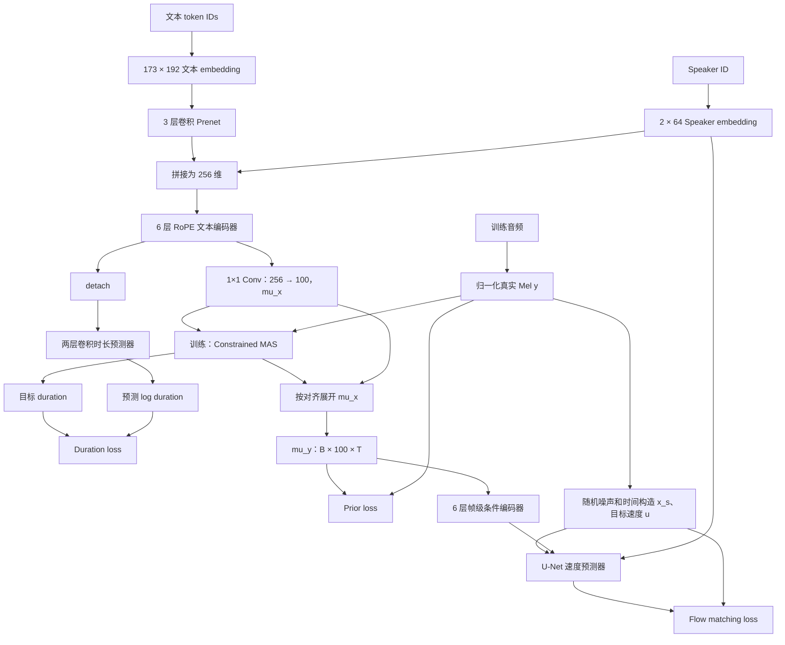

# LITs 模型架构与训练 loss：结构、公式及当前配方

核对日期：2026-09-14。本文记录 LITs 声学模型及此前 MajesticVoice 100 小时数据的 **48,000 步**微调配方。用户随后改为不加载 Stage 1 base、从零联合训练；当前设置见 [100 小时从零训练](../training/majestic_scratch/README.md)。下文微调初始化与分组学习率保留为历史记录。

第一阶段从随机初始化训练到 200,000 步的完整过程，见 [Stage 1 训练实录](stage1_training_zh.md)。

## 1. 总体目标

当前训练使用三项损失，权重均为 1：

$$
L_{\mathrm{train}}=L_{\mathrm{duration}}+L_{\mathrm{prior}}+L_{\mathrm{flow}}.
$$

| 项目 | 学习内容 | 日志名称 |
|---|---|---|
| Duration | 每个文本 token 应占多少 Mel 帧 | `sub_loss/train_dur_loss` |
| Prior | 文本对应的粗略 Mel 声学均值 | `sub_loss/train_prior_loss` |
| Flow matching | 从噪声生成真实 Mel 的速度场 | `sub_loss/train_diff_loss` |
| 总损失 | 上述三项之和 | `loss/train` |

输入是真实音频提取并归一化后的 Mel，以及对应文本 token 和 speaker ID。当前声学配置为 24 kHz、100 维 Mel、hop 384，即每帧 16 ms；沿用第一阶段 checkpoint 的 Mel mean/std。

这里的“文本 token”包括前端产生的音素、声调等符号，不一定对应一个汉字或一个英文单词。

## 2. 先通过 MAS 产生对齐

文本编码器输出每个 token 的 100 维声学均值 `mu_x`，以及预测的对数时长 `logw`。

训练时，用 `mu_x` 与真实 Mel 的高斯匹配分数运行 MAS（单调对齐搜索），寻找保持文本顺序的帧到 token 对齐。当前启用带时长上下界的 constrained MAS；具体约束取决于 token 和对应统计表。

注意实际边界的组合：虽然 `tone_floor_frames=1`，当前 `_mas_floor_frames` 先应用 `duration_floor_min_frames=2`，声调 token 的 MAS 下限实际为 2 帧，上限为 3 帧；推理时声调限幅则为 1–3 帧。

设对齐矩阵为 $A_{b,i,\tau}$：样本 $b$ 的第 $\tau$ 帧属于 token $i$ 时为 1，否则为 0。由它得到：

$$
d_{b,i}=\sum_\tau A_{b,i,\tau},\qquad
\mu_{b,f,\tau}=\sum_i A_{b,i,\tau}\,\mu^x_{b,f,i}.
$$

前者是时长监督目标，后者是展开到音频帧长度的声学均值。比如三个 token 分到 `[5, 8, 3]` 帧，就分别用这三个时长监督时长网络，同时按此分配展开 `mu_x`。

**MAS 在 `no_grad` 下执行，对齐结果被 detach。** 梯度不会穿过路径搜索；但展开后的 $\mu$ 仍能把 prior/flow 的梯度传给文本编码器。目标时长来自当前模型产生的对齐，会随训练变化，并非固定人工时长标签。

## 3. Duration loss：对数时长的平方误差

设 $\hat\ell_{b,i}$ 为模型预测的 `logw`，目标为 $\log(d_{b,i}+10^{-8})$：

$$
L_{\mathrm{duration}}=
\frac{\sum_b\sum_{i=1}^{N_b}m_{b,i}
\left[\hat\ell_{b,i}-\log(d_{b,i}+10^{-8})\right]^2}
{\sum_b N_b}.
$$

- $N_b$ 是有效文本 token 数。
- $m$ 是时长监督掩码：根据适用的英文/中文时长统计，排除异常对齐时长；没有适用边界的 token 不因此被排除。
- padding 位置由文本网络的 mask 置零，不贡献误差。
- **分母是全部有效 token 数，不是掩码筛选后的 token 数。** 异常目标越多，参与分子的监督越少，分母不变。

举例：目标时长为 8 帧，预测时长为 4 帧，这个 token 的误差是 $(\log4-\log8)^2\approx0.48045$，之后再与其他 token 一起求和、归一化。

梯度边界：时长预测器使用 `x_dp = torch.detach(x)`，因此这项 loss 直接训练时长预测器，不通过其输入反传到上游文本编码器或 speaker embedding。

## 4. Prior loss：单位方差高斯的负对数似然

令 $y$ 为归一化后的真实 Mel，$\mu$ 为 MAS 展开后的预测均值，$M_{b,\tau}$ 为有效音频帧 mask，$F=100$：

$$
L_{\mathrm{prior}}=
\frac{\sum_{b,f,\tau}M_{b,\tau}
\frac12\left[(y_{b,f,\tau}-\mu_{b,f,\tau})^2+\log(2\pi)\right]}
{F\sum_{b,\tau}M_{b,\tau}}.
$$

等价于：

$$
L_{\mathrm{prior}}=\tfrac12\operatorname{MSE}_{\mathrm{valid}}(y,\mu)+0.9189385.
$$

它要求文本侧给出有用的粗略声学预测，供后续 flow 解码器使用。这里只预测均值，方差固定为 1。

**这项 loss 的理论下限约为 0.91894，不是 0。** 例如 prior loss 为 0.96 时，对应 Mel MSE 约为 $2(0.96-0.9189385)=0.08212$。常数影响日志数值，但不影响梯度。因此不能仅凭 prior 数值大，就判断它主导了参数更新。

## 5. Flow matching loss：速度预测的均方误差

代码日志沿用 `diff_loss` 名称，实际目标为 conditional flow matching。

对每条样本独立采样一个时间 $s\sim U(0,1)$，并生成与 Mel 同形状的高斯噪声 $z\sim\mathcal N(0,I)$。当前 $\sigma_{\min}=10^{-4}$。

构造从噪声到真实 Mel 的中间状态：

$$
x_s=[1-(1-\sigma_{\min})s]z+sy.
$$

- $s=0$ 时为纯噪声 $z$。
- $s=1$ 时为 $y+\sigma_{\min}z$，即真实 Mel 加极小残余噪声。

这条路径对时间的导数就是监督目标：

$$
u=\frac{dx_s}{ds}=y-(1-\sigma_{\min})z.
$$

模型先通过 decoder 内的条件编码器处理 $\mu$，再结合 $x_s$、时间 $s$ 和 speaker embedding 预测速度 $v_\theta$。损失为：

$$
L_{\mathrm{flow}}=
\frac{\sum_{b,f,\tau}M_{b,\tau}
\left[v_{\theta,b,f,\tau}-u_{b,f,\tau}\right]^2}
{F\sum_{b,\tau}M_{b,\tau}}.
$$

**比较对象是速度，而非直接生成的波形。** 训练每次随机选一个时间点监督；生成时则从噪声开始，通过数值积分逐步得到 Mel，再交给声码器生成音频。

当前实例化 `CFM_Causal`，每次前向约以 50% 概率选择流式或非流式模式；两种模式都用上述目标。分子和分母均排除 padding，噪声在 padding 位置的值不计入 loss。

## 6. 聚合、权重与日志的准确含义

一般代码形式是：

$$
L_{\mathrm{train}}=w_dL_{\mathrm{duration}}+w_pL_{\mathrm{prior}}+L_{\mathrm{flow}}.
$$

本轮启动配置没有启用辅助 loss 衰减，encoder freeze callback 也被关闭，因此 $w_d=w_p=1$。仓库保留了其他权重调度能力，不能把“始终为 1”推广到所有实验。

验证总损失的实现是三项直接相加，**不读取训练的 $w_d,w_p$**。当前权重均为 1，训练与验证的组合形式一致；如果将来修改权重，需要同时留意这一差别。验证中的 flow 仍会随机采样噪声、时间和模式，因此验证值存在随机波动。

归一化在各 GPU 的本地 batch 内执行：duration 按有效 token 总数，prior/flow 按有效 Mel 元素总数。随后 DDP 平均各卡梯度；**没有跨卡先累加有效元素数量再统一归一化**。因此各卡长度总数不同时，不严格等价于对四卡所有有效元素做一次全局平均。`sync_dist=True` 的日志同步不会改变这个训练目标。

一个本地 batch 内，长句通常贡献更多有效帧或 token；实现并非先对每句平均再对句子平均。日志中的 `*_step` 和 `*_epoch` 也应区分，前者是单步记录，后者是 Lightning 聚合记录。

## 7. 当前 48,000 步训练如何使用这些 loss

| 配置 | 当前值 |
|---|---|
| 数据 | 中文 50 小时、英文 25 小时、混合 25 小时；验证/测试另计 |
| 初始化 | 第一阶段 197,000-step checkpoint，只加载模型权重，新建 Adam，微调步数归零 |
| 总预算 | 48,000 optimizer steps |
| 前 500 步 | 仅更新 speaker 1 embedding；其他参数不更新 |
| 之后 47,500 步 | 联合更新 speaker embedding、文本/先验编码器、时长预测器及 decoder |
| 联合阶段峰值 LR | embedding 为 1e-4，其余模块为 5e-6 |
| 学习率调度 | 按 48,000 总步数执行，联合阶段余弦衰减至峰值的 20% |
| Batch | 四卡，每卡 48，有效 batch 192 |

前 500 步不改变三项 loss 的定义或权重。回调通过学习率和清理非 embedding 参数梯度实现仅更新 embedding。由于 duration 输入被 detach，该项不会为 embedding 提供梯度；embedding 从适用的 prior/flow 条件路径得到训练信号。

本轮正式训练须在合成数据达标、最终审计和 GPU 预检通过之后启动。本文中的 48,000 步是本轮计划，不能与下节旧一轮的结果混用。

## 8. 已完成一轮的实际数值示例

以下来自旧训练 `majestic_only_joint_from197k_20260913` 的最后一次 12,000-step 验证记录，不是新 100 小时、48,000 步训练的结果。

| 项目 | 最后一步训练 | 验证 |
|---|---:|---:|
| Duration | 0.1566255 | 0.1599155 |
| Prior | 0.9643573 | 0.9638672 |
| Flow | 0.1589675 | 0.1554885 |
| 总 loss | 1.2799503 | 1.2792712 |

例如训练总 loss 为 $0.1566255+0.9643573+0.1589675\approx1.2799503$。权重相同不意味着三项梯度大小或感知效果贡献相同。

数据合成中的 WER/CER、DNSMOS、WavLM/CAMPPlus 相似度用于入库筛选，不进入这三项训练 loss。当前目标也没有额外波形重建、声码器 GAN 或 speaker 分类损失。判断发音、音色和自然度仍需结合生成评测和试听。

## 9. 详细模型架构

本节同时核对了当前源码、配置，以及本轮初始化来源的第一阶段 197,000-step checkpoint 的超参数与权重形状。以下尺寸对应本轮实际配置。记 $B$ 为 batch size，$N$ 为文本 token 长度，$T$ 为 Mel 帧长度；张量尺寸通常按 `[batch, channels, length]` 表示。

### 9.1 全链路与三项 loss 的位置



这是训练图。推理时没有真实 Mel，也不运行 MAS；使用预测 duration 展开 `mu_x`，从随机噪声积分得到 Mel，最后用 Vocos 输出波形。

### 9.2 文本输入与 speaker embedding

| 模块 | 配置 / 尺寸 | 作用 |
|---|---|---|
| 文本词表 | 173 个 token | 当前中英 rhyme-body-tone inventory |
| 文本 embedding | `[173, 192]` | token IDs → `[B, N, 192]` |
| 文本缩放 | embedding 乘以 $\sqrt{192}$ | 随后转置为 `[B, 192, N]` |
| 独立 tone embedding | 关闭，`n_tones=0` | 声调通过文本序列中的独立符号表达 |
| MAS tone 表 | `mas_n_tones=5` | 对齐约束使用，不是额外的声调 embedding |
| Speaker embedding | `[2, 64]` | speaker ID → `[B, 64]` |

本轮只有 speaker 1 的数据。其 embedding 从第一阶段 row 0 复制初始化，row 0 保留、不更新。该音色条件来自可训练 ID 查表，不是在 LITs 前向中用参考录音提取音色向量。

### 9.3 Prenet 与文本主干

**Prenet** 在拼接 speaker 之前处理文本 embedding：

```text
[B,192,N]
  → 3 × {Conv1d(192→192, kernel=5) → LayerNorm → ReLU → Dropout(0.5)}
  → Conv1d(192→192, kernel=1)
  → 与 Prenet 输入做残差相加
  → [B,192,N]
```

将 `[B,64]` speaker embedding 沿文本长度重复，再沿通道拼接，得到 `[B,256,N]`。因此 **192 是 token embedding 宽度，实际文本 Transformer 主干宽度为 256**。

文本主干共 6 层，每层包含：

1. 两头自注意力：hidden 256，每头 128 维；Q/K/V 和输出使用 1×1 卷积投影。
2. Q/K 每头前 64 维应用 RoPE，其余维度不旋转。
3. 注意力输出经过 dropout、残差相加和 LayerNorm。
4. 卷积 FFN：`256 → 768 → 256`，两次卷积 kernel=3，中间为 ReLU/dropout。
5. FFN 输出经过 dropout、残差相加和 LayerNorm。

主干 dropout 为 0.1。文本自注意力使用有效 token mask，不使用自回归因果 mask，可以利用整句文本。输出保持 `[B,256,N]`。

### 9.4 两个文本输出分支

**声学均值分支**：`Conv1d(256→100, kernel=1)`，产生 `mu_x=[B,100,N]`。训练时按 MAS 对齐展开为 `mu_y=[B,100,T]`，既用于 prior loss，也作为 flow 的条件输入。

**时长分支**：先 detach 主干输出，再执行：

```text
[B,256,N]
  → Conv1d(256→256, kernel=3) → ReLU → LayerNorm → Dropout(0.1)
  → Conv1d(256→256, kernel=3) → ReLU → LayerNorm → Dropout(0.1)
  → Conv1d(256→1, kernel=1)
  → logw：[B,1,N]
```

推理时将 log duration 指数化，再结合时长控制、取整和适用的边界处理得到帧数，生成展开路径。推理时没有真实音频辅助对齐。

### 9.5 帧级声学条件编码器

`decoder.encoder` 接收展开后的 `mu_y`，输出形状仍为 `[B,100,T]`。它在实现中叫 `ConformerEncoder`，但当前关闭 CNN 子模块及 macaron FFN，不能按完整标准 Conformer 描述。

| 项目 | 实际配置 |
|---|---|
| 输入 / 输出宽度 | 100 / 100 |
| 输入处理 | LinearNoSubsampling，不缩短帧序列 |
| 位置编码 | 相对位置编码 |
| 前视层 | `PreLookaheadLayer`，3 帧前视 |
| 主干层数 | 6 |
| 自注意力 | 2 头，每头 50 维，相对位置注意力 |
| FFN | `100 → 2048 → 100`，SiLU |
| 归一化 | pre-norm，末尾另有 LayerNorm |
| Dropout | 主干、位置、注意力均为 0.1 |
| 卷积子模块 / macaron | 均关闭 |

因此每次 loss 前向先对文本声学条件作帧级建模，再把它送入速度预测器。生成时条件可提前计算，随后多步 ODE 积分复用该条件。

### 9.6 Flow 速度预测器：CausalConditionalDecoder

速度预测器沿通道拼接三个输入：

```text
当前中间 Mel x_s    [B,100,T]
编码后的条件 mu     [B,100,T]
重复到帧的 speaker  [B, 64,T]
                    ↓ concat
                   [B,264,T]
```

时间 $s$ 走另一条路径：264 维正弦时间 embedding → SiLU MLP → 1024 维时间向量，注入残差块。当前普通 flow 模型没有蒸馏模型的 interval projector。

U-Net 的通道配置为 `[256,256]`，由 **2 个 down stage、2 个 middle stage、2 个 up stage**组成。每个 stage 均有一个时间条件残差块和一个 `BasicTransformerBlock`，总计 6 个 Transformer block。

| 阶段 | 残差块输入 → 输出通道 | 序列长度与连接 |
|---|---|---|
| Down 1 | 264 → 256 | 保存全分辨率 skip，然后下采样约 2 倍 |
| Down 2 | 256 → 256 | 保存低分辨率 skip，末尾因果卷积不再下采样 |
| Middle 1、2 | 各 256 → 256 | 保持低分辨率 |
| Up 1 | 512 → 256 | 拼接低分辨率 skip，然后上采样约 2 倍 |
| Up 2 | 512 → 256 | 拼接全分辨率 skip，末尾因果卷积 |
| 输出 | 256 → 256 → 100 | CausalBlock + 1×1 Conv，输出 `[B,100,T]` 速度 |

奇数长度和 padding 由实际 mask、skip 裁切等逻辑处理；表中的 2 倍描述的是采样尺度。

残差块由两组因果 1D 卷积、LayerNorm、Mish 构成，卷积 kernel=3；时间向量经投影后加入块内，另有残差连接。Transformer hidden 为 256、2 个注意力头、每头 64 维，所以注意力内部投影宽度为 128，再映射回 256；FFN 使用 SnakeBeta，dropout 为 0.05。

条件 Mel 和 speaker 信息通过通道拼接进入 U-Net；这里没有额外的文本 cross-attention 分支。输出是速度场，形状与 100 维 Mel 相同。

### 9.7 流式与非流式模式

训练每次前向随机选择流式或非流式模式，两者共用参数和 loss。流式注意力采用按块的 mask，允许访问当前块内位置；这不等于每一帧只能看此前帧。

- `static_chunk_size=50`：原始 Mel 尺度下 50 帧为 0.8 秒。
- `decoder_left_frames=20`：U-Net 注意力左侧上下文由 frame 参数控制，优先于旧的 left-chunks 参数。
- U-Net 各尺度都调用注意力 mask，因此不能将 20 直接理解为整个模型只有 320 ms 的感受野；下采样、卷积和多层传播也影响感受野。
- 条件编码器的 `mu_encoder_left_chunks=-1` 配置允许不限左侧块数；也不能由此推导所有路径都无右侧可见性限制。
- 推理流式实现为每个 ODE 步分别维护注意力 KV cache 和卷积尾部状态。

实际首包延迟还受文本前端、时长展开、前视、分块策略、ODE 步数与声码器影响，不能只由 chunk size 给出。

### 9.8 从速度到音频，以及模块更新关系

当前 solver 为 Euler。一次更新形式为：

$$
x_{s+\Delta s}=x_s+\Delta s\,v_\theta(x_s,s,\mathrm{condition}).
$$

积分完成得到归一化 Mel，使用保存的 mean/std 反归一化，再交给独立 Vocos 声码器生成 24 kHz 音频。声码器不包含在本轮三项声学 loss 的优化器中。

| 模块 | 主要梯度来源 | 本轮前 500 步 | 后续 47,500 步 |
|---|---|---|---|
| 文本 embedding、Prenet、RoPE 主干、mu 投影 | Prior + Flow | 不更新 | 更新 |
| 时长预测器 | Duration | 不更新 | 更新 |
| Speaker embedding row 1 | Prior + Flow | 更新 | 更新 |
| 帧级条件编码器 | Flow | 不更新 | 更新 |
| U-Net 速度预测器 | Flow | 不更新 | 更新 |
| Speaker row 0 | 本轮无该 ID 数据 | 不更新 | 不更新 |
| Vocos | 不在声学训练图中 | 不更新 | 不更新 |

本节额外实现入口：[U-Net](../lits/models/components/decoder.py)、[Transformer block](../lits/models/components/transformer.py)、[条件编码器及因果卷积工具](../lits/models/components/utils.py)、[文本编码器配置](../configs/model/encoder/default.yaml)、[decoder 配置](../configs/model/decoder/default.yaml)。

## 10. 197k checkpoint 的 duration 分布实测

2026-09-14 在训练固定验证子集（中文、英文各 256 条）完成了 MAS duration 与预测 duration 对照。排除静音、标点、声调等特殊 token 后：

| 指标（原始 exp(logw)，未取整） | 中文 | 英文 |
|---|---:|---:|
| 预测与 MAS 的 Pearson Corr | 0.419 | 0.501 |
| MAS Std（帧） | 4.933 | 3.156 |
| 预测 Std（帧） | 1.899 | 1.605 |
| Std 比（预测 / MAS） | 0.385 | 0.508 |
| MAS CV | 0.855 | 0.715 |
| 预测 CV | 0.409 | 0.405 |

分布压缩在取整前已存在。使用最终推理时长，并把每句预测和 MAS 各自归一化到均值 1 后，Std 比仍仅为中文 0.432、英文 0.511。因而存在明显的、相对于 MAS 的 duration oversmoothing，不能只用整体语速差异解释。

这尚不能单独证明 MSE 是唯一原因，也没有证明机械感主要来自 duration；MAS 是模型自身对齐参照。下一步应固定文本、噪声和 flow 设置，在相同总时长下做预测/MAS duration 替换试听。当前训练 loss 未修改。

完整表格、逐句置信区间、典型时长序列图与原始结果见 [197k duration 诊断报告](/119010446/tts-assets/training_runs/hifitts_premium_stage1_lr3e-4_20260911/diagnostics/duration_smoothing_197000_20260914/REPORT.md)。

随后已生成中文、英文各 3 条总时长严格匹配的预测/MAS duration 对照，固定同一噪声、197k checkpoint、10 步 Euler、非流式 flow 和 Vocos。可在 [独立 A/B 试听页](/119010446/tts-assets/training_runs/hifitts_premium_stage1_lr3e-4_20260911/diagnostics/duration_ab_197000_20260914/listen.html)盲听并导出评价；[实验说明与控制变量](/119010446/tts-assets/training_runs/hifitts_premium_stage1_lr3e-4_20260911/diagnostics/duration_ab_197000_20260914/REPORT.md)记录了样本选择、总帧数匹配和验证结果。

用户后续试听反馈：中文 B 基本听不清，A 勉强能听清。中文三组恰好都是 A=预测 duration、B=MAS，因此不能把恢复 MAS 方差作为已验证的改进方向。英文反馈为 B 节奏稍好，但第 4/6 组 B=MAS、第 5 组 B=预测，尚不能汇总成一致的方法偏好。分布压缩的统计事实与其感知质量后果必须区分；修改 duration loss 前，应优先核查中文 MAS 对齐和声学条件的可靠性。

进一步对这三条中文完成了 30 条音频的实现复核与消融：原 A/B 的 Mel 精确复现，MAS 路径及展开均正确。原录音和真实 Mel 重建的合并 ASR CER 均为 1.8%，预测 duration 为 17.9%，MAS 为 51.8%；MAS 增加到 30 步 Euler 为 62.5%，取消显式约束为 55.4%，预测/MAS 混合 50% 为 28.6%。前两句存在大量错词，第三句主要版本均能正确识别。上述 CER 是三个样本的辅助内容指标，不是整体自然度结论。

MAS 的 prior MSE 更小，但可懂度更差；其高斯匹配分数不能替代独立音素边界验证。当前尚不能在“MAS 时序本身错误”和“flow 对该时序条件生成不佳”之间唯一归因，也没有证据支持直接放大 duration 方差。完整逐 token 表、ASR 转写及消融音频见 [197k 中文 MAS 可懂度核查](/119010446/tts-assets/training_runs/hifitts_premium_stage1_lr3e-4_20260911/diagnostics/duration_failure_197000_20260914/REPORT.md)。

## 11. 对应实现与配置

- [MAS、duration 目标、prior 计算](../lits/models/lits.py)：`LITS.forward`。
- [duration 归一化](../lits/utils/model.py)：`duration_loss`。
- [时长输入 detach](../lits/models/components/text_encoder.py)：`TextEncoder.forward`。
- [flow 路径、速度目标、mask 与随机模式](../lits/models/components/flow_matching.py)：`CFM_Causal.compute_loss`。
- [总 loss、权重与验证日志](../lits/models/base.py)：`training_step`、`validation_step`。
- [模型配置](../configs/model/lits.yaml)与 [sigma 配置](../configs/model/cfm/default.yaml)。
- [本轮计划生成](../data_generation/majestic_200h/prepare_training.py)、[训练启动器](../training/stage2/run.py)、历史 embedding/联合阶段调度（代码见清理前提交 `9414aa7`）。
- [当前后台配置](/ai_sds_wuzz/DATA_TTS/MajesticVoice_200h_20260913/config.json)及[训练交接说明](/ai_sds_wuzz/DATA_TTS/MajesticVoice_200h_20260913/TRAINING_PLAN.md)。
- [旧一轮数值来源](/119010446/tts-assets/training_runs/majestic_only_joint_from197k_20260913/validation.jsonl)。
