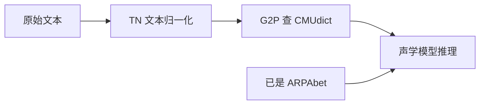

# temp_cmu_g2p

由于transsion g2p前端仅限内部调用，为方便测试和使用，这里借助cmudict里的映射，以支持普通英语文本。

本地英语 CMUdict 前端，用于 LITs 推理时将**英语文本**或**ARPAbet 音素**统一转换为模型可消费的格式。

本目录自包含，不依赖 `e2e_test/`；CMUdict 放在 `data/` 下。

## 与 TN 的顺序

查词典（G2P）应在 **TN（文本归一化）之后**。CMUdict 存的是词形，无法直接处理数字、货币、缩写等；需先由 TN 展开为可查词的英文。



| 输入 | 是否需要 TN | 是否需要 G2P |
|------|------------|-------------|
| 含数字/符号/缩写的英文 | 是 | 是 |
| 普通英文词（如 `hello world`） | 否 | 是 |
| 已是 ARPAbet（如 `HH AH0 L OW1`） | 否 | 否 |

`temp_cmu_g2p` 只负责 **G2P** 这一步；`inference_stream.py` 不会自动跑 TN，原始文本请先走 TN 再推理。

## 功能

自动识别两种输入模式（无需手动切换）：

| 输入类型 | 处理方式 | 示例 |
|---------|---------|------|
| 汉字 | 查 `chinese_lexicon.txt` 转拼音 | `今天天气很好` |
| 英语单词/句子（TN 后） | 查 CMUdict | `chap` → `CH AE1 P / .` |
| 拼音（带声调数字） | 原样通过 | `ni2 hao3` |
| ARPAbet 音素 | 原样保留，词间 `/` 分隔 | `HH AH0 L OW1` |
| 汉字 + inline 音素 | 汉字查词典，音素段原样保留 | `我一般用 / EY1 CH / 搜索` |

输出格式：**词内音素空格分隔，词与词（及标点）之间用 ` / ` 分隔**；`/` 仅作词边界，不应用于词内音素之间（应写 `HH AH0 L OW1`，而非 `HH / AH0 / L / OW1`）。句尾无标点时自动补 `.`。例如：

```
CHAP         ->  CH AE1 P / .
Hello world  ->  HH AH0 L OW1 / W ER1 L D / .
are you sure? -> AA1 R / Y UW1 / SH UH1 R / ?
```

### 大小写

- **英语文本**：大小写均可（`chap`、`CHAP` 效果相同）
- **ARPAbet 音素**：需使用大写（`CH`、`AE1`）；小写会被误判为普通英文

### 识别规则

- **分词**：拉丁文本按**空格**切 token，不在 token 内部再拆字符
- **拼音**：必须带声调数字（如 `ni2`、`hao3`），与 TN 后的英文词区分
- **英文词**：每个空格 token 整体查 CMUdict（`Good`、`GOOD` 均可）
- **ARPAbet**：空格 token 本身是音素符号（如 `EY1`、`CH`），原样通过

## 目录结构

```
temp_cmu_g2p/
├── README.md
├── __init__.py
├── arpa_tokens.py          # ARPAbet 音素表（用于输入模式判断）
├── cmudict_loader.py       # CMUdict 加载
├── g2p_engine.py           # 查词引擎（CMUdict + 补充词表 + OOV 兜底）
├── english_frontend.py     # 核心：模式判断 + 格式化
├── lookup.py               # CLI 查词
├── mixed_cleaners.py       # 接入 LITs cleaner 管线
└── data/
    ├── cmudict-0.7b              # CMU 发音词典（必需）
    └── supplement_lexicon.json   # OOV 补充词表（可自行配置，见下文）
```

## 单独使用

在仓库根目录执行：

```bash
# 查词
python temp_cmu_g2p/lookup.py "hello"
# HH AH0 L OW1 / .

# 英语文本 -> ARPAbet
python temp_cmu_g2p/english_frontend.py "Hello, world"
# HH AH0 L OW1 / , / W ER1 L D / .

# 已是 ARPAbet -> 规范化
python temp_cmu_g2p/english_frontend.py "HH AH0 L OW1"
# HH AH0 L OW1 / .
```


Python API：

```python
from temp_cmu_g2p import preprocess_english_input, en_zh_dict_mixed_cleaners

# 仅做 G2P 格式化
print(preprocess_english_input("chap"))
# CH AE1 P / .

# 完整 cleaner（含注音符号化，供 LITs tokenize）
from lits.text import text_to_sequence
ids, cleaned = text_to_sequence("chap", ["en_zh_dict_mixed_cleaners"])
```

### 自定义词典路径

```python
from temp_cmu_g2p import CMUDictG2P, preprocess_english_input

g2p = CMUDictG2P.from_paths(
    cmudict_path="/path/to/cmudict-0.7b",
    supplement_path="/path/to/my_supplement.json",  # 可省略
)
print(preprocess_english_input("CHAP", g2p))
```

### 补充词表 `supplement_lexicon.json`

如要补充CMUdict 未收录的词（OOV），自行配置 `data/supplement_lexicon.json`，或通过 `CMUDictG2P.from_paths(supplement_path=...)` 指定路径；文件不存在时自动跳过。

顶层需有 `entries` 对象，键为**大写词形**，值为音素列表。以下三种写法等价（以 `hello` 为例，音素同 CMUdict：`HH AH0 L OW1`）：

```json
{
  "entries": {
    "HELLO": {
      "phones": ["HH", "AH0", "L", "OW1"]
    }
  }
}
```

```json
{
  "entries": {
    "HELLO": ["HH", "AH0", "L", "OW1"]
  }
}
```

```json
{
  "entries": {
    "HELLO": "HH AH0 L OW1"
  }
}
```

查词时键名不区分大小写（`hello` 与 `HELLO` 相同）。`entries` 外的元数据字段（如 `source`、`entry_count`）会被忽略。

## 推理集成

`inference_stream.py` 使用 `--model_lang en-zh-dict` 即可启用（汉字词典 + 英语 CMUdict）：

```bash
python inference_stream.py \
  --model_lang en-zh-dict \
  --checkpoint /path/to/model.ckpt \
  --input_txt input.txt \
  --output_dir ./infer_output \
  --output_txt ./infer_output/meta.txt
```

输入 manifest 每行格式：`wav_path|text` 或 `wav_path|spk_id|text`，文本可以是：

```
test.wav|CHAP
test.wav|CH AE1 P
test.wav|Hello world
test.wav|今天天气很好
```

speaker 会自动推断：含汉字/拼音为中文（spk=1），纯英文为 spk=0。

## OOV 处理顺序

1. CMUdict 主词典（`data/cmudict-0.7b`）
2. 补充词表（`data/supplement_lexicon.json`，若自行提供）
3. 字母拼读兜底（逐字母查 CMUdict，如 `IBM` → `AY1 / B / IY1 / EH1 M` 各字母为独立词单元）

查不到的词会被跳过（不输出音素）。
